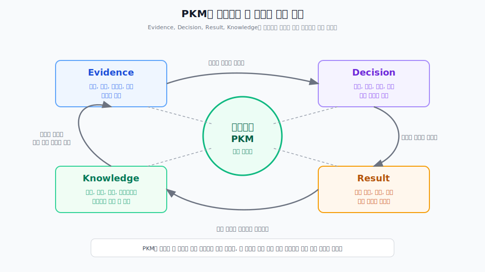

---
type: manuscript
chapter: Ch3
title: 관리 대상 네 가지
part: PART2
status: active
version: v2
created: 2026-03-26
updated: 2026-03-31
publish: true
publish_section: pkm
publish_order: 41
based_on: prologue, 90.archive/50.원고 PART3 reference
---

# 3장. 관리 대상 네 가지

PKM을 시작할 때 가장 먼저 생기는 오해가 있다.  
"일단 중요한 건 다 남기면 되지 않을까?"라는 생각이다.

이 접근은 오래가지 못한다.  
중요한 정보를 남긴다는 기준은 생각보다 금방 무너진다.  
회의 메모, 캡처, 채팅 로그, 리서치 자료, 아이디어, 태스크, 문서 초안이 뒤섞이기 시작하면 무엇이 근거이고 무엇이 결정이고 무엇이 나중에 다시 써야 할 지식인지 구분하기 어려워진다.

그래서 PKM은 "무엇이든 저장하는 시스템"이 아니라 "무엇을 관리할 것인가를 먼저 정하는 시스템"이어야 한다.  
기획자의 개인지식관리가 관리해야 할 대상은 근거, 결정, 재사용 지식, 실행 결과의 네 가지다.

> **[도식: fig-pkm-4targets-cycle]** — PKM이 관리하는 네 가지와 판단 순환
> 

이 네 가지를 구분하는 이유는 간단하다.  
기획자의 일은 이 네 가지가 계속 순환하는 구조이기 때문이다.  
근거 없이 결정할 수 없고, 결정 없이 실행할 수 없고, 실행 결과를 다시 배우지 않으면 지식이 쌓이지 않는다.  
그리고 축적된 지식은 다음 근거 해석과 다음 결정의 기준이 된다.

## 첫째, Evidence: 판단의 재료가 되는 근거

Evidence는 기획자의 판단에 재료를 제공하는 모든 사실과 관찰이다.  
사용자 인터뷰, VOC, 로그, 데이터, 리서치 메모, QA 이슈, 정책 제약, 시장 정보, 경쟁사 분석, 운영 중 발견한 패턴이 여기에 들어간다.

중요한 점은 Evidence가 곧 결론은 아니라는 것이다.  
Evidence는 판단의 재료다.  
여기서 곧바로 "그러므로 기능 A를 해야 한다"까지 가면 근거와 결정이 섞인다.  
PKM에서 Evidence를 따로 다루는 이유는 판단의 출발점을 나중에도 다시 검증할 수 있어야 하기 때문이다.

좋은 Evidence는 세 가지 특징을 가진다.

- 출처를 다시 확인할 수 있다.
- 당시의 맥락을 어느 정도 복원할 수 있다.
- 나중에 다른 결정과도 다시 연결할 수 있다.

예를 들어 "사용자들이 이 화면을 어려워했다"는 메모만 있으면 약하다.  
어떤 사용자군이, 어떤 상황에서, 어떤 표현으로 어려움을 드러냈는지까지 남아 있어야 그 근거는 다음 판단에서도 다시 쓸 수 있다.

즉 Evidence를 관리한다는 것은 자료를 많이 모은다는 뜻이 아니라, 판단의 재료를 다시 검증 가능한 형태로 남긴다는 뜻이다.

## 둘째, Decision: 선택과 이유를 남기는 기록

Decision은 무엇을 선택했고 무엇을 버렸는지, 왜 그렇게 결정했는지를 기록하는 영역이다.  
우선순위 판단, 범위 조정, 대안 비교, 정책 선택, 예외 처리 방식, 릴리스 기준 같은 것들이 여기에 들어간다.

많은 팀이 결과만 남긴다.  
"이번에는 이 기능을 넣는다", "이 플로우로 간다", "이 요구사항은 다음 분기로 미룬다" 같은 결론은 남지만, 왜 그런 판단을 했는지는 빠지는 경우가 많다.

하지만 기획자의 업무에서는 바로 그 이유가 중요하다.  
결정을 수정하려면 원래의 판단 기준을 알아야 하고, 새로운 이해관계자를 설득하려면 당시의 근거와 대안 비교를 설명할 수 있어야 한다.

그래서 Decision은 단순한 회의 결론이 아니다.  
선택, 이유, 버린 대안, 감수한 영향까지 포함하는 기록이다.  
결정이 이렇게 남아 있어야 다음 논의가 처음부터 반복되지 않는다.

## 셋째, Knowledge: 다음에도 다시 쓸 수 있는 지식

Knowledge는 특정 하루나 특정 프로젝트를 넘어서 반복해서 다시 쓸 수 있는 지식이다.  
용어, 개념, 원리, 방법, 프레임워크, 체크리스트, 산출물 패턴, 표기법, MOC 같은 것이 여기에 포함된다.

Evidence와 Decision이 특정 상황의 기록이라면, Knowledge는 그 상황에서 반복되는 패턴을 추출한 결과에 가깝다.  
예를 들어 여러 프로젝트에서 공통으로 등장한 우선순위 판단 기준이 있다면, 그것은 더 이상 개별 메모가 아니라 재사용 가능한 지식이 된다.

Knowledge를 따로 관리해야 하는 이유는 경험이 자동으로 자산이 되지 않기 때문이다.  
많은 사람이 경험은 쌓지만, 그 경험을 다음 프로젝트에서 다시 쓸 수 있는 형태로 정리하지 못한다.  
그러면 경험은 개인의 감각으로 남고, 팀과 미래의 프로젝트에는 거의 이전되지 않는다.

PKM에서 Knowledge를 만든다는 것은 "좋았던 메모를 모은다"는 뜻이 아니다.  
반복되는 판단 기준과 패턴을 꺼내어 다음에도 다시 쓸 수 있는 형태로 승격한다는 뜻이다.

## 넷째, Result: 실행 이후에 남는 결과와 발견

Result는 실제로 해본 뒤에 남는 결과다.  
무엇이 작동했고 무엇이 실패했는지, 예상과 실제가 어떻게 달랐는지, 어떤 리스크가 현실화됐는지, 어떤 새로운 발견이 생겼는지가 여기에 들어간다.

Result를 빼놓으면 PKM은 과거를 정리하는 시스템으로만 남는다.  
하지만 기획자의 판단은 실행을 거치며 계속 수정된다.  
실행 이후에 남는 관찰과 학습이 다시 근거와 지식으로 돌아와야 다음 판단의 품질이 올라간다.

그래서 Result는 단순한 완료 체크가 아니다.  
실행의 피드백이다.  
예상했던 사용자 반응이 맞았는지, 우선순위 판단이 적절했는지, 프로세스가 실제로 작동했는지를 확인하게 해주는 영역이다.

Result가 잘 관리되면 PKM은 닫힌 기록 보관함이 아니라 학습 시스템이 된다.

## 네 가지는 따로 저장하는 것이 아니라 순환으로 관리해야 한다

중요한 것은 이 네 가지를 단순 분류표로만 이해하지 않는 것이다.  
Evidence, Decision, Knowledge, Result는 독립된 상자가 아니라 하나의 흐름이다.

- Evidence가 Decision의 근거가 된다.
- Decision이 실행 방향을 만든다.
- 실행 뒤에는 Result가 남는다.
- Result에서 반복 패턴이 보이면 Knowledge로 올라간다.
- 축적된 Knowledge는 다시 다음 Evidence 해석과 Decision 판단의 기준이 된다.

이 순환이 있으면 PKM은 살아 있는 시스템이 된다.  
이 순환이 없으면 노트는 많아져도 판단은 누적되지 않는다.

그래서 이 책은 PKM을 저장 구조보다 운영 구조로 본다.  
무엇을 어디에 둘 것인가보다, 어떤 흐름으로 근거와 결정과 결과와 지식을 연결할 것인가가 더 중요하다.

## 이 장의 결론

기획자의 개인지식관리가 관리해야 할 대상은 네 가지다.  
Evidence, Decision, Knowledge, Result다.

이 네 가지를 구분해야 근거는 검증 가능하게 남고, 결정은 다시 설명 가능하게 남고, 경험은 재사용 가능한 지식으로 자랄 수 있다.  
그리고 실행 결과가 다시 다음 판단으로 돌아오면서 PKM은 메모 저장소가 아니라 판단 순환 시스템이 된다.

다음 장에서는 이 네 가지 지식이 어디에서 자라는지 살펴본다.  
기획자의 지식은 맥락, 도메인, 기술이해, 관계의 네 영역에서 자란다.

