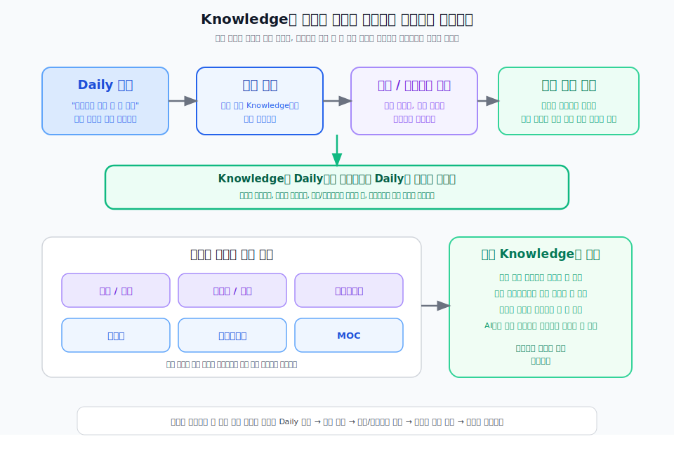

---
type: manuscript
chapter: Ch6
title: Knowledge의 역할
part: PART2
status: active
version: v2
created: 2026-03-26
updated: 2026-03-31
publish: true
publish_section: pkm
publish_order: 44
based_on: Knowledge/README.md, 90.archive/50.원고 reference
---

# 6장. Knowledge의 역할

Decision OS가 근거와 결정을 다루는 방법이라면, Knowledge는 재사용 지식을 다루는 방법이다.

기획자의 메모 중에는 프로젝트와 함께 수명이 끝나는 것들이 있다.  
하지만 그중 일부는 프로젝트를 넘어 다음에도 다시 쓸 수 있는 기준과 패턴으로 자란다.  
용어, 개념, 원리, 방법, 산출물 패턴, 체크리스트, 프레임워크 같은 것들이다.

문제는 많은 팀과 개인이 이 둘을 구분하지 않는다는 점이다.  
그 결과 재사용 가능한 지식이 Daily 노트나 프로젝트 문서 속에 묻혀버린다.  
경험은 쌓였는데, 다음 프로젝트에서 꺼내 쓸 수 있는 자산은 적다.

그래서 Knowledge가 필요하다.  
Knowledge는 좋은 메모를 모아두는 폴더가 아니라 반복해서 다시 쓸 수 있는 지식을 분리하고 운영하는 방법이다.

> **[도식: fig-knowledge-reuse-method]** — Knowledge는 재사용 지식을 분리하고 운영하는 방법이다
> 

## 왜 재사용 지식을 따로 다뤄야 하는가

기획자의 경험은 자동으로 자산이 되지 않는다.  
그날의 판단이 그날의 문서 안에만 남아 있으면, 시간이 지나며 다시 찾기 어려워지고 맥락도 함께 사라진다.

반면 재사용 지식으로 승격된 내용은 다음에도 다시 쓸 수 있다.

- 처음 만나는 용어를 정의할 수 있다.
- 비슷한 문제에 적용할 개념을 꺼낼 수 있다.
- 반복해서 쓰는 산출물 패턴을 재사용할 수 있다.
- 같은 실수를 막는 체크리스트를 만들 수 있다.

즉 Knowledge는 기억을 줄이기 위한 장치가 아니라 반복 비용을 줄이기 위한 장치다.

## Knowledge의 기본 단위

이 책에서 Knowledge는 하나의 형태만 의미하지 않는다.  
재사용 목적에 따라 여러 형태를 가진다.

- 용어
- 개념
- 산출물
- 표기법
- 프레임워크
- 기법
- 체크리스트
- MOC

이 구분이 중요한 이유는 같은 내용이라도 어떤 형태로 남기느냐에 따라 다음 사용성이 달라지기 때문이다.

예를 들어 어떤 내용을 "개념"으로 남기면 정의와 의미를 다시 설명하기 좋고,  
"체크리스트"로 남기면 실행 직전에 바로 꺼내 쓰기 좋고,  
"산출물"로 남기면 다음 문서 작성의 틀로 쓰기 좋다.

그래서 Knowledge는 단순히 저장이 아니라 형식 선택의 문제이기도 하다.

## Knowledge는 Daily 노트에서 시작하지만 Daily 노트에 머물지 않는다

Knowledge도 처음에는 Daily 노트에서 시작한다.  
하루의 메모 속에 "이건 나중에도 다시 쓸 것 같다"는 항목이 들어온다.

그 순간 중요한 것은 메모를 길게 쓰는 것이 아니다.  
그 항목이 기존 지식의 업데이트인지, 새로운 지식의 시작인지, 어떤 형태의 노트로 다뤄야 하는지 판단하는 것이다.

이 흐름은 대체로 다음 순서로 진행된다.

- Daily 노트에서 Knowledge 후보를 확인한다.
- 기존 Knowledge를 검색한다.
- 신규 생성인지 기존 업데이트인지 판단한다.
- 적절한 노트 형태를 정한다.
- 관련 노트와 연결한다.

이 방식이 있어야 Knowledge 트리가 중복으로 무너지지 않고, 재사용 가능한 지식이 점점 선명해진다.

## Knowledge에서 중요한 것은 분류보다 재사용성이다

Knowledge를 운영할 때 흔히 빠지는 함정은 분류 체계를 완벽하게 만들려는 것이다.  
하지만 지식 트리의 목적은 예쁜 구조가 아니라 다음에도 다시 꺼내 쓸 수 있는 상태를 만드는 데 있다.

그래서 좋은 Knowledge 노트는 최소한 다음 중 하나를 가능하게 해야 한다.

- 내가 처음 보는 사람에게 설명할 수 있다.
- 다음 프로젝트에서 바로 참조할 수 있다.
- 새로운 판단의 기준으로 쓸 수 있다.
- AI에게 넘길 컨텍스트 패키지에 포함할 수 있다.

반대로 분류는 정교한데 다시 읽어도 바로 쓸 수 없다면 그 노트는 지식보다 보관에 가깝다.

Knowledge의 품질은 내용의 양보다 재사용성으로 판단해야 한다.

## 이 장의 결론

Knowledge는 메모를 모아두는 곳이 아니라, 재사용 가능한 지식을 분리하고 운영하는 방법이다.
용어, 개념, 산출물, 프레임워크, 기법, 체크리스트 같은 형태로 지식을 다루어야 다음 프로젝트에서 다시 꺼내 쓸 수 있다. 이렇게 구조화된 Knowledge는 사람이 직접 참조하는 것은 물론, AI에게 넘길 컨텍스트로도 바로 활용할 수 있다.

독자가 가져가야 할 것은 폴더 구조 자체가 아니라 `Daily 노트 후보 → 기존 검색 → 신규/업데이트 판단 → 적절한 노트 형태 → 연결`의 방법이다. 자기 환경에 이식하는 구체적인 방법은 Ch21에서 다룬다.

다음 장에서는 마지막 관리 대상인 실행 결과를 본다.
실행 결과는 끝이 아니라 다음 근거와 지식의 시작이다.
