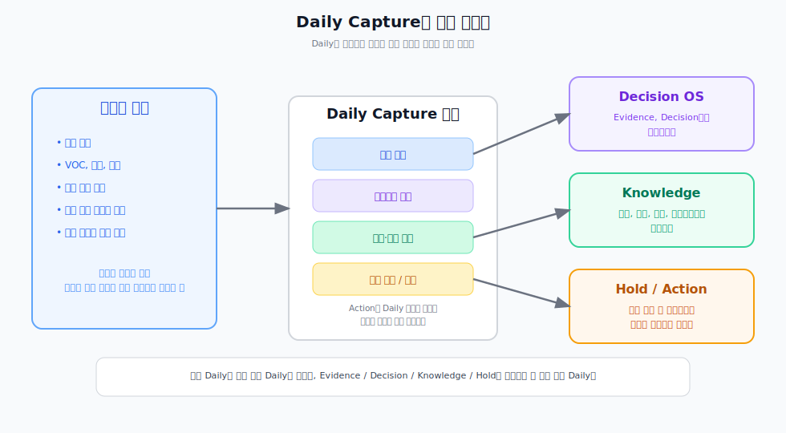

---
type: manuscript
chapter: Ch8
title: Daily Capture 설계법
part: PART3
status: active
version: v2
created: 2026-03-26
updated: 2026-03-31
publish: true
publish_section: pkm
publish_order: 51
based_on: Decision OS/Daily-Capture-파이프라인-HOWTO-v1.md, Template 10. Daily Log.md
---

# 8장. Daily Capture 설계법

많은 사람이 Daily 노트를 쓴다.  
하지만 많은 사람이 동시에 같은 문제를 겪는다.  
기록은 계속 남는데, 시간이 지나면 다시 꺼내 쓸 수 있는 것은 적다는 문제다.

이 문제는 Daily 노트를 안 써서 생기는 것이 아니다.  
Daily 노트를 입력 장소가 아니라 종착지처럼 쓰기 때문에 생긴다.

PKM에서 Daily 노트는 일기의 페이지가 아니다.  
하루 동안 들어오는 정보가 시스템 안으로 들어오는 입력 허브다.  
오늘의 관찰, 오늘의 결정, 오늘의 새 용어, 오늘의 액션 결과가 처음 모이는 장소다.

그래서 Daily Capture를 제대로 설계하면 하루의 메모는 날짜 파일에 갇히지 않는다.  
근거는 근거로, 결정은 결정으로, 재사용 지식 후보는 Knowledge로 흘러간다.  
Daily 노트가 강해질수록 이후 Organize와 Distill의 비용도 함께 내려간다.

> **[도식: fig-daily-capture-branching]** — Daily 노트가 입력 허브가 되어 각 영역으로 분기되는 구조
> 

## Daily 노트를 일기로 쓰면 왜 지식이 쌓이지 않는가

일기형 Daily 노트는 보통 이런 흐름을 가진다.

- 오늘 있었던 일을 적는다.
- 회의 내용을 요약한다.
- 할 일을 적는다.
- 다음 날 새 파일로 넘어간다.

이 방식은 하루를 돌아보는 데는 도움이 된다.  
하지만 PKM의 관점에서는 치명적인 약점이 있다.  
입력은 쌓이는데 분기가 없고, 분기가 없으니 구조화도 없고, 구조화가 없으니 재사용도 없다.

그 결과 회의 메모는 날짜 파일 속에 잠기고,  
결정은 결론만 남은 채 맥락이 끊기고,  
다음에도 써야 할 개념은 그냥 한 줄 메모로 묻혀버린다.

즉 문제는 Daily 노트가 있다는 사실이 아니라, Daily 노트 이후의 흐름이 없다는 사실이다.

## Daily Capture는 입력을 네 가지로 받아야 한다

이 책의 Daily Capture는 최소 네 가지 입력 구간을 가진다.

- 사실 캡처
- 의사결정 기록
- 용어·개념 메모
- 확인 필요 / 보류

여기에 별도로 Action을 Daily 노트 체크리스트 안에서 운영한다.

이 구조의 장점은 단순하다.  
하루 동안 들어오는 대부분의 입력을 이 네 가지로 일단 나눌 수 있고,  
나뉜 입력은 이후 Decision OS나 Knowledge로 자연스럽게 흘러갈 수 있다.

예를 들어:

- 사용자 불만, 회의 발언, 수치, 운영 이슈는 `사실 캡처`
- 오늘 확정한 방향, 범위 조정, 우선순위 판단은 `의사결정 기록`
- 나중에도 다시 쓸 용어, 개념, 방법, 산출물 후보는 `용어·개념 메모`
- 아직 근거가 부족하거나 지금 판단하기 어려운 항목은 `확인 필요 / 보류`

이렇게만 나누어도 Daily 노트는 더 이상 메모의 쓰레기통이 아니라 입력 정류장이 된다.

## 중요한 것은 길게 쓰는 것이 아니라 분기 가능하게 쓰는 것이다

Daily Capture에서 가장 흔한 실수는 처음부터 완성된 문장을 쓰려는 것이다.  
하지만 Capture 단계에서는 정교한 문장이 중요하지 않다.  
나중에 분기할 수 있는 최소 정보가 더 중요하다.

그래서 형식은 짧아도 된다.

- 사실 | 배경 | 관련 대상
- 결정 | 이유 | 근거 | 영향 범위
- 워딩 | 맥락 | 후보 유형
- 항목 | 왜 보류인지 | 다음 확인 포인트

이 정도면 충분하다.  
Capture의 목적은 완성된 지식을 만드는 것이 아니라 이후 단계로 흘려보낼 수 있는 입력을 남기는 데 있다.

입력 형식이 단순할수록 유지가 쉽고,  
유지가 쉬울수록 매일 반복이 가능하고,  
반복이 가능할수록 PKM은 실제 운영 체계가 된다.

## Daily 노트는 입력 허브이고 Action은 그 안에서 닫힌다

Daily 노트에는 모든 것을 영구 저장할 필요가 없다.  
특히 Action은 대부분 Daily 노트 안에서 닫히는 것이 맞다.

지금 해야 할 일, 담당자, 기한, 후속 요청은 Daily 노트 체크리스트로 관리하면 충분하다.  
다만 그 실행 결과가 새로운 근거가 되거나, 반복 가능한 패턴이 되거나, 다음에도 다시 참고할 만한 발견이 되면 그때는 승격 대상이 된다.

즉 Daily 노트는 모든 것을 영구 보관하는 곳이 아니다.  
어떤 것은 그날 안에서 소화하고 어떤 것은 Decision OS나 Knowledge로 넘기는 관문이다.

이 구분이 없으면 Daily 노트는 금방 비대해진다.  
반대로 이 구분이 있으면 Daily 노트는 가볍게 유지되면서도 지식 시스템의 입구 역할을 계속 할 수 있다.

## 이 장의 결론

Daily 노트는 일기가 아니라 PKM의 입력 허브다. 사실, 결정, Knowledge 후보, 보류를 최소 구조로 남길 수 있어야 하루의 메모가 지식 파이프라인으로 들어간다.

좋은 Daily Capture는 많이 쓰는 방식이 아니라 분기 가능하게 쓰는 방식이다. Capture가 잘 되면 이후 Organize와 Distill의 비용이 함께 내려간다. 입력이 이미 근거, 결정, Knowledge 후보 단위로 나뉘어 있기 때문이다. 반대로 Capture 단계에서 분기가 없으면 Organize에서 다시 모든 Daily 노트를 뒤져야 하고, 많은 입력이 그냥 방치된다.

Action은 Daily 노트 안에서 닫고, 의미 있는 결과만 다시 승격시키면 Daily 노트는 가볍고 시스템은 강해진다.

다음 장에서는 이 Capture 단계에서 AI가 실제로 무엇을 맡을 수 있는지 본다. AI는 단순 요약기가 아니라 입력 정리자이자 1차 분기 보조자 역할을 할 수 있다.
