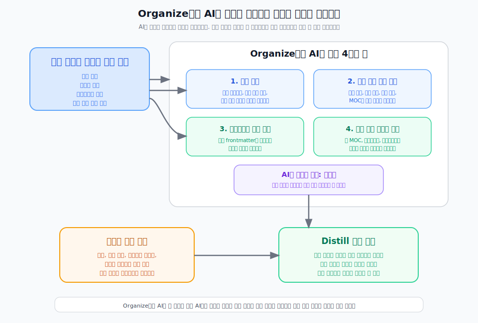

---
type: manuscript
chapter: Ch12
title: Organize에서 AI는 무엇을 하는가
part: PART4
status: active
version: v2
created: 2026-03-26
updated: 2026-03-31
publish: true
publish_section: pkm
publish_order: 63
based_on: Knowledge ingest skill, Decision OS structure docs, 90.archive/50.원고 PART4 reference
---

# 12장. Organize에서 AI는 무엇을 하는가

Capture 단계에서 AI의 역할이 입력 정리와 1차 분기였다면, Organize 단계에서의 역할은 구조에 맞게 배치하고 연결하는 것이다.  
이 단계에서 중요한 것은 AI가 대신 생각해주는 것이 아니라 이미 정해진 구조를 더 일관되게 적용하도록 돕는다는 점이다.

구조가 없는 상태에서 AI는 그럴듯한 정리를 제안할 수는 있다.  
하지만 그것은 사람마다 다른 감각에 기대는 임시 정리에 가깝다.  
반대로 객체 정의, 파일명 규칙, 메타데이터 규칙, 분류 축이 먼저 정해져 있으면 AI는 강한 운영 보조자가 된다.

> **[도식: fig-organize-ai-roles]** — Organize에서 AI는 구조를 제안하고 사람은 구조를 승인한다
> 

## Organize에서 AI가 맡는 일은 네 가지다

첫째, 분류 추천이다.  
입력된 노트나 새로 만든 초안이 어떤 객체인지, 어떤 축에 놓여야 하는지, 어떤 유형 이름을 써야 하는지를 AI가 먼저 제안할 수 있다.

둘째, 기존 자산과의 연결 추천이다.  
새 노트를 만들기보다 기존 노트를 업데이트해야 할 때가 많다.  
AI는 유사 노트, 관련 근거, 관련 결정, 연결할 MOC나 허브 후보를 탐색해 제시할 수 있다.

셋째, 메타데이터 초안 작성이다.  
사람이 매번 frontmatter를 처음부터 채우면 비용이 크다.  
AI는 노트 유형에 맞는 최소 메타데이터를 제안하고, 누락된 항목이 무엇인지 점검할 수 있다.

넷째, 구조 확장 포인트 제안이다.  
같은 유형의 노트가 일정 수 이상 모였는지, 새로운 MOC가 필요한지, 체크리스트나 프레임워크로 승격할 만한 패턴이 보이는지를 AI가 먼저 알려줄 수 있다.

## Organize 단계에서 AI의 강점은 일관성이다

사람은 의미 판단에는 강하지만, 반복적으로 같은 규칙을 적용하는 일에는 쉽게 흔들린다.  
어제는 같은 유형의 노트를 `개념`으로 만들고, 오늘은 `메모`나 `정리` 같은 임의 이름으로 만들기 쉽다.

AI는 여기서 강점을 가진다.  
한 번 정한 규칙이 있으면 그 규칙에 따라 같은 입력을 비슷한 방식으로 정리하고, 파일명과 메타데이터도 더 안정적으로 맞출 수 있다.

따라서 Organize 단계에서 AI의 가장 큰 가치는 창의성이 아니라 일관성이다.  
구조를 새로 만드는 데 쓰기보다, 이미 정한 구조를 반복적으로 지키는 데 쓰는 편이 훨씬 효과적이다.

## 사람은 예외와 의미를 판단해야 한다

그렇다고 Organize를 AI에 전부 맡길 수는 없다.  
구조에는 언제나 예외가 생기고, 예외는 대개 맥락을 읽어야 판단할 수 있다.

예를 들어 어떤 입력은 표면적으로는 개념 노트처럼 보여도 실제로는 특정 프로젝트에만 유효한 의사결정 근거일 수 있다.  
반대로 작은 실행 메모처럼 보이는 것도 반복되면 체크리스트나 가이드로 승격할 가치가 있을 수 있다.

이런 판단은 조직의 맥락, 프로젝트의 중요도, 향후 재사용 가능성을 함께 봐야 한다.  
그래서 Organize 단계에서도 최종 구조 판단은 사람이 가져가야 한다.

## AI는 구조를 제안하고, 사람은 구조를 승인한다

이 책이 권하는 협업 방식은 단순하다.  
AI는 분류와 연결과 초안을 먼저 제안한다.  
사람은 그 제안을 승인하거나 조정한다.

이 방식의 장점은 두 가지다.  
첫째, 정리 속도가 빨라진다.  
둘째, 구조 품질이 올라간다.  
사람이 매번 빈 화면에서 시작하지 않아도 되고, AI가 제안한 후보를 보면서 더 빠르게 맞고 틀림을 판단할 수 있기 때문이다.

즉 Organize에서 AI를 잘 쓴다는 것은 AI에게 구조를 맡긴다는 뜻이 아니다.  
구조 운영의 보조자, 규칙 적용의 자동화 도구, 연결 탐색의 조수로 쓰는 것이다.

## Organize가 안정되어야 Distill이 가능해진다

Distill은 흩어진 기록에서 패턴을 발견하고, 재사용 가능한 원칙으로 끌어올리는 단계다.  
그런데 Organize가 약하면 Distill도 약해진다.

같은 유형의 정보가 같은 방식으로 쌓여 있지 않으면 비교가 어렵고, 비교가 안 되면 패턴도 보이지 않는다.  
관련 노트가 링크로 이어져 있지 않으면, 무엇이 반복되는지 파악하기도 어렵다.

그래서 Organize는 Distill의 전제 조건이다.  
좋은 Distill은 좋은 구조에서만 나온다.

## 다음 파트에서는 Distill을 다룬다

이제 입력은 객체가 되었고, 구조 안에 배치되었고, 링크와 메타데이터로 다시 찾을 수 있게 되었다.  
다음 질문은 이것이다.  
이 흩어진 축적물에서 무엇을 발견하고, 무엇을 원칙과 자산으로 끌어올릴 것인가.

다음 파트에서는 개인지식관리로 어떻게 Distill 하는지 살펴본다.
