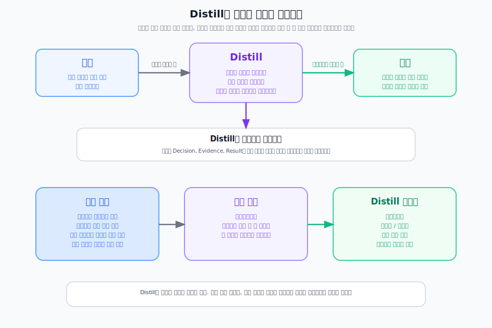

---
type: manuscript
chapter: Ch13
title: Distill은 승격이다
part: PART5
status: active
version: v2
created: 2026-03-26
updated: 2026-03-31
publish: true
publish_section: pkm
publish_order: 71
based_on: 90.archive/50.원고 confirmed-toc-v10 Distill section, ch03-업무인프라-draft.md, step03-프로젝트-draft.md
---

# 13장. Distill은 승격이다

많은 사람이 지식관리를 정리 단계에서 멈춘다.  
기록을 예쁘게 다듬고, 노트를 잘 분류하고, 제목을 정리하면 충분하다고 생각한다.  
하지만 개인지식관리가 실제 판단 인프라가 되려면 한 단계가 더 필요하다.  
그 단계가 Distill이다.

Distill은 저장된 노트를 짧게 압축하는 일이 아니다.  
서로 떨어져 있는 기록을 연결하고, 반복 패턴을 발견하고, 다음에도 다시 쓸 수 있는 기준으로 끌어올리는 일이다.

> **[도식: fig-distill-promotion-loop]** — Distill은 요약이 아니라 연결에서 패턴을 찾아 재사용 가능한 기준으로 승격하는 단계다
> 

## 요약은 길이를 줄이지만, Distill은 재사용성을 높인다

회의 메모를 세 줄로 줄이는 것은 요약이다.  
비슷한 프로젝트 세 개에서 반복된 실패 원인을 뽑아 "이 조건에서는 먼저 기본값을 점검한다"는 원칙으로 만드는 것은 Distill이다.

즉 요약은 현재 문서를 읽기 쉽게 만들고, Distill은 미래의 판단을 쉽게 만든다.  
이 차이를 이해해야 개인지식관리가 단순 정리 습관에서 벗어난다.

기획자에게 중요한 것은 "어떤 기록이 있었는가"보다 "그 기록에서 무엇을 배웠는가"다.  
Distill은 바로 그 배움을 분리해내는 단계다.

## Distill은 연결에서 시작된다

패턴은 한 노트 안에서 잘 보이지 않는다.  
하나의 Decision Log만 봐서는 개인 취향인지, 일시적 상황인지, 반복 가능한 기준인지 알기 어렵다.  
비슷한 Decision Log가 여러 개 모이고, 관련 Evidence Note와 함께 볼 수 있어야 비로소 패턴이 드러난다.

그래서 Distill의 출발점은 연결이다.  
같은 유형의 문제, 비슷한 의사결정, 반복되는 사용자 불만, 자주 등장하는 실행 결과를 서로 이어봐야 한다.  
연결이 있어야 "이건 우연이 아니라 패턴"이라는 판단이 가능해진다.

이 의미에서 Distill은 Organize의 다음 단계다.  
Organize가 구조를 만들었다면, Distill은 그 구조 안에서 반복을 읽어내는 단계다.

## 승격의 기준은 다음에도 다시 쓸 수 있는가다

모든 기록을 Distill할 필요는 없다.  
어떤 노트는 그 프로젝트에서만 의미가 있고, 다시 볼 일이 없을 수도 있다.  
Distill의 기준은 단순한 중요도가 아니라 재사용 가능성이다.

예를 들어 다음과 같은 항목은 승격 후보가 된다.

- 여러 프로젝트에서 반복해서 등장한 의사결정 기준
- 같은 유형의 문제를 해결할 때 공통으로 쓰인 접근 방식
- 반복되는 액션에서 드러난 체크 순서
- 특정 도메인에서 자주 틀리는 개념과 그 해석 기준

이런 항목이 보이면 단순 기록으로 두지 말고 체크리스트, 가이드, 방법론, 컨텍스트 패키지 후보로 올려야 한다.  
이 승격이 일어나야 PKM이 쌓이는 구조가 된다.

## Distill 산출물은 판단의 재료가 되어야 한다

좋은 Distill 산출물은 읽고 감탄하는 문서가 아니다.  
다음 프로젝트에서 바로 꺼내 써서 판단 속도와 품질을 높여주는 문서다.

예를 들어 반복되는 액션 패턴은 체크리스트가 될 수 있다.  
여러 케이스에서 공통으로 통했던 접근은 가이드가 될 수 있다.  
의사결정 패턴이 충분히 쌓이면 방법론이나 의사결정 기준 문서가 될 수 있다.  
특정 상황에서 필요한 근거, 결정, 지식을 묶어두면 컨텍스트 패키지가 된다.

이렇게 보면 Distill은 Express의 준비 단계이기도 하다.  
Express에서 좋은 산출물을 만들려면, 그 전에 이미 Distill된 판단 기준이 있어야 한다.

## Distill은 버리기보다 끌어올리기다

정리라고 하면 많은 사람이 삭제를 먼저 떠올린다.  
하지만 Distill의 핵심은 지우는 일이 아니라 끌어올리는 일이다.

물론 중복이 심하거나 가치가 떨어진 기록은 정리할 수 있다.  
하지만 더 중요한 것은 "이 기록을 남길까 말까"가 아니라 "이 기록에서 무엇을 추출할 수 있을까"를 묻는 것이다.

어떤 프로젝트의 실패 기록도 다음 판단 기준으로 승격되면 가치가 생긴다.  
어떤 오래된 회의 메모도 반복되는 쟁점을 설명하는 근거가 되면 다시 살아난다.  
Distill은 이 전환을 만드는 단계다.

## Distill이 있어야 기획자의 경험이 자산이 된다

경험이 자산이 되지 못하는 이유는 경험이 없어서가 아니다.  
경험에서 패턴을 꺼내지 못하기 때문이다.

경험이 자산이 되는 기획자는 단순히 많이 겪은 사람이 아니라 겪은 것에서 기준을 뽑아내는 사람이다.
무엇이 반복되었는지, 어떤 선택이 어떤 상황에서 통했는지, 어떤 실패가 다시 나타나는지 꺼내 말할 수 있어야 한다.

Distill은 바로 그 능력을 시스템으로 만드는 단계다.  
즉 개인지식관리에서 Distill은 경험을 판단 기준으로 바꾸는 작업이다.

## 이 장의 결론

Distill은 요약이 아니라 승격이다. 기록을 짧게 만드는 것이 아니라, 반복되는 사례와 연결에서 다음 판단에 바로 쓸 수 있는 기준과 패턴을 끌어올리는 일이다. 이 단계가 있어야 개인지식관리는 기록 저장소를 넘어 판단 인프라가 된다.

경험이 자산이 되는 기획자는 단순히 많이 겪은 사람이 아니라 겪은 것에서 기준을 뽑아내는 사람이다. Distill은 그 능력을 시스템으로 만드는 단계다. 다음 장에서는 중복·고립·승격 후보를 어떤 기준으로 다루는지, Distill의 실무 판단으로 넘어간다.
