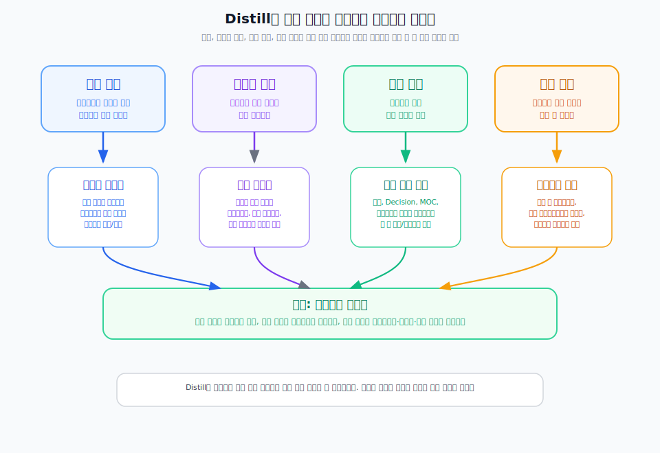

---
type: manuscript
chapter: Ch14
title: 병합할 것과 남길 것
part: PART5
status: active
version: v2
created: 2026-03-26
updated: 2026-03-31
publish: true
publish_section: pkm
publish_order: 72
based_on: 90.archive/50.원고 confirmed-toc-v10 Distill section, step04-운영루틴-draft.md, ch23-자산화-draft.md
---

# 14장. 병합할 것과 남길 것

Distill이 패턴을 끌어올리는 단계라면, 그 과정에는 반드시 정리 판단이 따라온다.  
같은 내용이 여러 곳에 흩어져 있다면 병합해야 하고, 오래됐지만 여전히 의미 있는 노트는 남겨야 하며, 고립된 노트 중 일부는 승격 후보로 다시 봐야 한다.

이 장에서는 Distill에서 자주 마주치는 네 가지 대상을 기준으로 판단해본다.  
중복, 오래된 노트, 고립 노트, 승격 후보다.

> **[도식: fig-distill-repositioning-rules]** — Distill은 중복, 오래된 노트, 고립 노트, 승격 후보를 삭제보다 재배치 기준으로 다룬다
> 

## 중복 노트는 없애기보다 기준본을 만들어야 한다

중복은 지식관리에서 피하기 어렵다.  
비슷한 회의, 유사한 프로젝트, 같은 개념의 다른 표현이 계속 생기기 때문이다.

중요한 것은 중복을 기계적으로 삭제하는 것이 아니다.  
무엇이 기준본이 될지를 먼저 정하는 것이다.

예를 들어 같은 개념을 설명하는 메모가 세 개 있다면, 가장 맥락이 분명하고 재사용하기 좋은 노트를 기준본으로 삼고 나머지는 그 노트로 흡수하거나 링크로 연결할 수 있다.  
Decision Log도 같은 유형의 결정이 반복되었다면 개별 로그는 남기되, 그 위에 패턴 노트를 추가하는 편이 더 낫다.

즉 중복을 줄이는 목적은 파일 수를 줄이기 위해서가 아니라, 다음에 다시 꺼낼 때 기준점을 하나로 만들기 위해서다.

## 오래된 노트는 날짜보다 현재 효용으로 판단해야 한다

오래된 노트라고 해서 자동으로 버릴 대상은 아니다.  
기획자의 개인지식관리에서는 몇 년 전 Decision Log가 오늘의 판단 근거가 되기도 하고, 예전 프로젝트의 Evidence Note가 지금 문제를 이해하는 실마리가 되기도 한다.

따라서 오래된 노트를 볼 때는 날짜보다 효용을 먼저 봐야 한다.

- 지금도 반복되는 문제를 설명하는가
- 비슷한 상황에서 다시 참고할 가치가 있는가
- 이미 더 나은 최신 버전이 있는가
- 현재 구조와 연결할 수 있는가

이 질문에 답할 수 있다면 오래된 노트는 퇴물이 아니라 자산 후보다.  
반대로 더 이상 맥락도 없고 연결도 안 되며 재사용 가능성도 없으면 보관만 하고 운영 대상에서는 제외할 수 있다.

## 고립 노트는 삭제보다 연결 시도가 먼저다

고립 노트는 혼자 떨어져 있는 노트다.  
링크도 없고, 허브에도 걸리지 않고, 같은 주제의 다른 노트와도 연결되지 않는다.

이런 노트는 무가치해 보이기 쉽지만, 실제로는 연결만 안 되었을 뿐 잠재력이 큰 경우가 많다.  
특히 개념 메모, 작은 인사이트, 프로젝트 회고 조각은 처음에는 고립되어 있다가 나중에 중요한 패턴 노드가 되기도 한다.

그래서 고립 노트를 봤을 때는 바로 버리기보다 먼저 연결을 시도해야 한다.

- 어떤 기존 개념 노트와 연결할 수 있는가
- 어떤 Decision Log의 배경으로 들어갈 수 있는가
- 같은 유형의 다른 노트와 묶어 MOC를 만들 수 있는가
- 체크리스트나 가이드 후보로 승격할 가능성이 있는가

이 질문을 거친 뒤에도 아무 연결점이 없다면 그때 비로소 보류나 아카이브를 고려하면 된다.

## 승격 후보는 반복성과 적용 범위로 판단한다

Distill에서 가장 중요한 판단은 무엇을 승격 후보로 볼 것인가다.  
모든 좋은 메모가 승격 대상은 아니다.  
승격은 반복성과 적용 범위가 보이는 순간에만 일어난다.

예를 들어 특정 프로젝트에서만 유효한 꼼수는 승격 가치가 낮다.  
반면 여러 상황에서 반복되는 확인 순서, 의사결정 기준, 실패 방지 원칙은 승격 가치가 높다.

승격 후보를 볼 때는 다음 질문이 유효하다.

- 이 기준이 한 번이 아니라 여러 번 등장했는가
- 다음 프로젝트에서도 그대로 쓸 수 있는가
- 다른 사람에게 설명 가능한 수준으로 일반화할 수 있는가
- 체크리스트, 가이드, 방법론, 컨텍스트 패키지 중 하나로 바꿀 수 있는가

이 질문에 답할 수 있다면 승격을 검토할 시점이다.

## Distill의 정리 판단은 삭제보다 재배치에 가깝다

중복은 기준본으로 모이고, 오래된 노트는 효용 기준으로 재평가되고, 고립 노트는 연결이 시도되고, 승격 후보는 더 높은 단계의 자산으로 재배치된다.  
이 과정을 보면 Distill의 정리 판단은 삭제보다 재배치에 가깝다.

기록이 쌓일수록 중요한 것은 "얼마나 남겼는가"가 아니라 "무엇이 어떤 역할을 하게 되었는가"다.  
Distill은 이 역할 재배치를 담당한다.

즉 어떤 노트는 원본으로 남고, 어떤 노트는 패턴 노트로 흡수되고, 어떤 노트는 체크리스트나 가이드로 승격된다.  
이 재배치가 잘 일어나야 개인지식관리의 밀도가 올라간다.

## Distill은 주간 단위 루틴으로 작동할 때 가장 현실적이다

매일 모든 노트를 Distill하려고 하면 오래 못 간다.  
Capture는 일간 루틴에 가깝고, Distill은 주간 혹은 프로젝트 마감 단위 루틴에 더 가깝다.

한 주에 쌓인 Decision Log와 Evidence를 훑어보며 반복되는 질문을 찾고, 프로젝트 하나가 끝날 때 케이스 패턴을 추출하는 식이 현실적이다.  
이 빈도여야 사람도 유지할 수 있고, AI도 충분한 재료를 가지고 패턴을 제안할 수 있다.

## 이 장의 결론

Distill의 정리 판단은 삭제보다 재배치에 가깝다. 중복은 기준본으로 모으고, 오래된 노트는 날짜가 아닌 효용으로 재평가하고, 고립 노트는 연결을 시도한 뒤 판단하고, 반복되는 기준은 승격 후보로 올린다. 이 재배치가 잘 일어날수록 개인지식관리의 밀도가 올라간다.

Distill은 주간 또는 프로젝트 마감 단위의 루틴으로 작동할 때 가장 현실적이다. 다음 장에서는 이 Distill 과정에서 AI가 패턴 탐지와 승격 후보 제안을 어떻게 도울 수 있는지 살펴본다.
