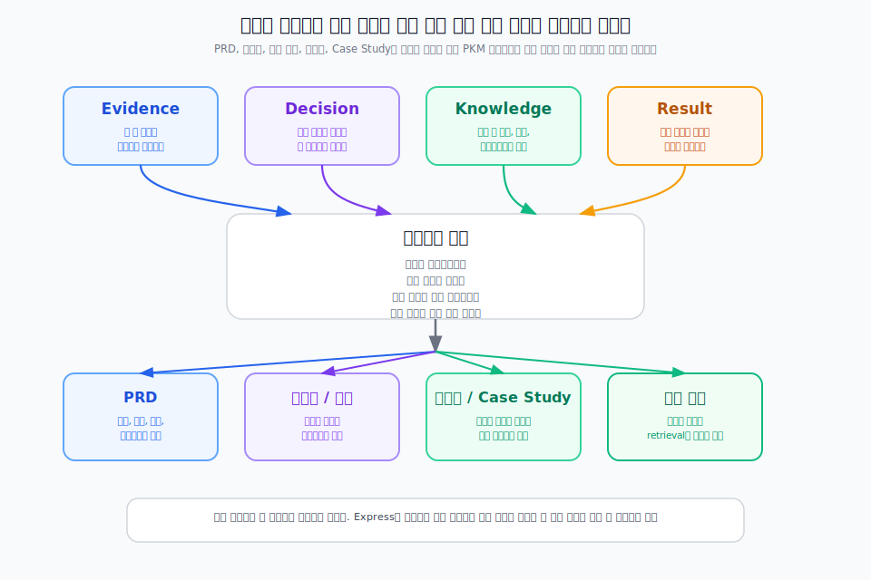

---
type: manuscript
chapter: Ch17
title: 지식을 산출물로 꺼내 쓰는 법
part: PART6
status: active
version: v2
created: 2026-03-26
updated: 2026-03-31
publish: true
publish_section: pkm
publish_order: 82
based_on: ch13-객체설계-draft.md, step05-AI연결-draft.md, ch23-자산화-draft.md
---

# 17장. 지식을 산출물로 꺼내 쓰는 법

개인지식관리가 잘 작동하면 결과물 작성 방식도 바뀐다.  
예전에는 산출물을 만들 때 필요한 정보를 다시 수집하고, 회의를 다시 열고, 예전 결정을 다시 기억해내야 했다.  
하지만 PKM이 쌓이면 결과물은 처음부터 새로 쓰는 문서가 아니라, 이미 축적된 판단 재료를 조합하는 문서가 된다.

> **[도식: fig-express-output-composition]** — 산출물은 빈 화면에서 새로 쓰는 문서가 아니라, 축적된 판단 재료를 조합해 꺼내는 출력이다
> 

## PRD는 요구사항 목록이 아니라 근거가 연결된 문서여야 한다

좋은 PRD는 기능 설명만 있는 문서가 아니다.  
왜 이 기능이 필요한지, 어떤 근거 위에서 이 방향을 택했는지, 어떤 제약 안에서 설계했는지가 보여야 한다.

그래서 PKM 기반 PRD는 보통 이런 흐름을 가진다.

- Problem Brief 또는 문제 정의
- 관련 Evidence Note
- 핵심 Decision Log
- 관련 도메인/기술 지식
- 요구사항과 예외 처리

이 구조가 있으면 PRD는 단순 지시서가 아니라 맥락 있는 실행 문서가 된다.  
작성자 본인이 아니어도 읽는 사람이 의도를 이해하기 쉬워진다.

## 제안서와 보고 문서는 재설명 가능한 판단을 꺼내는 문서다

제안서나 보고 문서도 마찬가지다.  
표면적으로는 발표용 문서처럼 보여도, 실제로는 이전 판단과 근거를 재설명하는 형식이다.

예를 들어 제안서에서는 왜 이 문제를 이렇게 정의했는지, 왜 이 접근이 적합한지, 어떤 사례와 데이터가 이를 지지하는지가 중요하다.  
보고 문서에서는 지금까지 어떤 결정이 내려졌고 무엇이 남은 리스크인지가 중요하다.

이런 문서를 잘 쓰려면 새로운 표현력보다 기존 근거와 결정을 정확하게 꺼내는 능력이 더 중요하다.  
즉 Express는 글솜씨보다 retrieval과 조합의 문제에 더 가깝다.

## 온보딩 문서와 Case Study는 재사용 지식을 확산시키는 형식이다

온보딩 문서는 팀의 반복 기준을 새 사람에게 빠르게 전달하는 형식이다.  
Case Study는 특정 프로젝트 경험에서 재사용 가능한 패턴을 꺼내 보여주는 형식이다.

둘 다 단순 요약 문서로 만들면 금방 낡는다.  
온보딩 문서는 실제 Decision Log, 체크리스트, 가이드와 연결되어야 하고, Case Study는 문제, 접근, 결과, 재사용 패턴이 분리되어 있어야 한다.

이렇게 만들어야 다음 사람도 "무슨 일이 있었나"를 넘어서 "다음에 어떻게 해야 하나"를 배울 수 있다.

## 산출물은 종류가 달라도 Express의 기본 구조는 같다

표면 형식은 다르지만 Express 단계의 기본 구조는 크게 다르지 않다.

- 무엇을 해결하려는가
- 어떤 근거가 있는가
- 어떤 결정이 이미 내려졌는가
- 어떤 지식을 다시 써야 하는가
- 무엇을 지금 산출물로 표현할 것인가

이 구조가 유지되면 PRD, 제안서, 보고 문서, 온보딩 문서, Case Study가 서로 완전히 다른 작업처럼 느껴지지 않는다.  
모두 같은 PKM 시스템에서 나온 다른 형태의 출력으로 보이기 시작한다.

## 좋은 산출물은 새로 쓰는 문서가 아니라 조합한 결과다

기획자가 매번 빈 문서에서 시작하면 속도도 느리고 품질도 흔들린다.  
반대로 관련 Evidence, Decision, Knowledge, Result를 이미 잘 관리하고 있다면, 산출물 작성은 필요한 조각을 적절히 꺼내 조합하는 일로 바뀐다.

이 전환이 중요하다.  
그래야 PKM이 진짜 생산성 시스템이 된다.  
저장만 잘하는 시스템이 아니라, 결과물의 품질과 속도를 바꾸는 시스템이 되어야 하기 때문이다.

## 산출물의 품질은 입력보다 컨텍스트 품질에 더 좌우된다

AI 시대에는 더 그렇다.  
초안 생성 속도 자체는 더 이상 큰 차별점이 아니다.  
누가 더 나은 맥락을 조합해서 넘길 수 있는지가 차이를 만든다.

같은 "PRD를 써줘"라도 근거와 결정이 없는 요청은 흔한 초안을 낳고, 컨텍스트 패키지가 있는 요청은 실행 가능한 초안을 낳는다.  
즉 Express 단계에서 기획자의 경쟁력은 쓰는 속도보다, 꺼내는 맥락의 품질에 있다.

## 이 장의 결론

Express는 글솜씨보다 retrieval과 조합의 문제에 가깝다. PRD든 제안서든 보고 문서든, 형식은 달라도 기본 구조는 같다. 무엇을 해결하려 하는지, 어떤 근거가 있는지, 어떤 결정이 이미 내려졌는지, 어떤 지식을 다시 써야 하는지. 이 구조가 유지되면 모든 산출물이 같은 PKM 시스템에서 나온 다른 형태의 출력으로 보이기 시작한다.

AI 시대에 산출물 품질을 결정하는 것은 초안 생성 속도가 아니라 어떤 맥락을 얼마나 잘 조합해 넘기는가다. 다음 장에서는 이 과정에서 AI가 검색·조합·초안 작성·비평·대안 비교를 어떻게 도울 수 있는지 정리한다.
