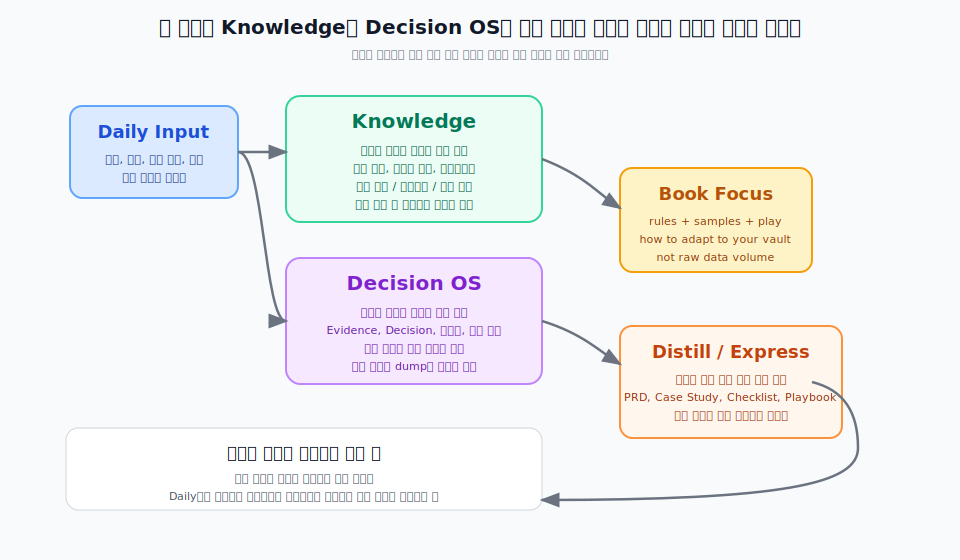

---
type: manuscript
chapter: Ch21
title: 책에서 다루는 Knowledge와 Decision OS
part: PART7
status: active
version: v2
created: 2026-03-26
updated: 2026-03-30
publish: true
publish_section: pkm
publish_order: 93
based_on: Knowledge README, Decision OS README, project README, user direction for 원고V2
---

# 21장. 책에서 다루는 Knowledge와 Decision OS

이 책에서 `Knowledge`와 `Decision OS`는 두 가지 역할을 동시에 한다.
하나는 기획자의 개인지식관리가 어떻게 작동하는지 보여주는 사례이고,
다른 하나는 독자가 자기 환경에서 비슷한 구조를 만들어갈 때 참고할 수 있는 기준이다.

> **[도식: fig-knowledge-decision-book-scope]** — Knowledge와 Decision OS를 자기 환경으로 옮기는 이식 경로
> 

이 두 시스템을 이식할 때 중요한 것은 구조의 복사가 아니라 원리의 이해다.
파일 이름, 폴더 구조, 속성 이름을 그대로 따라 해도 운영 방식을 이해하지 못하면 곧 작동을 멈춘다.
반대로 원리를 이해하면 자기 환경의 도구와 상황에 맞게 변형해서 운영할 수 있다.

## 이식의 출발점은 구조가 아니라 질문이다

Knowledge와 Decision OS를 자기 환경에 옮기기 전에 먼저 스스로에게 물어야 할 것이 있다.

- 나는 어떤 기준으로 근거와 의사결정을 구분하고 있는가?
- 지금 내가 쌓고 있는 지식 중 다음 프로젝트에서 다시 쓸 수 있는 것은 무엇인가?
- Daily 노트에서 들어오는 입력을 어떻게 분류하고 어디로 보내고 있는가?
- 오래된 결정을 다시 꺼낼 때 어디를 보면 되는가?

이 질문에 답하기 어렵다면, 현재 상태가 이식의 시작점이다.
완성된 시스템을 옮기는 것이 아니라, 지금 막히는 지점을 해결하는 방식으로 구조를 가져오면 된다.

## Knowledge는 분류 기준과 성장 방식이 핵심이다

`Knowledge`의 원리 자체는 Ch6에서 이미 설명했다.
이 장에서 중요한 것은 그 정의를 반복하는 것이 아니라, 자기 환경에서 얼마나 작은 단위로 시작할 수 있는가다.

처음부터 용어, 개념, 산출물, 표기법, 프레임워크, 기법, 체크리스트 축을 모두 만들 필요는 없다.
지금 가장 자주 참조하는 노트 유형 한두 개만 먼저 잡고, 그 안에서 쌓이기 시작하면 된다.

이식에서 더 중요한 것은 축의 개수보다 판단 기준이다.
같은 개념이 들어왔을 때 기존 노트를 업데이트할지, 새 노트를 만들지, 일단 보류할지를 일관되게 판단할 수 있어야 한다.
즉 Knowledge 이식의 핵심은 완전한 분류표를 만드는 것이 아니라, 재사용 지식이 흐트러지지 않게 성장 규칙을 먼저 세우는 데 있다.

## Decision OS는 상태 관리와 근거 연결이 핵심이다

`Decision OS`의 원리도 Ch5에서 이미 설명했다.
여기서 강조할 것은 전체 구조를 복사하는 것이 아니라, 자기 환경에서 무엇을 최소 단위로 재현할 것인가다.

가장 먼저 필요한 것은 두 가지다.
결정에 상태를 붙이는 것과, 그 결정이 어떤 근거에서 나왔는지 다시 올라갈 수 있게 연결하는 것이다.

이 두 가지만 있어도 과거 결정과 현재 결정을 구분할 수 있고, 왜 그런 판단을 했는지 다시 설명할 수 있다.
도구는 Obsidian이어도 되고, 노션이어도 되고, 스프레드시트여도 된다.
형식은 달라도 `상태 관리`와 `근거 연결`이 재현되면 Decision OS의 역할은 살아난다.

## 자기 환경 이식의 세 가지 경로

이 책의 구조를 자기 환경으로 가져오는 현실적인 경로는 세 가지다.

첫 번째 경로는 Daily 노트 입력부터 시작하는 것이다.
Daily Log에서 사실과 결정과 지식 후보를 구분하는 것만 먼저 해도 시스템의 기초가 생긴다.
분류가 안정되면 그 다음에 Decision Log와 Knowledge Note를 만들면 된다.

두 번째 경로는 자주 쓰는 산출물에서 시작하는 것이다.
PRD를 자주 쓴다면 PRD 관련 Evidence와 Decision을 먼저 구조화한다.
자주 쓰는 산출물 주변의 지식부터 정리하면 시스템이 실제 업무와 연결된다.

세 번째 경로는 반복되는 질문에서 시작하는 것이다.
같은 질문이 다시 나올 때마다 짜증스럽다면, 그 질문의 답을 Knowledge Note로 만들면 된다.
이 방식은 이식이 아니라 생성에 가깝지만, 결국 비슷한 구조에 도달한다.

## 완성보다 재개가 중요하다

Knowledge와 Decision OS를 처음부터 완성된 형태로 이식하려 하면 대부분 실패한다.
노트 분류가 너무 복잡해지거나, 메타데이터 설계에 시간을 다 쓰거나, 아직 채워지지 않은 구조가 부담이 된다.

더 현실적인 방식은 작게 시작하고 빠르게 쓰기 시작하는 것이다.
쓰다 보면 부족한 부분이 보이고, 그 지점에서 구조를 보완하면 된다.
BASE에서 제공하는 샘플은 그 시작을 돕기 위한 최소 단위다.

중요한 것은 완성된 시스템을 갖추는 것이 아니라, 멈췄다가도 다시 돌아올 수 있는 구조를 만드는 것이다.

## 이 장의 결론

이식의 핵심은 구조의 복사가 아니라 원리의 이해다. `Knowledge`와 `Decision OS`가 각각 무엇인지는 Ch6과 Ch5에서 이미 다뤘고, 이 장에서는 그것을 자기 환경에서 어떤 최소 단위로 시작할지에 집중해야 한다.

완성된 시스템을 한 번에 이식하려 하면 대부분 실패한다. Daily 노트 입력 분류, 자주 쓰는 산출물 주변, 또는 반복되는 질문 중 하나에서 시작해 쓰면서 구조를 보완하는 것이 더 현실적이다. 다음 장에서는 이렇게 쌓인 지식을 체크리스트, 플레이북, BPMN, DMN 같은 실행 가능한 자산으로 전환하는 방법을 살펴본다.
