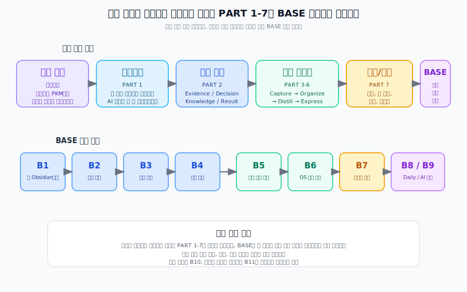

---
publish: true
publish_section: pkm
publish_order: 10
cssclasses: [hide-folder-listing]
title: AI 시대 기획자의 PKM
---

# 프롤로그. AI 시대 기획자의 PKM

> 전체 원고 구조와 도식 목록은 [목차](confirmed-toc)에서 한 번에 볼 수 있다.

이 책의 질문은 하나다.  
기획자는 개인지식관리(PKM)로 무엇을 어떻게 관리해야 하는가.

이 책의 답도 분명하다.  
AI 시대 기획자는 메모를 많이 남기는 사람이 아니라, 근거, 결정, 재사용 지식, 실행 결과를 관리하는 사람이다.  
이 지식은 맥락, 도메인, 기술이해, 관계의 네 영역으로 자라고, Capture → Organize → Distill → Express의 흐름으로 관리된다.

이 책은 결국 이 한 문장을 풀어 설명하는 책이다.

> **[도식: fig-book-reading-path]** — 본문 흐름과 BASE 실습 흐름을 함께 보는 읽기 경로
> 

실행 쪽부터 먼저 따라가고 싶은 독자라면 BASE를 `B1 → B2 → B3 → B4 → B5 → B6 → B7 → B8/B9` 순서로 읽으면 된다. 도구 선택 이유를 이해하고, 최소 세팅과 개념을 잡고, 볼트 구조와 핵심 샘플을 본 뒤, 샘플을 템플릿과 Daily 노트 운영으로 옮기는 흐름이다.

많은 기획자가 기록을 열심히 남긴다.
회의 메모, 화면 캡처, 문서, 태스크, 채팅 로그는 계속 쌓이지면 시간이 지나면 다시 꺼내 쓸 수 있는 것은 의외로 적다.  
무엇을 봤는지는 남아 있어도 왜 그렇게 판단했는지는 흐려지고, 무엇을 결정했는지는 남아 있어도 어떤 근거에서 나온 결정인지는 끊어진다.  
그래서 다음 프로젝트가 시작되면 비슷한 고민을 다시 처음부터 하게 된다.

문제는 기록량이 부족해서가 아니다.  
개인지식관리의 관리 대상이 분명하지 않고, 기록이 판단의 흐름으로 연결되지 않기 때문이다.

기획자의 일은 정보를 많이 모으는 일이 아니라 판단을 만드는 일이다.  
더 정확히 말하면, 기획자의 개인지식관리는 판단의 재료가 되는 근거를 모으고, 실제 선택과 합의의 흔적인 결정을 남기고, 그 과정에서 반복해서 쓸 수 있는 지식을 축적하고, 실행 결과에서 다시 배우는 운영 방식이어야 한다.  
메모는 이 과정을 돕는 도구일 뿐, 목적이 아니다.

AI가 들어오면서 이 문제는 더 선명해졌다.  
예전에는 문서를 쓰는 속도가 병목이었다.  
지금은 초안을 만드는 속도보다, 어떤 근거를 넣었는지, 어떤 결정을 이어받았는지, 어떤 제약과 맥락을 반영했는지를 관리하는 일이 더 중요해졌다.  
AI는 빠르게 써줄 수 있지만, 무엇을 왜 써야 하는지까지 대신 판단해 주지는 않는다.  
좋은 결과물은 여전히 인간이 구조화해 둔 지식 위에서 나온다.  
그래서 AI 시대의 기획자는 더 많이 적는 사람이 아니라, 더 잘 남기고 더 잘 연결하는 사람이어야 한다.

이 책이 다루는 관리 대상은 네 가지다. 근거, 결정, 재사용 지식, 실행 결과다.
이 네 가지가 하나의 순환을 이룰 때 PKM은 예쁜 보관함에서 벗어나 판단 인프라가 된다.
각각이 무엇이고 어떻게 연결되는지는 PART 2에서 자세히 다룬다.

이 지식은 네 영역에서 자란다. 맥락, 도메인, 기술이해, 관계다.
같은 기능을 보더라도 이 네 영역이 연결될 때 기획자의 판단은 달라진다.
이 영역들이 왜 중요한지는 PART 2에서 함께 설명한다.

이제 남는 질문은 하나다.
기획자는 이 지식을 어떻게 관리해야 하는가.

이 책은 그 흐름을 네 단계로 설명한다.
Capture는 하루의 입력을 놓치지 않고 받는 단계다.
Organize는 들어온 입력에 구조를 부여하는 단계다.
Distill은 흩어진 기록에서 재사용 가능한 기준을 끌어올리는 단계다.
Express는 축적된 지식을 실제 산출물로 꺼내 쓰는 단계다.
각 단계의 구체적인 방법은 PART 3부터 PART 6에서 순서대로 설명한다.

AI는 이 네 단계에서 서로 다른 방식으로 쓰인다.
하지만 이 책은 AI를 만능 답안 생성기로 다루지 않는다.
AI는 기획자가 관리해 둔 지식을 더 잘 꺼내고 더 빨리 조합하도록 돕는 협업자다.
어떤 단계에서 무엇을 맡기고, 무엇은 기획자가 최종 책임져야 하는지는 각 파트에서 함께 다룬다.

이 책에서 Knowledge와 Decision OS는 중요한 위치를 차지한다.  
다만 그것을 거대한 저장소 소개로 보여주지는 않을 것이다.  
이 책의 목적은 누군가의 볼트를 구경시키는 것이 아니라, 독자가 자기 환경에서 같은 원리를 구현할 수 있게 만드는 데 있다.  
그래서 Decision OS는 근거와 결정을 연결하는 방식으로, Knowledge는 재사용 지식을 분류하고 성장시키는 방식으로 설명할 것이다.  
독자가 알아야 하는 것은 파일 개수가 아니라 판단 구조다.

결국 이 책은 네 가지 질문에 답하려고 한다.

왜 기획자에게는 이제 단순한 메모가 아니라 개인지식관리가 필요한가.  
개인지식관리로 무엇을 관리해야 하는가.  
그것을 어떤 구조와 흐름으로 관리해야 하는가.  
그리고 각 단계에서 AI를 어떻게 써야 하는가.

이 질문에 답할 수 있다면 PKM은 더 이상 생산성 취미가 아니다.  
기획자의 판단을 쌓고, 팀의 기억을 남기고, AI와 함께 더 나은 산출물을 만드는 운영 체계가 된다.

이 책은 그 운영 체계를 기획자의 언어로 설명하려는 시도다.  
무엇을 남길지, 어떻게 연결할지, 무엇을 다시 꺼내 쓸 수 있게 만들지를 함께 살펴보려 한다.  
AI 시대의 기획은 문서를 더 빨리 만드는 일에서 끝나지 않는다.  
근거를 추적하고, 결정을 기록하고, 재사용 가능한 지식을 축적하고, 실행 결과를 다시 학습하는 일까지 포함한다.

이 책이 그 구조를 시작하는 출발점이 되었으면 한다.

