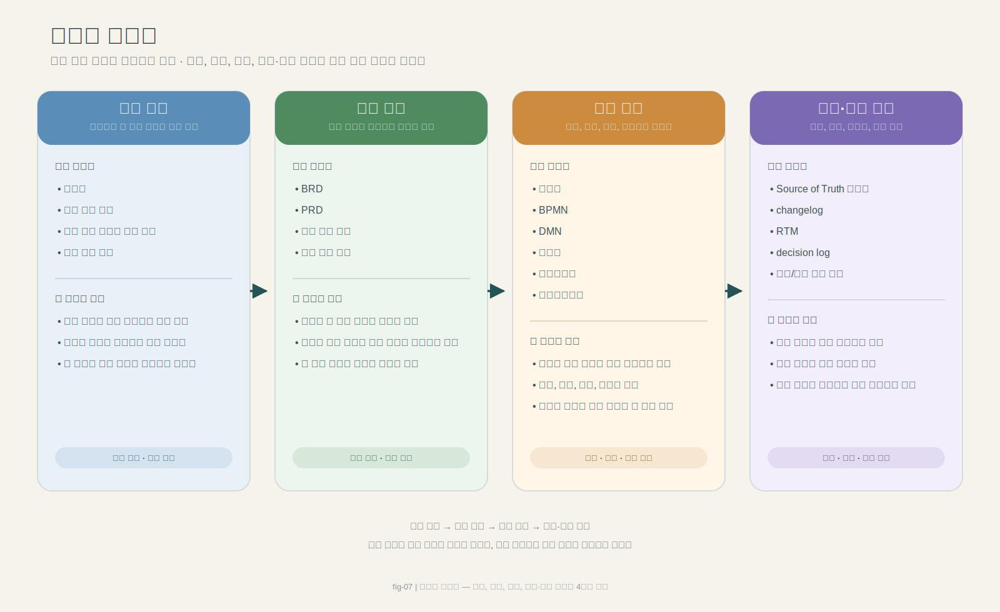

# 3장. 산출물 지형도

## 이 장의 목적

이 장은 책 전체 문서군을 한눈에 보여주는 지도 역할을 한다. 기준·입력·실행·연결·운영이라는 네 영역으로 문서를 나눠 전체 윤곽을 잡는다. 세부 경계는 다음 장부터 다룬다.

---

## 1. 문서는 많아서가 아니라 역할이 섞여서 문제다

실무에서 혼란을 만드는 것은 문서 수 자체가 아니다. 같은 문서 안에 방향, 정책, 판단, 구현, 검증이 뒤섞여 있을 때 문제가 생긴다.

문서가 섞이면 다음이 동시에 일어난다.

- 같은 정책이 여러 문서에 중복된다.
- 어떤 문서가 기준인지 불분명해진다.
- 실행 문서가 해석에 의존하게 된다.
- 검증 문서가 뒤늦게 붙으며 추적성이 끊긴다.

그래서 문서를 볼 때는 "몇 개냐"보다 "어떤 역할군으로 나뉘어 있느냐"를 먼저 봐야 한다.

---

## 2. 문서를 네 영역으로 본다

이 책은 전체 문서군을 네 영역으로 본다.

- **기준 문서**: 흔들리면 안 되는 기준과 공통 지식을 담는 문서
- **입력 문서**: 특정 과제를 시작하고 방향을 고정하는 문서
- **실행 문서**: 정책, 흐름, 판단, 구현으로 내려가는 문서
- **연결·운영 문서**: 버전, 승인, 추적성, 운영을 유지하는 문서

이 네 영역은 문서 이름을 새로 붙이는 분류가 아니라, 문서가 전체 체인에서 맡는 위치를 보여주는 분류다.

---

## 3. 네 영역의 문서군

### 3-1. 기준 문서

기준 문서는 여러 과제가 공통으로 참조하는 문서다.

- 용어집
- 공통 정책 기준
- 전사 또는 서비스 공통 원칙
- 운영 기준 문서

### 3-2. 입력 문서

입력 문서는 특정 과제를 시작하고 방향을 고정하는 문서다.

- BRD
- PRD
- 문제 정의 문서
- 범위 정의 문서

### 3-3. 실행 문서

실행 문서는 방향을 실제 동작과 구현으로 연결한다.

- 정책서
- BPMN
- DMN
- 사양서
- 프로토타입
- 테스트케이스

### 3-4. 연결·운영 문서

연결·운영 문서는 문서 체계를 유지하고 추적 가능하게 만든다.

- Source of Truth 기준표
- changelog
- RTM
- decision log
- 승인/상태 관리 문서

---

## 4. 무엇을 줄이고 무엇을 남길 것인가

줄여야 하는 것은 문서 수보다 **중복 서술**이다.

- 같은 정책 문장의 반복
- 같은 범위 설명의 재서술
- 근거 없이 복사된 예외 규칙
- 승인되지 않은 초안의 계속된 재사용

반대로 남겨야 하는 것은 다음이다.

- 방향을 고정하는 문서
- 규칙과 판단을 분리하는 문서
- 구현 가능한 기준을 남기는 문서
- 검증 가능한 결과를 남기는 문서
- 변경 추적과 승인 이력을 남기는 문서

즉, 줄이는 대상은 문서가 아니라 중복과 혼재다.

---

## 5. 전체 지형도 도식 해설

> 도식: 기준·입력·실행·연결·운영 문서가 어떻게 연결되는지를 보여주는 전체 지형도. 도식이 준비되지 않은 환경에서는 아래 흐름 설명을 기준으로 읽는다.

이 책의 문서 체인은 대체로 다음 흐름으로 읽을 수 있다.

`기준 문서 → 입력 문서 → 실행 문서 → 연결·운영 문서`

이 흐름은 선형 작업 순서만 뜻하지 않는다. 오히려 각 문서가 어떤 기준을 참조하고, 어떤 문서로 내려가며, 어떤 운영 구조 위에서 유지되는지를 함께 보여준다.

문서 레이어는 이 지형도에서 각 문서가 어떤 질문을 맡는지 나누는 축에 가깝고(4장), Source of Truth 원칙은 이 문서군을 실제로 운영할 때 기준을 고정하는 축에 가깝다(6장).

---

## 6. 이 장의 핵심 메시지

> 산출물 지형도는 문서 목록이 아니라, 기준·입력·실행·연결·운영 문서가 어떻게 분리되고 연결되는지 보여주는 지도다.

이 지도가 있어야 프로젝트마다 문서 세트를 얼마나 가져갈지 판단할 수 있다.

---

## 7. 다음 장으로의 연결

이 장에서는 전체 산출물을 어떤 영역으로 구분하고 조망해야 하는지 봤다.

이 장의 4개 영역(기준·입력·실행·연결·운영)은 문서 전체를 역할별로 묶은 큰 틀이다. 다음 장에서는 이 틀 안의 문서들을 목적과 질문 기준으로 더 세밀하게 나눈다. 거기서 나오는 7개 레이어는 이 4개 영역과 충돌하는 분류가 아니라, 실행 수준에서 문서 간 경계를 구분하기 위한 세분화다. 예를 들어 이 장의 "실행 문서" 영역은 4장에서 정책/판단, 흐름, 상세 설계, 경험, 검증 레이어로 세분된다.

이제 다음 질문이 따라온다.

> 이 큰 분류 안에서 각 문서는 어디까지 책임져야 하는가?

다음 장에서는 BRD, PRD, 정책서, BPMN, DMN, 사양서, 프로토타입, 테스트케이스가 각각 어디까지 책임져야 하는지 다룬다.

다음 장: [[04. 문서 레이어와 책임 분리|4장. 문서 레이어와 책임 분리]]
