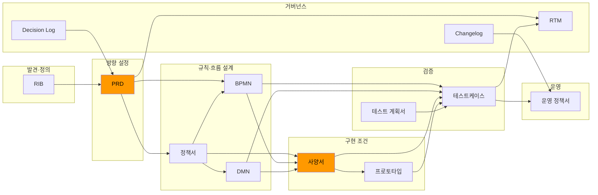

# 25장. 산출물 체인 설계

## 이 장의 목적

Part 3과 4에서 개별 산출물을 하나씩 살펴봤다. RIB, PRD, NFR, Feature Spec, Scenario, AC, 정책서, BPMN, DMN, IA, ERD, 사양서, API 명세서, 프로토타입. 이 산출물들은 각각의 역할이 있지만, 독립적으로 존재해서는 의미가 없다. 하나의 체인으로 연결되어야 비로소 실행 입력물로 작동한다.

이 장은 그 체인의 전체 구조를 보여준다. 어떤 산출물이 어떤 산출물의 입력이 되는지, 어떤 연결 지점에서 AI를 활용할 수 있는지, 어디서 체인이 끊어지기 쉬운지를 다룬다.

---

> **이 장에서 다루는 것**
> - 산출물 체인 전체 구조 (RIB → 개발/운영)
> - 체인의 각 연결 지점에서 AI 역할과 PM 책임 구분
> - 체인 설계 기준과 끊기는 지점 점검법

> 8~24장에서 개별 산출물을 하나씩 살펴봤다. 이 장은 WHAT 파트의 종합 장이다. 그 산출물들이 어떻게 하나의 체인으로 연결되는지 전체 그림을 한 번에 본다. 개별 산출물을 아는 것과 그것이 어떤 체인 위에 있는지 아는 것은 다르다.

> **전제 지식**: 8장(RIB)부터 24장(테스트케이스)까지. 이 장은 개별 산출물 장의 내용을 전제로 한다. 각 산출물의 역할과 입출력을 먼저 이해한 상태에서 읽어야 체인 전체 조감이 의미 있게 들어온다.

## 이 산출물이 왜 존재하는가

산출물 체인 설계서(Artifact Chain Design)는 프로젝트에서 생성되는 개별 산출물들이 어떤 순서로 연결되고, 서로 무엇을 주고받으며, 어디서 분기되는지를 정의하는 구조 문서다. 각 산출물의 존재를 확인하는 체크리스트가 아니라, 산출물이 다음 단계의 입력으로 안전하게 전달되는지를 설계하고 추적하기 위해 만든다.

이 산출물이 존재하는 이유는 하나다. 실무에서 프로젝트가 흔들리는 원인은 대부분 문서 부재가 아니라 문서 간 연결 실패다.

PRD는 있는데 정책서와 연결이 끊기고, 정책서는 있는데 BPMN/DMN으로 분리되지 않고, DMN은 있는데 테스트케이스에 반영되지 않는다. 산출물 체인 설계서는 이 연결 실패를 사전에 설계하고, 실행 중에 추적하고, 변경 발생 시 영향 범위를 파악하기 위해 존재한다.

이 장은 8~24장에서 개별적으로 설명한 산출물들을 하나의 체인 관점으로 묶어 조감한다. 체인 내 변경 추적과 RTM 운영은 27장에서, PRD의 구조적 재해석은 15장에서 다뤘다.

이 장을 읽고 나면 다음을 이해해야 한다.

- 왜 개별 문서보다 산출물 체인이 더 중요한지
- RIB에서 PRD, 정책서, BPMN, DMN, 사양서, 프로토타입, 테스트케이스, 개발/운영 문서까지 어떤 순서와 역할로 이어지는지
- 각 문서가 다음 문서에 무엇을 넘겨줘야 하는지
- 흐름은 BPMN으로, 판단은 DMN으로, 구현 조건은 사양서로, 경험 검토는 프로토타입으로, 검증은 테스트케이스로 어떻게 분기되는지
- AI를 쓸 때 무엇을 자동화하고 무엇을 사람이 직접 보증해야 하는지

---

## 1. 왜 문서 목록이 아니라 체인으로 봐야 하는가

실무에서는 보통 다음처럼 말한다.

- PRD도 있다
- 정책서도 있다
- BPMN도 있다
- 사양서도 있다
- 테스트케이스도 있다

문서가 "있다"는 사실만으로는 아무것도 보장되지 않는다. 실제로 프로젝트가 흔들리는 이유는 문서가 없어서가 아니라, 문서들이 서로 이어지지 않기 때문이다.

예를 들어:

- RIB에서 정리한 문제 정의가 PRD에서 흐려진다.
- PRD의 범위가 정책서와 다르게 해석된다.
- 정책서의 규칙이 BPMN/DMN으로 충분히 분리되지 않는다.
- BPMN의 예외 흐름이 사양서에서 빠진다.
- DMN의 판단 규칙이 테스트케이스에 반영되지 않는다.
- 사양과 프로토타입은 있는데 운영 FAQ는 갱신되지 않는다.

즉 산출물의 품질은 개별 문서 완성도보다 "이 문서가 다음 문서의 입력으로 안전하게 전달되는가"에 달려 있다.

---

## 2. 이 책이 말하는 기본 산출물 체인


> 도식: RIB에서 개발/운영까지 이어지는 전체 산출물 체인 흐름도. PRD와 사양서(Spec)가 주황색으로 강조된 허브 산출물이다.
> 📁 `Process with ai/figures/fig-22-artifact-chain.svg`

이 책이 제안하는 기본 체인은 다음과 같다.

**RIB → PRD → 정책서 → BPMN → DMN → 사양서 → 프로토타입 → 테스트케이스 → 개발/운영 문서**

이를 질문 중심으로 풀면 다음과 같다.

- RIB: 어떤 문제를 어떤 맥락에서 풀 것인가
- PRD: 무엇을 만들 것인가
- 정책서: 어떤 규칙과 예외를 적용할 것인가
- BPMN: 어떤 흐름과 역할로 처리할 것인가
- DMN: 어떤 조건에서 어떤 판단을 내릴 것인가
- 사양서: 그것을 어떤 상태, 메시지, 인터페이스로 구현할 것인가
- 프로토타입: 사용자는 그것을 어떻게 경험할 것인가
- 테스트케이스: 그 결과가 실제로 맞는지 어떻게 검증할 것인가
- 개발/운영 문서: 실제 실행과 운영에 어떻게 반영할 것인가

여기서 중요한 것은 "문서 순서" 자체보다 "질문이 단계적으로 바뀐다"는 점이다.

### 산출물 체인 전체 다이어그램



이 다이어그램에서 PRD와 사양서(SPEC)가 주황으로 강조된 이유는 이 두 산출물이 체인의 허브 역할을 하기 때문이다. PRD는 10개 산출물로 분기하고, SPEC은 상위 모든 산출물을 흡수해 개발로 전달한다.

---

## 2-1. 체인 전체를 처음부터 갖출 필요는 없다

이 다이어그램을 처음 보면 당연히 이 질문이 나온다.

> "이걸 다 만들면 기획에만 몇 달이 걸리는 것 아닌가?"

답부터 말하면: 그렇지 않다. 체인은 한 번에 전부 작동시키는 시스템이 아니라, 필요한 지점부터 추가해나가는 구조다.

체인을 규모별로 세 단계로 나눌 수 있다.

### 핵심 체인 (3개) — 어떤 팀이든 이것은 있어야 한다

**RIB → PRD → 사양서**

이 세 개가 없으면 다음 단계 담당자가 혼자 시작할 수 없다.

- RIB가 없으면 PRD의 문제 정의가 약하다.
- PRD가 없으면 사양서가 무엇을 위한 조건인지 불분명하다.
- 사양서가 없으면 개발자가 스스로 판단을 채워야 한다.

이 세 개만으로도 외주 개발·소규모 팀·빠른 MVP 상황에서 체인이 작동한다.

### 표준 체인 (6개) — 복잡도가 올라가면 이 범위로 확장한다

**RIB → PRD → 정책서 → BPMN or DMN → 사양서 → 테스트케이스**

판단 규칙이 4개 이상이거나, 역할이 둘 이상이거나, 예외 케이스가 5개 이상이면 정책서와 BPMN/DMN이 필요하다. 이 시점부터 "구두로 결정하면 안 되는 기준"이 생기기 때문이다.

BPMN과 DMN은 둘 다 필요한 게 아니다. 흐름 복잡도가 높으면 BPMN, 판단 조건이 복잡하면 DMN을 우선 추가한다.

### 전체 체인 (12개+) — 팀 규모와 추적 요구에 따라 선택 추가한다

RTM, Decision Log, Changelog, 테스트 계획서, OPD는 "없으면 당장 개발이 안 되는" 산출물이 아니다. 팀 규모가 커지고, 변경 빈도가 높아지고, 외부 감사 또는 인수인계 상황이 생길 때 추가한다.

이 원칙은 부록에서 팀 유형별로 더 구체적으로 다룬다. → [[appendix-minimal-set-v1]]

**체인 크기 결정 기준 요약:**

| 상황 | 권장 체인 규모 | 필수 산출물 |
|---|---|---|
| 1인 + 외주 / MVP | 핵심 체인 | RIB, PRD, 사양서 |
| 스타트업 3~5인 / 중간 복잡도 | 표준 체인 | + 정책서, BPMN or DMN, TC |
| 스크럼 팀 / 복잡 비즈니스 규칙 | 표준 체인 + α | + 프로토타입, DoR/DoD |
| 중형 조직 / 추적·감사 필요 | 전체 체인 | + RTM, Decision Log, OPD |
| 레거시 고도화 | 변경 범위 한정 체인 | As-is 복원 후 해당 산출물만 |

즉 이 책이 제시하는 전체 체인은 이상형이 아니라 **가장 복잡한 상황의 최대 범위**다. 어떤 팀도 첫날부터 전부 갖출 필요는 없다.

---

## 2-2. 이 체인은 워터폴인가

산출물에 순서가 있다는 것을 보고 워터폴 방법론과 혼동하는 경우가 있다. 이 질문은 타당하다. 그러나 이 체인은 워터폴이 아니다. 차이는 하나의 기준으로 설명된다.

**워터폴**: 이전 단계가 완전히 완료되어야 다음 단계가 시작된다.

**이 체인**: 다음 단계 담당자가 시작할 수 있을 만큼 충분하면 다음으로 넘긴다.

PRD가 100% 완성되어야 정책서를 쓰는 게 아니다. PRD의 핵심 방향과 범위가 정리되어 정책서 담당자가 규칙을 구체화할 수 있으면 넘긴다. 정책서가 완성되어야 BPMN을 그리는 게 아니다. 처리해야 할 주요 흐름과 예외 유형이 보이면 BPMN 초안을 시작한다. 체인은 순서가 있는 논리적 의존 관계이지, 각 단계의 완성도를 기다리는 게이트가 아니다.

### 스프린트 팀이 이 체인을 쓰는 방식

스크럼 팀이 이 체인을 쓴다면 실제 작동 방식은 이렇다.

**스프린트 이전 (백로그 정제 단계)**

RIB를 바탕으로 PRD Feature 목록과 우선순위를 정한다. 이 시점의 정책서와 사양서는 핵심 규칙만 담은 1~2페이지 초안이다.

**스프린트 1~2일 (스프린트 시작)**

해당 스프린트의 Feature를 대상으로 Scenario와 AC를 확정한다. 동시에 정책서의 관련 규칙과 BPMN 흐름을 초안 수준으로 완성한다. DoR(Definition of Ready)을 통과하면 개발이 시작된다.

**스프린트 중반 (개발 진행 중)**

개발하면서 드러나는 예외 케이스를 정책서와 DMN에 추가한다. 사양서의 오류 코드와 상태 전이를 구체화한다.

**스프린트 말미 (검증)**

TC를 완성하고 DoD 기준으로 완료를 판단한다.

이 방식에서 산출물은 스프린트 내에서 점진적으로 보완된다. 전체 체인이 스프린트 1개 안에서 완결되는 것이 아니라, 해당 스프린트 범위에 맞는 축소 체인이 작동하는 것이다.

### 이 체인이 워터폴과 다른 세 가지 이유

첫째, 산출물은 완성본이 아니라 다음 단계를 여는 충분한 수준이면 된다. "이 정도면 BPMN 그릴 수 있다", "이 정도면 개발 시작할 수 있다"가 기준이지, 문서 완성도 100%가 기준이 아니다.

둘째, 발견된 내용은 앞 단계 산출물로 다시 올라간다. 개발 중 드러난 예외는 정책서로, 운영 이슈는 다음 RIB로 환류된다. 워터폴은 앞 단계로 돌아가는 것을 비용으로 보지만, 이 체인은 환류를 구조적으로 설계한다.

셋째, 산출물의 상세도는 복잡도에 따라 다르다. 단순한 기능은 RIB + PRD + 사양서 3개로 스프린트를 진행하고, 복잡한 기능은 표준 체인 6개를 쓴다. 같은 팀이 같은 스프린트에서도 기능별로 다른 체인 규모를 적용할 수 있다.

---

## 3. 각 문서는 다음 단계에 무엇을 넘겨줘야 하는가

산출물 체인을 실무적으로 설계하려면 각 문서가 다음 문서에 넘겨주는 입력을 명시해야 한다.

| 산출물 | 다음 단계로 넘기는 것 | 한 줄 요약 |
|---|---|---|
| RIB | 문제 정의, 이해관계자, 제약, 범위 초안 | 문제와 맥락 입력 |
| PRD | 기능 범위, 시나리오, 우선순위, 성공 기준 | 무엇을 어디까지 |
| 정책서 | 기본 규칙, 허용/차단 기준, 예외 규칙, 상태별 처리 | 규칙과 예외 기준 |
| BPMN | 정상 흐름, 예외 흐름, 역할 전환, 운영 개입 | 흐름과 책임 구조 |
| DMN | 입력 조건, 규칙 조합, 결과값 | 판단 규칙 |
| 사양서 | 상태값, 메시지, 인터페이스 조건, 예외 처리 | 구현 조건 |
| 프로토타입 | 화면 구조, 상호작용 흐름, 상태 표현 방식 | 경험 검토 결과 |
| TC | 전제 조건, 정상/예외 케이스, 기대 결과 | 검증 기준 |
| RTM | 요구사항-TC-결과 추적 | 추적 가능성 |
| 운영 정책서 | 운영 이슈 패턴, 대응 기준 | 다음 체인 입력 |

---

## 복잡도별 병렬 진행 조합: 사양서·프로토타입·TC

사양서·프로토타입·테스트케이스는 체인의 마지막 실행 구간을 구성한다. 세 산출물은 모두 BPMN/DMN/정책서를 입력으로 받는다는 공통점이 있지만, 서로 간에도 의존 관계가 있다. 이 의존 관계를 무시하면 두 가지 문제가 생긴다.

- **너무 일찍 병렬**로 돌리면: 사양서의 상태값·메시지가 확정되기 전에 프로토타입의 오류 화면이 완성되거나, 사양서의 입력 조건이 정해지기 전에 TC의 기대결과가 추정으로 채워진다.
- **너무 늦게 병렬**로 돌리면: 단순 기능에도 모두 순차 대기하느라 일정이 불필요하게 늘어난다.

올바른 기준은 "복잡도에 따라 의존 관계의 엄격성이 달라진다"는 것이다.

---

### 세 산출물의 의존 관계 원칙

어떤 복잡도이든 다음 두 분류는 고정된다.

**순차가 필요한 의존 관계 (3가지)**

| 선행 완성 조건 | 후행 작업 | 이유 |
|---|---|---|
| 사양서 상태값·메시지 확정 | 프로토타입 오류 상태·안내 문구 작성 | 메시지가 미확정이면 프로토타입과 운영 UI가 불일치 |
| 사양서 입력 조건·기대 결과 확정 | TC 기대 결과 작성 | 조건이 정해지지 않은 기대 결과는 추정이며, 구현 완료 후 수정 비용이 크다 |
| 프로토타입 UX 흐름 확정 | TC UX 경로 케이스 작성 | 화면 흐름이 바뀌면 TC 경로 케이스가 통째로 재작성된다 |

**병렬이 가능한 조합 (3가지)**

| 병렬 조합 | 가능한 이유 | 시작 조건 |
|---|---|---|
| 사양서 Foundation ‖ 프로토타입 와이어프레임 | PRD와 핵심 시나리오만 있으면 두 작업 모두 시작 가능 | PRD Approved |
| DMN 행 → TC 케이스 목록 ‖ 프로토타입 인터랙션 | TC 구조(케이스 ID·시나리오)는 DMN에서 도출 가능. 프로토타입 인터랙션은 사양서 Feature Spec 50% 기준 | DMN Approved + 사양서 50% |
| 프로토타입 리뷰 ‖ TC 케이스 상세 작성 | 리뷰와 상세 작성은 서로 다른 영역을 다룬다 | 사양서 완성 + 프로토타입 와이어프레임 완성 |

---

### Level 1 — 단순 (판단 조건 ≤3, 역할 1개)

사양서가 50% 완성되면 프로토타입과 TC를 동시에 시작할 수 있다.

```
[사양서 Feature Spec 작성]
        │
        ├─ (50% 시점) ──→ [프로토타입 와이어프레임] ══ [TC 케이스 목록]  ← 병렬
        │
        ↓ (완성)
[프로토타입 인터랙션 + 메시지 반영] → [TC 기대결과 작성]  ← 순차
        │
        ↓
[프로토타입 리뷰] ══ [TC 상세 작성]  ← 병렬
```

**적용 기준**: BPMN/DMN 불필요. 사양서 1장으로 충분한 기능.
**주의**: 사양서 메시지·상태가 확정되기 전에 프로토타입의 오류 화면을 완성하면 나중에 전면 수정이 필요하다.

---

### Level 2 — 중간 (판단 조건 4~7, 역할 2개)

정책서 또는 DMN이 확정되는 시점이 병렬 시작의 기준점이 된다.

```
[정책서 확정] + [DMN 확정]
        │               │
        ↓               ↓
[사양서 Foundation]  [TC 케이스 목록]  ← 병렬
        │
        ├─ (Foundation 완성) ──→ [프로토타입 와이어프레임]  ← 병렬 시작 가능
        │
        ↓ (Feature Spec 50%)
[프로토타입 인터랙션] ← 시작
        │
        ↓ (사양서 완성)
[TC 기대결과 작성]
        │
        ↓ (프로토타입 리뷰 완료)
[TC UX 경로 케이스 추가]
```

**적용 기준**: 정책서 or DMN 1개가 필요한 기능.
**주의**: TC 케이스 목록은 DMN 행에서 바로 뽑을 수 있지만, 기대결과는 사양서 완성 후에 채운다. 두 단계를 혼동해서 처음부터 기대결과까지 쓰면 나중에 전면 수정된다.

---

### Level 3 — 복잡 (판단 조건 ≥8, 역할 3개 이상)

BPMN 확정이 사양서 Foundation과 프로토타입 시작의 게이트가 된다. 순차 구간이 가장 엄격하다.

```
[BPMN 확정]           [DMN 확정]
      │                     │
      ↓                     ↓
[사양서 Foundation 작성]  [TC 구조 + 케이스 목록]  ← 병렬
      │
      ↓ (Foundation 완성)
[사양서 Feature Spec 작성]  ← 시작
      │
      ├─ (Feature Spec 50%) ──→ [프로토타입 와이어프레임]  ← 병렬 시작
      │
      ↓ (Feature Spec 완성)
[프로토타입 인터랙션 + 메시지 반영]  ← 시작
[TC 기대결과 작성]  ← 시작
      │                         │
      ↓ (리뷰 완료)              ↓ (완성)
[TC UX 경로 케이스 추가] ════ [TC 전체 검토]  ← 병렬
```

**적용 기준**: BPMN + DMN이 모두 필요한 기능. 역할이 3개 이상이고 예외 흐름이 복잡한 케이스.
**주의**: 프로토타입을 BPMN 전에 시작하면 역할 분기(운영자 Lane 등)가 반영 안 된 흐름이 완성될 수 있다. Level 3에서 병렬 범위를 Level 1처럼 넓히면 후반에 재작업 비용이 급증한다.

---

### 흔한 실수 두 가지

**단순 기능에 Level 3 방식을 적용하는 경우**

"BPMN이 완성되어야 사양서를 쓰고, 사양서가 완성되어야 프로토타입을 시작한다"는 규칙을 복잡도와 무관하게 적용하면, 판단 조건이 2개인 기능에도 순차 대기가 생겨 1~2주가 낭비된다.

**복잡한 기능에 Level 1 방식을 적용하는 경우**

프로토타입과 TC를 사양서 50% 시점에 동시에 시작했는데, 그 기능이 실제로 BPMN 역할 분기가 있는 복잡 케이스라면, 프로토타입의 운영자 화면과 TC의 역할 분기 케이스 모두 나중에 전면 수정된다.

---

### 복잡도 판단 기준 한눈에 보기

| 복잡도 | 병렬 시작 기준점 | 순차 필수 구간 |
|---|---|---|
| **단순** (조건 ≤3) | 사양서 50% | 상태·메시지 확정 → 프로토타입 오류 화면 |
| **중간** (조건 4~7) | DMN 확정 + 사양서 Foundation 완성 | 사양서 완성 → TC 기대결과 / 프로토타입 리뷰 → TC UX 케이스 |
| **복잡** (조건 ≥8) | BPMN + DMN 모두 확정 | Feature Spec 50% → 프로토타입 인터랙션 / 사양서 완성 → TC 기대결과 |

---

## 4. 어디서 분기해야 하는가

이 책에서 중요한 원칙은 모든 내용을 한 문서에 다 밀어넣지 않는 것이다. 체인은 분기 지점이 분명해야 한다.

**흐름은 BPMN으로 분기한다.**

PRD나 정책서 안에 흐름 설명을 문장으로 길게 쓰는 대신, 흐름과 역할은 BPMN으로 내려야 한다. 정상/예외 경로가 드러나고, 운영 개입 지점과 역할 간 handoff가 보인다.

**판단은 DMN으로 분기한다.**

조건 조합에 따라 결과가 달라지는 규칙은 DMN으로 내려야 한다. 규칙 충돌이 줄고, DMN 행이 TC 행으로 자동 변환된다.

**구현 조건은 사양서로 분기한다.**

BPMN과 DMN이 있다고 해도 화면 메시지, 상태 전이, 인터페이스 조건은 사양서가 받아줘야 한다.

**경험 검토는 프로토타입으로 분기한다.**

문서만으로는 사용자 경험이 검토되지 않는다. 디자인 시스템과 연결된 프로토타입으로 어떻게 보이고 느껴지는지를 검토한다.

**검증은 테스트케이스로 분기한다.**

모든 설계는 결국 검증 가능해야 한다. AC만으로는 부족하고, TC로 기대 결과를 구조화해야 한다.

---

## 5. 이 체인이 없으면 어디서 끊기는가

실무에서 자주 끊기는 지점은 거의 정해져 있다.

| 끊기는 지점 | 증상 |
|---|---|
| RIB 없이 PRD로 바로 가는 경우 | 문제 정의가 약해 이후 문서가 계속 흔들린다 |
| PRD에서 정책서를 건너뛰는 경우 | 규칙과 예외가 PRD 문장 안에 섞여 구조화되지 않는다 |
| 정책/BPMN/DMN 없이 사양서로 바로 가는 경우 | 흐름과 판단이 구현 문서에 뒤섞여 재사용성이 떨어진다 |
| 사양서 없이 프로토타입/개발로 가는 경우 | 경험은 보이지만 예외 처리 기준이 약해진다 |
| TC를 너무 늦게 만드는 경우 | 설계 빈칸이 구현 버그처럼 늦게 발견된다 |
| 운영 문서로 연결하지 않는 경우 | 운영 이슈가 다음 입력 자산으로 반영되지 않는다 |

---

## 6. 체인 관점에서 보면 중복이 줄어든다

산출물 체인을 싫어하는 팀은 "문서가 너무 많아진다"고 느끼기 쉽다. 실제로는 반대다. 체인 관점이 없을 때 문장이 여러 문서에 중복된다.

- 규칙이 PRD, 정책서, 사양서, FAQ에 장문으로 반복된다.
- 예외가 정책서와 테스트케이스에서 다르게 표현된다.
- 운영 문구가 프로토타입과 FAQ에서 어긋난다.

체인 관점으로 보면 각 문서는 자기 역할만 맡고, 나머지는 참조로 넘길 수 있다. 즉 문서 수가 늘어나는 것이 아니라, 문서 간 중복과 충돌이 줄어든다.

---

## 7. AI를 쓸 때 이 체인이 왜 더 중요해지는가

AI는 문서를 많이, 빨리 만든다. 그래서 체인이 약하면 오류도 빨리 증폭된다.

### 7-1. AI 워크플로: 체인을 따라 단계적으로 연결하기

**1단계: RIB → PRD 연결 확인**

```
아래 RIB 문서의 문제 정의, 범위 초안, 열린 질문을 바탕으로
PRD에서 다뤄야 할 기능 후보 목록을 만들어줘.
RIB에서 명확히 결정되지 않은 항목은 PRD 열린 질문으로 이전해줘.

[RIB 문서 붙여넣기]
```

**PM 확인:** PRD 기능 후보가 RIB 문제 정의와 실제로 연결되는지, 이전된 열린 질문이 빠지지 않았는지.

**2단계: 정책서 → BPMN / DMN 분류**

```
아래 정책서에서 규칙 항목을 검토해줘.
흐름(순서, 역할 전환, 운영 개입)이 필요한 항목은 BPMN 후보로,
조건 조합에 따라 결과가 달라지는 항목은 DMN 후보로 분류해줘.
둘 다 해당하거나 판단이 어려운 항목은 별도 표로 보여줘.

[정책서 규칙 목록 붙여넣기]
```

**PM 확인:** 분류된 항목 중 BPMN/DMN으로 내리기에 복잡도가 너무 낮은 항목(사양서 직행이 나은 경우) 식별.

**3단계: 체인 전체 불일치 점검**

```
아래 산출물 목록을 검토해줘.
각 산출물의 핵심 내용(범위, 규칙, 흐름 판단 기준)을 비교해서
서로 충돌하거나 불일치하는 항목을 찾아줘.
항목별로 어느 산출물이 Source of Truth가 되어야 하는지 제안해줘.

[PRD 주요 항목]
[정책서 주요 규칙]
[BPMN 흐름 요약]
[DMN 테이블 요약]
```

**PM 확인:** AI가 제안한 Source of Truth가 팀의 실제 의사결정 권한 구조와 맞는지. 공식 판단 기준은 PM/PO가 최종 확정.

### 7-2. AI가 잘하는 일

- RIB 정리, PRD 초안 생성
- 정책 규칙 → BPMN/DMN 분류 후보 제안
- DMN 행 → TC 자동 변환
- 문서 간 불일치 탐지

### 7-3. AI가 잘 못하는 일

- 최종 범위 확정
- 정책 충돌의 공식 판단
- 운영 현실과 조직 제약 반영
- Source of Truth 선택
- 승인 기준 결정

즉 AI는 체인을 따라 초안을 빠르게 만들 수 있지만, 그 체인이 맞게 연결되었는지 보증하는 것은 사람 몫이다.

---

## 8. 로그인/회원가입 계열에 적용해 보면

이 케이스를 체인으로 보면 다음처럼 된다.

| 체인 단계 | 내용 |
|---|---|
| RIB | 문제: 로그인 정책과 운영 대응이 일관되지 않음 / 범위: 활성·잠금·휴면·비밀번호 재설정 |
| PRD | 어떤 로그인 경험을 개선할지, 이번 릴리즈 범위와 우선순위 |
| 정책서 | 로그인 허용 조건, 잠금 기준, 휴면 해제 기준, 예외 계정 처리 기준 |
| BPMN | 정상 로그인 흐름, 반복 실패와 잠금 흐름, 휴면 복귀 흐름 |
| DMN | 상태+인증 결과 조합별 허용/차단, 휴면 여부에 따른 분기 |
| 사양서 | 메시지, 상태 전이, API/로그 처리, 오류 응답 |
| 프로토타입 | 로그인 화면, 잠금 안내, 휴면 안내, 비밀번호 재설정 흐름 |
| TC | 정상 로그인, 반복 실패, 잠금, 휴면 복귀, 예외 계정 처리 |
| 운영 문서 | FAQ, 고객센터 대응 가이드, 릴리즈 노트 |

이렇게 보면 체인이 곧 프로젝트의 학습 구조가 된다.

---

## 9. 인하우스형과 수주형은 어디서 시작되는가

같은 산출물 체인을 쓰더라도 시작 입력이 다르면 체인의 앞단 운영 방식도 달라진다.

- 인하우스형은 보통 로드맵, 문제 정의, 운영 이슈, VOC를 RIB로 구조화하는 데서 시작한다.
- 수주형은 보통 승인된 제안서, 범위표, 일정/견적, 계약 조건, 고객 요청사항을 먼저 받고, 이를 수주형 RIB로 다시 구조화하는 데서 시작한다.

| 구분 | 최초 입력 | 앞단 핵심 산출물 | 중간 핵심 산출물 | 최종 개발 입력 |
|---|---|---|---|---|
| 인하우스형 | 로드맵, 문제 정의 메모, 운영 이슈, VOC | RIB, PRD | 정책서, BPMN, DMN, 사양서, 프로토타입 | TC, Epic/Story/Task |
| 수주형 | 프로젝트 착수 자료, 고객 요청사항 | 수주형 RIB, PRD | Feature/Scenario/AC, 정책서, BPMN, DMN, 사양서 | TC, RTM, Epic/Story/Task, 납품/검수 입력 |

---

## 10. 4분면별 체인 우선순위

같은 체인이라도 프로젝트 유형에 따라 어느 구간을 먼저 단단히 해야 하는지가 다르다.

| 분면 | 먼저 단단해야 하는 구간 | 특히 강하게 관리할 산출물 |
|---|---|---|
| 신규 구축 + 자사 서비스 | RIB → PRD → Feature/Scenario/AC → 프로토타입 | PRD, 프로토타입, 초기 TC |
| 고도화/운영 + 자사 서비스 | As-is 복원 → 정책서 → BPMN → DMN → 사양서 | 정책서, BPMN, DMN, 운영 반영 문서 |
| 신규 구축 + 수주형 | PRD → 검수 기준 → 사양서 → TC | RTM, 고객 검토본, 승인 상태 |
| 고도화/운영 + 수주형 | As-is/To-be → RTM → 사양서 → TC → 운영 가이드 | RTM, Decision Log, Changelog, 인수 자료 |

신규 구축 + 자사 서비스 체인은 비교적 가볍고 빠르게 돈다. PRD, Feature/Scenario/AC, 프로토타입의 비중이 높다. 최소 정책과 최소 BPMN/DMN만으로 시작해도 된다.

고도화/운영 + 자사 서비스는 체인이 더 길고 무거워진다. 정책서, BPMN, DMN, 사양서, TC, 운영 문서까지 강하게 묶여야 한다. 운영 반영이 다음 체인 입력으로 다시 들어오는 구조가 중요하다.

수주형에서는 RTM과 승인 상태 관리의 비중이 높아진다. 고객 검토용 산출물과 내부 실행용 산출물을 구분하는 것이 좋다.

고도화/운영 수주형은 As-is/To-be 분리와 추적성이 핵심이다. RTM / Decision Log / Changelog 3종이 강하게 필요하다.

---

## 11. 품질 기준과 체크리스트

### 11-1. 필수 점검 — 체인이 이어져 있는가

- [ ] 각 산출물에 입력 산출물(선행)과 출력 산출물(후행)이 명시되어 있는가
- [ ] PRD 기능 항목마다 정책서/BPMN/DMN 중 하나 이상에 연결되어 있는가
- [ ] DMN 규칙 행이 TC로 변환되었는가
- [ ] BPMN 예외 경로가 사양서와 TC에 반영되었는가
- [ ] TC 결과가 RTM에 등록되었는가
- [ ] 운영 이슈 패턴이 운영 정책서에 기록되었는가

### 11-2. 품질 향상 — 체인의 각 연결이 명시적인가

- [ ] 산출물 ID(PRD F-001, 정책 P-01, BPMN-01, DMN-01, TC-001)가 참조 형식으로 연결되어 있는가
- [ ] 문서 간 불일치(범위, 규칙, 상태값)가 검토되었는가
- [ ] AI 생성 초안과 PM 승인본이 상태로 구분되어 있는가 (Draft / Reviewed / Approved)
- [ ] 체인의 Source of Truth(각 항목의 기준 문서)가 명시되어 있는가

### 11-3. 오류 유형 점검 — 체인이 끊기거나 중복되지 않았는가

- [ ] 동일한 규칙이 정책서와 사양서에 다르게 기술된 경우가 없는가
- [ ] BPMN 흐름과 TC 케이스 간 커버되지 않는 경로가 없는가
- [ ] 운영 문서에만 있고 정책서에는 없는 규칙이 없는가
- [ ] AI 초안이 검토 없이 공식 산출물로 처리된 경우가 없는가

---

## 12. 다음 단계 연결 규칙

이 장은 개별 산출물이 아니라 전체 체인을 다루기 때문에 다음 단계 연결 규칙도 체인 관리 관점으로 정의한다.

**체인 상태 추적:** 각 산출물의 상태(Draft / Reviewed / Approved)를 체인 전체 관점에서 추적한다. 상위 산출물이 Approved 상태가 아니면 하위 산출물은 초안(Draft)으로 표시한다.

**변경 전파 규칙:** 한 산출물이 변경되면 해당 산출물을 입력으로 받는 모든 하위 산출물에 변경 영향 검토가 필요하다. 이 추적은 Changelog와 Decision Log가 담당한다.

**체인 완료 기준:** 기능 단위로 체인이 완료되려면 해당 기능의 TC가 작성 완료이고, RTM에 요구사항-TC 연결이 등록되어 있으며, DoD 항목이 충족되어야 한다.

**체인이 이 장에서 결정하지 않는 것:** 개별 산출물의 내용 결정(각 산출물 담당 장에서 처리), 팀별 산출물 적용 범위(26~28장에서 처리), 도구와 자동화 연결(30~32장에서 처리).

---

## 13. 정리

산출물 체인은 문서를 많이 만들자는 얘기가 아니다. 문서가 서로 어떤 입력과 출력을 주고받는지 설계하자는 얘기다. 이 체인이 서야 각 문서의 역할이 분명해지고, 중복이 줄고, AI를 써도 기준이 덜 흔들린다.

좋은 기획은 좋은 문서를 쓰는 것이 아니라, 좋은 문서 체인을 설계하는 것이다.

---

## 같이 보면 좋은 자료

- [[deliverable-chain-validation-v1]] — 30개 산출물 입출력 검증 분석표
- [[deliverable-chain-overview-v1]] — Obsidian Canvas 전체 흐름도
- [[02. 기획 업무는 어떻게 달라지는가#4사분면별 적용 기준]] — 4분면별 적용 가이드
- [[inhouse-vs-delivery-deliverable-flow-v1]] — 인하우스/수주형 산출물 흐름

---

## 이 장의 핵심 메시지

산출물은 목록이 아니라 체인이다. 어떤 산출물을 얼마나 만들었는가가 중요한 것이 아니라, 앞 산출물이 다음 산출물의 입력이 되는 연결 구조가 있는가가 중요하다.

체인이 끊어지면 그 지점부터 팀원마다 다른 기준으로 일한다. AI도 마찬가지다. 체인의 앞단 산출물을 컨텍스트로 제공받지 않으면, AI는 이전 결정과 무관한 결과를 만든다.

---

## 12. 다음 장으로의 연결

산출물 체인이 설계됐다면, 다음 질문은 "어떤 기준으로 다음 단계로 넘어가는가"이다. 26장은 Input Gate, DoR, DoD를 통해 체인의 각 전환점에서 진입 기준을 어떻게 정의하는지를 다룬다.

---
