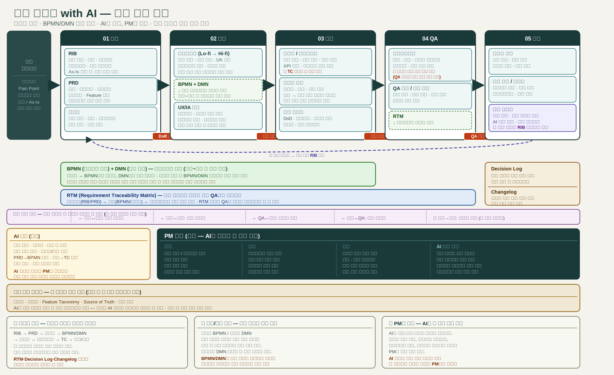

---
publish: true
publish_section: planning
publish_order: 41
title: "1장. AI는 기획을 없애지 않는다 — 요구사항 구조가 더 중요해진 이유"
---

# 1장. AI는 기획을 없애지 않는다 — 요구사항 구조가 더 중요해진 이유

## 이 장의 목적

이 장은 생성형 AI가 문서 작성 속도를 높인 것과 기획 품질이 올라간 것은 다른 문제임을 설명한다. AI 시대에는 산출물이 더 빨리 만들어지고, 더 쉽게 변환되고, 더 빠르게 다음 단계로 퍼진다. 그래서 요구사항 구조가 약하면 문제도 그만큼 빨리 증폭된다.

이 장을 읽고 나면 독자는 다음을 할 수 있어야 한다.

- 왜 AI 시대에 요구사항 품질 문제가 더 빨리 드러나는지 설명할 수 있다.
- 문서 초안 품질과 실행 품질의 차이를 구분할 수 있다.
- AI가 산출물에 가져온 변화가 속도만이 아님을 이해할 수 있다.
- PM/PO의 역할이 왜 문서 작성에서 구조 설계로 이동하는지 설명할 수 있다.

> 도식: AI 시대 기획 산출물 재설계 전체 개요: WHY → WHAT(산출물 체인) → HOW(팀 운영체계)

---

## 1. 문서가 빨리 써지는 것과 일이 잘 되는 것은 다르다

AI가 들어오면서 가장 먼저 쉬워진 일은 문서 초안 만들기다. 회의 내용을 요약하고, 요구사항 목록을 정리하고, PRD 초안을 쓰고, 테스트 포인트 후보를 뽑는 일은 예전보다 훨씬 빨라졌다.

문제는 여기서 많은 팀이 착각하기 쉽다는 점이다.

- 문서가 빨리 만들어지면 요구사항도 정리된 것처럼 보인다.
- 항목이 많아지면 검토가 충분히 된 것처럼 보인다.
- 표현이 매끈하면 실행도 잘될 것처럼 보인다.

하지만 실제 실무에서는 전혀 다른 질문이 남는다.

- 이 문서가 정말 같은 의미로 읽히는가
- 정책과 예외가 빠지지 않았는가
- 누가, 언제, 어떤 기준으로 판단하는지가 드러나는가
- 뒤 단계 문서로 안정적으로 이어질 수 있는가

즉, 문서 생성 속도는 올라갔지만 **실행 가능한 요구사항의 품질**까지 자동으로 올라간 것은 아니다.

---

## 2. 달라진 것은 속도만이 아니다

생성형 AI가 바꾼 것은 단지 초안 생성 속도가 아니다. 산출물의 역할 자체가 바뀌었다. 과거에는 기획 문서가 회의와 승인, 전달을 위한 결과물 성격이 강했다. 문서를 써서 공유하고, 합의하고, 다음 사람에게 넘기면 그 역할이 끝나는 경우가 많았다.

AI 시대에는 이 역할이 달라진다.

- 문서는 AI가 읽는다.
- 문서는 다른 문서로 변환된다.
- 문서는 테스트케이스, 프로토타입, 개발 태스크로 내려간다.
- 문서는 운영 지식과 연결된다.

이 변화에는 속도 이외에 네 가지가 더 있다.

**변환성**: 한 문서가 다른 문서의 초안으로 더 쉽게 변환된다. 회원가입 정책이 담긴 PRD를 AI에게 주면 BPMN, DMN, 테스트케이스 후보까지 이어질 수 있다. 단, 이 변환이 안정적이려면 PRD의 구조가 먼저 변환 가능한 형태여야 한다. 모호하게 쓴 PRD는 AI가 변환하려 해도 빈칸이 많은 초안만 돌려준다.

**재사용성**: 기준 문서와 과거 산출물을 다시 활용하기 쉬워졌다. 재사용이 쉬워질수록 기준이 되는 문서를 잘 만들어두는 것이 더 중요해진다.

**추적 필요성**: 변환이 빨라질수록 무엇이 어디서 왔는지 추적해야 한다. AI가 PRD에서 테스트케이스를 생성했는데 나중에 PRD가 바뀌었다면, 어느 테스트케이스가 구 버전을 기준으로 만들어진 것인지 알기 어려워진다.

**검증 필요성**: 초안이 쉬워질수록 오히려 검증 기준은 더 엄격해야 한다. AI가 만든 테스트케이스 초안은 그럴듯해 보여도 핵심 예외 케이스가 빠져 있거나 정책서와 어긋난 조건을 담는 경우가 있다. 빠르게 생성된 문서는 검토 없이 다음 단계로 넘어가기 쉽고, 그렇게 쌓인 오류는 개발·QA 단계에서 증폭된다.

즉, AI 시대의 산출물은 `빨리 쓰는 문서`가 아니라 **빨리 이어지고 빨리 퍼지는 문서**가 된다.

---

## 3. AI와 모호함 — 증폭시키기도 하고, 발견하게 해주기도 한다

예전에는 문서가 모호해도 중간에 사람이 오래 붙들고 있으면서 암묵적으로 메우는 경우가 많았다. 회의를 다시 하고, 메신저로 물어보고, 운영팀의 기억을 빌리고, 개발자가 "아마 이런 뜻이겠지" 하며 구현을 맞추는 식이다.

AI 시대에는 이 모호함이 더 빨리 다음 단계로 넘어간다.

- PRD 초안이 바로 생성된다.
- 시나리오와 테스트케이스 후보가 바로 생성된다.
- 프로토타입이나 코드 스캐폴딩까지 바로 이어질 수 있다.

이때 입력 구조가 약하면 어떤 일이 생기는가.

- 같은 요구사항이 서로 다른 문서에서 다르게 해석된다.
- 정책 문장이 그럴듯한 규칙처럼 바뀌지만 실제 기준과는 어긋난다.
- 예외 처리 누락이 빠르게 복제된다.
- 오래된 문서와 최신 문서가 함께 근거로 사용된다.
- 팀마다 다른 버전의 "정답"이 생긴다.

그런데 반대 방향도 성립한다. AI는 모호함을 증폭시키는 도구가 될 수도 있지만, **모호함을 발견하는 도구**가 될 수도 있다. "이 정책에서 빠진 예외 케이스를 찾아줘", "두 조건이 충돌하는 경우가 있는지 검토해줘"처럼 AI를 리뷰어로 사용하면, 문서 작성 단계에서 사람이 놓쳤을 구멍을 먼저 발견하게 해준다.

즉, AI가 모호함을 처리하는 방식은 사용 방식에 달려 있다.

- **입력으로 사용할 때**: 구조가 약한 문서를 그대로 넣으면 모호함이 빠르게 증폭된다.
- **검토자로 사용할 때**: 작성된 문서를 비판적으로 검토하게 하면 모호함을 조기에 발견할 수 있다.

이 책은 이 두 역할을 모두 다룬다. AI가 초안을 만들고, 다시 AI가 그 초안의 구멍을 점검하는 구조다. 단, 두 역할 모두에서 **입력 구조의 품질**이 결과를 결정한다. 구조가 약한 상태에서 AI에게 리뷰를 맡겨도 그럴듯한 검토 결과가 돌아올 뿐, 실제 구멍은 남는다.

---

## 4. 요구사항 품질 문제는 어디서 가장 자주 드러나는가

AI 시대에 요구사항 품질 문제는 주로 다음 장면에서 크게 드러난다.

**범위가 불명확할 때**: 무엇을 이번 과제에서 다루고 무엇을 다루지 않는지가 모호하면 PRD는 커지고 사양은 흔들리고 일정은 무너진다.

**정책과 예외가 문장 속에만 있을 때**: "원래 이렇게 해요" 수준으로 남아 있는 규칙은 BPMN, DMN, 테스트케이스로 안정적으로 이어지기 어렵다.

**상태 정의가 불명확할 때**: 휴면, 잠금, 탈퇴, 재가입 가능 같은 상태가 분명하지 않으면 화면, 운영, 코드, QA가 각자 다른 기준을 갖게 된다.

**문서 간 연결이 없을 때**: PRD는 있는데 정책서와 연결되지 않고, 정책서는 있는데 테스트케이스가 그 규칙을 검증하지 않고, 사양은 있는데 운영 문서가 따라오지 않는 상태가 생긴다.

**기준 문서가 약할 때**: 용어집, 공통 정책, 로드맵 같은 기준 문서가 없으면 실행 문서는 매번 다시 흔들린다.

이 책의 대표 러닝 케이스인 회원가입/로그인 기능을 보면, 문서 품질이 약한 상태에서 나타나는 징후가 뚜렷하다. 화면 문구와 운영 기준이 다르고, QA는 정상 흐름만 테스트하며 예외를 놓치고, 개발은 코드에 규칙을 넣었지만 문서에는 남지 않는다. 이런 상태에서 AI를 붙이면 좋아지기보다 더 빨리 혼란이 커진다. AI는 주어진 문서를 토대로 가장 그럴듯한 답을 만들기 때문에, 기준이 흔들리면 그럴듯한 오답도 더 빨리 만들어진다.

---

## 5. 문서 초안 품질과 실행 품질은 다르다

이 장에서 가장 먼저 구분해야 하는 것이 이 차이다.

**문서 초안 품질**은 문장이 자연스러운가, 형식이 보기 좋은가, 항목이 빠르게 채워졌는가, 이해하기 쉽게 요약되었는가를 본다.

**실행 품질**은 다른 질문을 던진다. 문서가 뒤 단계로 제대로 이어지는가. 같은 규칙이 팀 전체에서 일관되게 해석되는가. 예외가 누락되지 않았는가. 검증 가능한가. 운영 단계까지 살아남는가.

AI는 전자에는 매우 강하다. 하지만 후자는 여전히 구조와 기준, 책임이 필요하다. 그래서 이 책은 좋은 문장 그 자체보다 **좋은 입력 구조, 좋은 문서 레이어, 좋은 연결 구조**를 더 중요하게 본다.

---

## 6. PM/PO의 일은 왜 구조 설계로 이동하는가

AI는 아래 일을 잘 돕는다.

- 회의록 구조화
- PRD 초안 생성
- 정책 후보 추출
- 시나리오 정리
- 테스트 포인트 후보 생성

반면 AI가 대신하기 어려운 것은 아래다 (2025~2026년 AI 역량 기준).

- 이번 과제의 실제 범위 결정
- 어떤 예외를 공식 규칙으로 인정할지 판단
- 어떤 문서를 기준 문서로 둘지 결정
- 어떤 산출물 체인이 필요한지 설계
- 어디서 승인을 걸고 검증할지 정하기

이 경계는 고정된 것이 아니다. AI가 트레이드오프를 분석하고 우선순위 프레임을 제안하는 능력은 이미 상당 수준에 도달했고, 앞으로 더 빠르게 확장될 것이다. 다만, 이 책이 다루는 시점(2025~2026년)에서 위 항목들은 AI가 보조할 수는 있지만 대신할 수는 없는 영역에 해당한다. 이 책의 역할 구분은 이 전제 위에서 읽어야 한다.

이 때문에 PM/PO의 중심 업무는 문서를 직접 많이 쓰는 일에서 **문서의 경계와 체인을 설계하는 일**로 이동한다. AI가 초안을 만들수록, 그 초안이 실행 가능한 구조 위에 놓여야 한다는 책임은 오히려 더 무거워진다.

---

## 6-1. AI가 실제로 읽는 최소 입력: 사양서와 AC

PM이 산출물 체인을 처음 접하면 자연스럽게 드는 질문이 있다.

> "AI에게 코딩을 맡기려면 최소한 뭘 줘야 하지? 체인 전체를 다 거쳐야 하나?"

결론부터 말하면, **AI 코딩(이른바 바이브 코딩)에 필요한 최소 산출물은 사양서와 AC(Acceptance Criteria) 두 가지**다. 다른 산출물이 없어도 이 두 가지가 제대로 만들어져 있으면 AI는 코드를 만들 수 있다.

단, 조건이 있다. **품질 유지가 전제**될 때만이다.

### 왜 사양서 + AC인가

RIB, PRD, 정책서, BPMN, DMN이 각각 다루는 것들 — 범위, 정책, 흐름, 판단 조건, 데이터 구조 — 은 원칙적으로 사양서 한 장에 구조화해서 담을 수 있다. 사양서가 "이 기능이 무엇을 해야 하는가"를 정책·상태·예외까지 담은 형태로 쓰여 있고, AC가 "그것이 충족되었는지 어떻게 검증하는가"를 항목으로 정리하고 있다면, AI는 그 두 문서만으로 구현을 시작할 수 있다.

이것이 체인의 **두 번째 역할**이다. 체인은 사람에게는 단계적 사고 구조화 도구지만, AI에게는 사양서와 AC로 압축되는 입력 구조다.

### 닭과 달걀 문제

여기서 주의해야 할 점이 있다. 사양서 한 장이 RIB·정책서·BPMN·DMN의 내용을 흡수하려면, 사실상 그 문서들을 만드는 수준의 사고가 먼저 이루어져야 한다.

- 정책서 없이 사양서에 판단 규칙을 쓰면, 조건이 빠지거나 충돌한다.
- BPMN 없이 흐름을 사양서에 넣으면, 역할 경계가 흐릿해진다.
- DMN 없이 예외 조건을 서술하면, 케이스가 누락된다.

즉, **체인 없이 사양서를 만드는 것은 가능하지만, 품질을 유지하는 사양서를 만들려면 체인의 사고 과정이 전제**된다. AI 바이브 코딩에 사양서만 쓰면 된다는 말은 반만 맞다. 그 사양서가 온전하게 만들어지기 위해 필요한 것이 이 책 전체가 다루는 내용이다.

### 복잡도에 따른 최소 세트 확장

기능의 복잡도에 따라 사양서+AC만으로 충분한 경우와 아닌 경우가 구분된다.

| 복잡도 수준 | 판단 조건 수 | 관여 역할 수 | 최소 산출물 |
|---|---|---|---|
| **단순** (단일 화면, 단순 CRUD) | 3개 이하 | 1개 | 사양서 + AC |
| **중간** (정책이 있는 기능, 상태 전이 포함) | 4~7개 | 2개 이상 | 사양서 + AC + 정책서 또는 DMN |
| **복잡** (역할 간 협력, 예외 분기 다수) | 8개 이상 | 3개 이상 | 사양서 + AC + 정책서 + BPMN + DMN |

단순한 기능이라면 사양서와 AC만으로 충분하다. 그러나 판단 조건이 4개를 넘거나 역할이 2개 이상 관여하면 사양서 한 장으로는 모든 정보를 정확하게 담기 어렵다. 이 임계점을 넘는 순간 체인의 다른 문서들이 하나씩 필요해진다.

이것이 이 책이 체인 전체를 다루는 이유다. 단순한 기능에는 축소 체인으로 충분하고, 복잡한 기능에는 전체 체인이 필요하다. 어느 쪽이든 AI에게 넘기는 최종 입력은 사양서와 AC다. 그 사양서가 제대로 만들어졌는지가 AI 출력 품질을 결정한다.

---

## 7. 이 장의 핵심 메시지

> AI는 기획을 없애지 않는다. 오히려 요구사항 구조의 차이를 더 빠르고 더 크게 드러낸다.

문서를 빨리 만드는 것과 일을 제대로 하는 것은 다르다. 산출물은 더 빨리 이어지고 변환되기 때문에, 모호한 요구사항은 더 빨리 증폭되고, 정책·예외·상태·연결 구조가 약할수록 그럴듯한 오답도 더 빨리 퍼진다.

AI 시대의 기획 경쟁력은 문장력보다 구조 설계력에 더 가깝다.

한 가지를 미리 짚어두겠다. 이 책은 산출물 사이의 논리적 순서를 다룬다. 그것이 워터폴처럼 보일 수 있다. 그러나 이 체인의 순서는 "이전 단계가 완전히 끝나야 다음을 시작한다"는 의미가 아니다. "다음 담당자가 시작할 수 있을 만큼 충분하면 넘긴다"는 논리적 의존 순서다. 스프린트 팀은 이 체인의 축소 버전을 2주 안에 돌릴 수 있고, 실제로 그렇게 써야 한다. 이 구분은 24장에서 더 구체적으로 다룬다.

---

## 8. 다음 장으로의 연결

이 장에서는 AI 시대에 왜 요구사항 구조가 더 중요해졌는지를 보았다. 그렇다면 이제 다음 질문이 자연스럽다.

> 그 구조는 어떤 맥락에서 설계해야 하는가? 이 책은 어떤 상황을 대상으로 하는가?

다음 장에서는 **이 책의 범위를 먼저 고정하고, 기획 업무가 맥락에 따라 왜 달리 설계되어야 하는지**를 다룬다.

### 이 장에서 다음 장으로 이어지는 전제

| 이 장에서 확립한 것 | 다음 장이 이것을 바탕으로 하는 이유 |
|---|---|
| AI는 구조 품질을 증폭시킨다 | 어떤 맥락에서 기획하느냐에 따라 구조 설계 방식이 달라진다 |
| 산출물 체인이 핵심이다 | 체인을 설계하기 전에 내가 어떤 환경에 있는지 먼저 구분해야 한다 |
| 모호한 입력은 AI로 더 빠르게 퍼진다 | 수주형·자사 서비스, 신규·고도화마다 모호함의 위치가 다르다 |

- **이 장(1장)이 확립한 것**: AI 시대에 요구사항 구조가 왜 더 중요한가
- **다음 장(2장)이 결정하는 것**: 이 책의 대상 범위와 기획 맥락 구분

