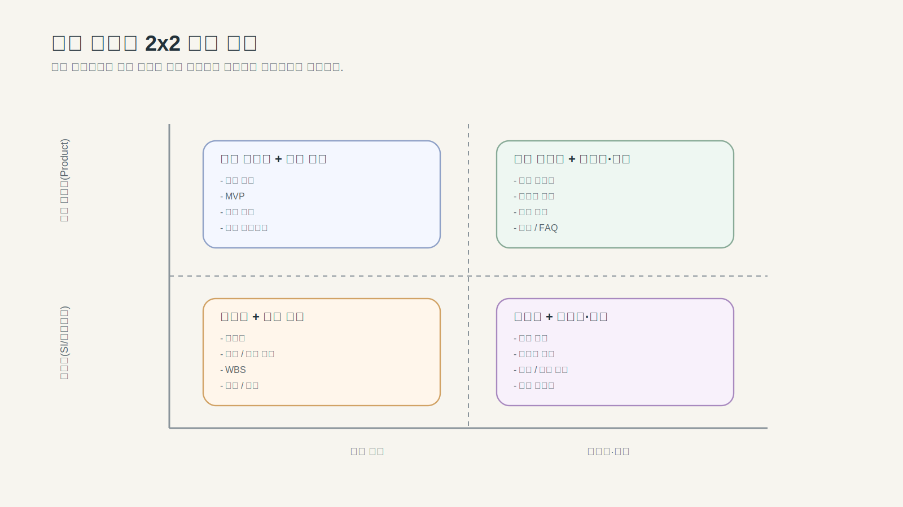

---
publish: true
publish_section: planning
publish_order: 42
title: "2장. 이 책의 범위와 기획 업무가 달라지는 이유"
---

# 2장. 이 책의 범위와 기획 업무가 달라지는 이유

## 이 장의 목적

이 장은 두 가지를 다룬다. 먼저 이 책이 어디에 서 있는지를 짧게 고정하고, 그다음 왜 기획 업무를 맥락에 따라 다르게 설계해야 하는지를 설명한다.

이 장을 읽고 나면 독자는 다음을 할 수 있어야 한다.

- 이 책이 AI 기능 기획서가 아니라 산출물 운영체계 설계서에 가까움을 설명할 수 있다.
- 자신의 기획 과제가 어떤 맥락에 속하는지 두 축으로 구분할 수 있다.
- 왜 같은 PRD 템플릿으로 모든 업무를 처리하면 안 되는지 설명할 수 있다.
- 이후 장에서 다룰 산출물 체인이 맥락에 따라 어떻게 달리 적용되는지 감을 잡을 수 있다.

---

## 이 책이 다루는 것과 다루지 않는 것

이 책은 AI 모델 구조, 프롬프트 엔지니어링 테크닉, AI 기능이 들어간 제품 전략을 중심 주제로 삼지 않는다. AI 일반서도 아니고 AI 제품관리서도 아니다.

이 책이 다루는 것은 기존 PM/PO/BA의 기획 산출물을 AI 협업이 가능한 구조로 재설계하는 일이다. 무엇을 기준 문서로 둘 것인지, 어떤 입력 구조로 요구사항을 정리할 것인지, PRD·정책서·BPMN·DMN·사양서·테스트케이스를 어떤 순서와 역할로 둘 것인지, 문서 사이를 어떻게 연결하고 추적할 것인지, AI를 팀 운영체계 안에 어떻게 올릴 것인지를 다룬다.

이 책은 최대 범위의 산출물 체인을 설명하지만, 그것이 모든 팀이 처음부터 갖춰야 하는 기준을 의미하지 않는다. **핵심 3개(RIB, PRD, 사양서)부터 시작해도 체인은 작동한다.** 복잡도가 올라갈수록 정책서, BPMN/DMN, 테스트케이스가 추가되고, 팀 규모와 추적 요구에 따라 나머지를 더한다. 지금 상황에 맞는 최소 범위는 부록(팀 규모별 최소 산출물 세트)에서 다룬다.

이 책의 중심 질문은 `AI 기능을 제품에 넣을까`가 아니라 `AI가 읽고 이어갈 수 있도록 기획 산출물을 어떻게 바꿀까`다.

신규 AI 제품 기획에만 국한되지 않는 이유도 여기에 있다. 문서가 부실한 레거시 서비스, 운영 예외가 많은 기존 기능, 정책과 화면과 테스트가 어긋난 영역에서는 AI를 쓴다고 문제가 사라지지 않는다. 오히려 기준 문서가 없고 예외 규칙이 흩어져 있을수록 AI 결과 품질은 더 불안정해진다. 그래서 이 책은 기존 서비스와 레거시 개선까지 포함하는 산출물 재설계 방법론을 택한다.

---

## 1. 왜 기획 업무는 같은 방식으로 하면 안 되는가

이 책의 산출물 이야기를 본격적으로 시작하기 전에, 먼저 하나의 질문을 던져야 한다.

> 지금 내가 다루는 일은 어떤 종류의 기획 업무인가?

많은 조직에서 기획 문서는 두 가지 방식으로 무너진다. 하나는 문서가 없는 경우이고, 다른 하나는 문서가 많지만 역할이 구분되지 않는 경우다. 더 흔한 문제는 두 번째다. **같은 양식으로 너무 다른 문제를 처리하려는 것**이다. 신규 서비스 기획서와 레거시 운영 정책 개선 문서가 같은 구조를 쓰고, 수주형 제안서와 자사 서비스 개선 PRD가 같은 수준의 상세도를 요구받는다.

AI가 들어오면 이 문제는 더 커진다. AI는 문서 형식을 그럴듯하게 맞추는 데는 능하지만, 그 문서가 지금 다루는 과제의 맥락에 맞는지까지 자동으로 보장해주지는 않는다. **같은 방식으로 기획하면 안 되는 이유는 사람의 한계 때문만이 아니라, AI가 그 차이를 대신 구분해주지 못하기 때문**이다.

---

## 2. 기획 업무를 나누는 두 축

이 책은 기획 업무를 먼저 두 축으로 나눈다.

- **수행 환경**: 수주형(SI/에이전시)인가, 자사 서비스(Product/Platform)인가
- **생애주기**: 신규 구축(New, 0→1)인가, 고도화·운영(Enhancement, 1→N)인가

이 두 축을 조합하면 네 가지 대표 맥락이 나온다.

| 구분 | 신규 구축(0→1) | 고도화·운영(1→N) |
|---|---|---|
| **수주형(SI/에이전시)** | 범위 정의, 검수 기준, 합의 가능성이 핵심 | 변경 요청, 영향도, 인수 기준이 핵심 |
| **자사 서비스(Product/Platform)** | 문제 정의, MVP, 빠른 학습이 핵심 | 운영 정합성, 레거시 처리, 예외 규칙 정리가 핵심 |

> 도식: 기획 업무 4가지 맥락 2×2 구분표 (수행환경 × 생애주기)

이 표는 단순한 분류가 아니다. **어떤 산출물이 먼저 와야 하는지를 결정하는 기준**이다.

---

## 3. 같은 '기획'이어도 출발점이 다르다

### 3-1. 수주형 신규 구축

수주형 신규 구축에서는 무엇을 어디까지 구축할 것인가, 어떤 범위를 견적과 일정 안에 넣을 것인가, 고객과 공급자의 책임 경계는 어디인가라는 질문이 먼저 나온다. 기획 문서는 문제 탐색보다 **범위와 책임의 명확화**가 더 중요하다. RFP 분석, 제안서, 범위 정의서, WBS, 기능정의서, 검수 기준 문서가 앞에 온다.

### 3-2. 수주형 고도화

변경 요청은 어디까지가 계약 범위인가, 기존 기능과 충돌하는 부분은 없는가, 영향도는 어디까지 확산되는가. As-is와 To-be를 비교하는 문서, 변경 영향도 분석, 검수 항목의 재정의가 중요하다. AI를 써도 바뀌지 않는 핵심은 **변경 책임과 범위 합의**다.

### 3-3. 자사 서비스 신규 구축

어떤 문제를 풀어야 하는가, MVP는 어디까지인가, 성공을 어떻게 측정할 것인가. PRD, 핵심 시나리오, 프로토타입, 우선순위 기준이 중요하다. 가장 흔한 실수는 문제 정의가 충분히 되기 전에 상세 기능부터 적기 시작하는 것이다. AI는 이 실수를 더 빠르게 확대한다. 문제 정의가 빈약해도 기능 리스트는 아주 그럴듯하게 만들어주기 때문이다.

### 3-4. 자사 서비스 고도화

이 책의 대표 러닝 케이스가 속하는 영역이다. 무엇을 유지하고 무엇을 바꿀 것인가, 기존 정책과 예외 규칙은 어디에 숨어 있는가, 운영 중인 시스템과 어떤 정합성을 맞춰야 하는가. 이 경우에는 PRD만으로 부족하다. 정책서, BPMN, DMN, 사양서, 테스트케이스, 릴리즈 노트까지 함께 봐야 한다. **레거시를 다루는 기획은 "새로 만드는 기획"이 아니라 "정합성을 유지하며 바꾸는 기획"**이다.

---

## 4. 왜 같은 템플릿으로 처리하면 안 되는가

표준화 자체는 필요하다. 문제는 표준화가 획일화로 바뀔 때 생긴다.

**첫째, 중요한 정보의 위치가 어긋난다.** 신규 구축에서는 사용자 문제와 성공 지표가 핵심인데, 고도화 과제에서는 기존 정책과 영향도 분석이 더 중요할 수 있다. 같은 양식은 이 차이를 반영하지 못한다.

**둘째, 문서의 깊이가 어긋난다.** 수주형에서는 검수 범위와 책임 경계가 중요하지만, 자사 서비스 개선에서는 운영 예외와 데이터 정합성이 더 중요하다. 같은 템플릿은 일부 과제에는 과하고, 일부 과제에는 부족하다.

**셋째, AI 활용이 왜곡된다.** AI는 템플릿이 있으면 더 빠르게 채운다. 채우기 쉬운 항목만 과도하게 풍부해지고, 원래 중요한 항목은 오히려 놓치기 쉽다. 같은 템플릿을 쓰면 효율은 올라가지만 정합성은 내려갈 수 있다.

필요한 것은 "템플릿을 없애는 것"이 아니라, **맥락별 기본형을 구분하는 것**이다.

---

## 5. 맥락마다 달라지는 업무 프로세스

4분면이 다르면 산출물 이름만 달라지는 것이 아니라, 업무를 굴리는 순서 자체가 달라진다.

**신규 구축 + 자사 서비스**: 문제 정의 → 가설 정리 → MVP 범위 결정 → PRD → 핵심 시나리오/AC → 프로토타입 → 필요한 최소 정책·BPMN·DMN 보강 → 출시 → 운영 반영. 핵심은 `빠른 학습`이다.

**고도화·운영 + 자사 서비스**: As-is 복원 → 운영 이슈 수집 → 정책·예외 규칙 정리 → PRD → BPMN으로 흐름 분리 → DMN으로 판단 분리 → 사양서·테스트케이스 정교화 → 릴리즈 → 운영 문서 반영. 핵심은 `정합성을 유지하며 바꾸는 것`이다.

**신규 구축 + 수주형**: 요구 합의 → 범위 정의 → 검수 기준 정리 → PRD → 기능·시나리오·AC → 정책·BPMN·DMN → 사양서 → 테스트케이스 → 고객 검토 → 개발·검수·인수. 핵심은 `합의 가능성`이다.

**고도화·운영 + 수주형**: 레거시 As-is 복원 → 변경 요청 분석 → 영향도 분석 → As-is/To-be 정책·BPMN·DMN → 사양서 → 테스트케이스 → 운영 가이드 → 검수·인수 → 운영 안정화. 핵심은 `안전한 변경`이다.

---

## 6. 산출물 관리 방식도 달라진다

같은 산출물을 써도 관리 방식이 다르다.

**Product 계열은 학습과 반영 중심이다.** 문서는 살아 있는 기준이어야 한다. Draft → Review → Approved 주기는 짧게 가고, 운영 데이터와 사용자 피드백이 다음 문서 갱신으로 바로 이어져야 한다.

**SI 계열은 합의와 승인 중심이다.** 문서는 승인과 책임 경계를 남겨야 한다. 내부 검토와 외부 검토를 구분해야 하고, RTM과 검수 기준 연결이 매우 중요하다.

**신규 구축은 방향 정렬 문서가 먼저다.** RIB, PRD, 프로토타입의 무게가 크다. 문서의 목적은 `빠르게 맞추고 바로 움직이는 것`에 가깝다.

**고도화·운영은 추적성과 회귀 기준이 먼저다.** As-is/To-be 구분이 중요하고, 정책서·BPMN·DMN·테스트케이스·운영 문서의 연결이 중요하다. 문서의 목적은 `안전하게 바꾸고 다시 설명 가능한 상태를 유지하는 것`이다.

---

## 7. 이 책이 제안하는 원칙

이 책은 네 가지 방법론을 각각 따로 설명하는 구조를 택하지 않는다. 그렇게 하면 독자가 오히려 적용하기 어렵다. 대신 아래 구조로 간다.

**공통 산출물 체인**: RIB → PRD → Feature/Scenario/AC → 정책서 → BPMN → DMN → 사양서 → 프로토타입 → 테스트케이스 → 운영 반영

**4분면별 차이**: 어떤 산출물이 더 앞에 오는가, 어떤 산출물이 더 무거운가, 어떤 승인 구조를 가져야 하는가, 어떤 운영 리듬을 가져야 하는가.

즉 **같은 방법론 + 다른 운영 방식**이 이 책의 정확한 구조다.

네 가지 원칙을 기억하자. 맥락은 다르지만 공통 골격은 있어야 한다. 공통 골격은 산출물 체인으로 정의한다. 같은 이름의 문서도 역할은 달라질 수 있다. AI는 맥락을 대신 판단하지 않는다.

---

## 8. 이 책의 대표 적용 맥락

이 책의 대표 러닝 케이스는 **자사 서비스 × 고도화·운영** 영역에 놓인다. 이미 운영 중인 서비스에서 문서가 부족하고 정책이 암묵지로 남아 있는 기능을 대상으로, 산출물 체계를 다시 세우는 상황이다.

대표 사례로 회원가입/로그인 정책 복원 및 개선을 선택한 이유도 여기에 있다. 이 기능은 단순해 보이지만 실제로는 복잡하다. 회원 상태가 여러 단계로 나뉘고, 본인인증·비밀번호·휴면·탈퇴·재가입 규칙이 얽혀 있고, 운영 정책과 법적 기준이 동시에 개입하고, 레거시 시스템과의 정합성이 중요하다. 이 사례는 왜 PRD만으로 부족한지, 왜 정책서와 BPMN·DMN·사양서·테스트케이스가 함께 가야 하는지를 보여주기에 적합하다.

---

## 9. 이 장의 핵심 메시지

> 기획은 하나의 방식으로 표준화할 수 있는 일이 아니라, 맥락에 따라 산출물의 무게중심이 달라지는 일이다.

수주형과 자사 서비스는 다르고, 신규 구축과 고도화도 다르다. 같은 PRD라는 이름도 상황에 따라 역할이 달라지고, 같은 BPMN·DMN·사양서도 관리 방식이 달라진다. AI는 그 차이를 대신 판단하지 않기 때문에, 먼저 맥락을 구분한 뒤 업무 프로세스와 산출물 관리 체계를 같이 설계해야 한다.

---

## 10. 다음 장으로의 연결

이 장에서는 이 책의 범위를 고정하고, 기획 업무가 맥락에 따라 왜 달리 설계되어야 하는지를 살펴봤다. 그렇다면 다음 질문이 자연스럽게 따라온다.

> 맥락이 다르더라도, AI와 함께 일할 때 문서 품질을 결정하는 핵심 요소는 무엇인가?

다음 장에서는 **좋은 문장보다 좋은 구조가 왜 더 중요한가**와 함께 **기준 산출물이 왜 먼저여야 하는가**를 다룬다.

### 이 장에서 다음 장으로 이어지는 전제

| 이 장에서 확립한 것 | 다음 장이 이것을 바탕으로 하는 이유 |
|---|---|
| 수주형 vs. 자사 서비스 구분 | 맥락에 따라 어떤 산출물이 "기준"이 되는지가 달라진다 |
| 신규 구축 vs. 고도화 구분 | 고도화는 As-is 복원이 선행되어야 기준 산출물을 세울 수 있다 |
| PM / PO / BA 역할 구분 | 역할에 따라 어떤 문서의 품질 책임이 달라지는지가 다음 구조 원칙의 전제다 |

- **이 장(2장)이 결정한 것**: 이 책의 독자 범위와 기획 맥락 유형
- **다음 장(3장)이 결정하는 것**: 맥락 전체에 공통으로 필요한 구조 설계 원칙

