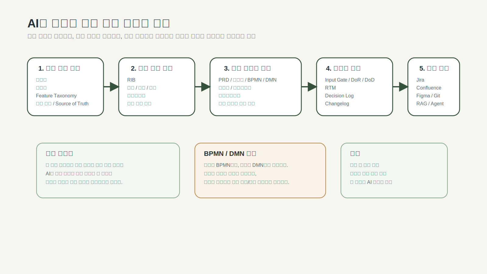

# 3장. 구조가 먼저다: 좋은 문장보다 좋은 구조, 기준 산출물이 토대

## 이 장의 목적

이 장은 WHAT 파트의 출발점이다. 앞선 두 장에서 WHY(왜 AI 시대에 요구사항 구조가 더 중요해졌는가, 왜 기획 업무는 맥락마다 달라야 하는가)를 살펴봤다. 이제 WHAT으로 넘어간다. 어떤 산출물이 필요하고, 그 산출물은 어떤 구조여야 하는가.

이 장은 두 가지를 함께 다룬다. 첫째, AI 협업에서 텍스트의 수사와 표현력보다 문서의 구조와 입력 정합성이 더 중요하다는 점. 둘째, 그 구조는 실행 산출물이 아닌 기준 산출물 위에 세워져야 한다는 점.

이 장을 읽고 나면 독자는 다음을 할 수 있어야 한다.

- 좋은 문장과 좋은 구조의 차이를 설명할 수 있다.
- 왜 프롬프트보다 입력 체계가 더 중요한지 이해할 수 있다.
- 기준 산출물과 실행 산출물을 구분하고, 실행 산출물의 품질이 기준 산출물에 종속된다는 점을 설명할 수 있다.
- 이후 장에서 각 문서를 '읽기용 결과물'이 아니라 '구조화된 입력'으로 볼 수 있다.



> 도식: WHY·WHAT·HOW 3파트 구조: 이 책의 전체 논리 흐름과 각 파트의 역할

---

## 1. 왜 좋은 문장만으로는 부족한가

기획 문서는 오랫동안 "잘 쓴 문장"의 영향을 크게 받았다. 문제가 명확해 보이고, 의도가 자연스럽고, 배경 설명이 풍부하면 좋은 문서처럼 보이기 쉽다.

하지만 AI 협업에서는 다른 질문이 더 중요해진다.

- 이 문장에서 정책 포인트를 분리할 수 있는가
- 이 문장에서 흐름을 추출할 수 있는가
- 이 문장에서 판단 규칙을 찾을 수 있는가
- 이 문장에서 테스트 기준을 만들 수 있는가

즉, 문장의 품질만이 아니라 **구조적 해석 가능성**이 중요해진다.

예를 들어 아래 문장을 보자. "휴면회원은 본인확인 후 로그인할 수 있다." 문장 자체는 분명해 보인다. 하지만 구조는 아직 약하다. 본인확인 성공 여부는 어떤 기준인가, 본인확인 실패 시 결과는 무엇인가, 상태 전환은 언제 일어나는가, 로그인 허용 여부 판단은 DMN으로 분리할 것인가.

좋은 구조는 이런 질문을 열어준다. 즉, 좋은 구조는 `문장이 그럴듯한 상태`가 아니라 `정책, 흐름, 판단, 검증으로 내려갈 준비가 된 상태`다.

---

## 2. 프롬프트보다 입력 구조가 중요한 이유

많은 팀이 AI 활용에서 먼저 프롬프트를 개선하려 한다. 물론 프롬프트는 중요하다. 하지만 입력 구조가 약하면 프롬프트를 아무리 정교하게 바꿔도 한계가 있다.

입력 구조가 약한 상태에서는 범위와 예외가 빠지고, 같은 용어가 다르게 쓰이고, 기준 문서가 연결되지 않고, 뒤 문서가 해석에 의존하게 된다. 반대로 입력 구조가 좋으면 AI는 비교적 단순한 프롬프트로도 꽤 안정적인 결과를 낼 수 있다.

그래서 이 책은 프롬프트보다 먼저 **문서 구조와 입력 구조를 설계하는 일**을 다룬다.

---

## 3. AI가 읽기 쉬운 문서의 조건

AI가 읽기 쉬운 문서는 문장이 짧은 문서만을 뜻하지 않는다. 오히려 아래가 더 중요하다.

- 범위가 분리돼 있는가
- 핵심 시나리오가 보이는가
- 정책 포인트가 분리돼 있는가
- 판단 포인트가 드러나는가
- 예외가 별도 항목으로 정리돼 있는가
- 뒤 단계 문서 후보가 식별되는가

이 구조가 있어야 PRD는 정책서, BPMN, DMN, 테스트케이스로 더 안정적으로 이어진다. AI 시대의 기획자는 문장 작성자보다 **구조 설계자**에 가까워진다.

---

## 4. 그 구조는 무엇 위에 세워져야 하는가

구조가 중요하다는 점이 분명해졌다면, 다음 질문이 자연스럽게 따라온다. 그 구조는 무엇 위에 세워지는가.

많은 조직은 프로젝트 문서부터 쓰기 시작한다. 요구사항을 정리하고, PRD를 쓰고, 화면을 그리고, 개발 태스크를 쪼갠다. 그러나 이 순서에는 자주 빠지는 전제가 있다. **무엇을 기준으로 그 문서를 쓸 것인가**가 먼저 정리되어 있지 않으면, 실행 산출물은 빨리 만들어져도 오래 유지되지 못한다.

실행 문서부터 쓰면 초기에는 빨라 보인다. 그러나 프로젝트가 조금만 복잡해지면 문제가 드러난다. 같은 용어를 팀마다 다르게 쓰고, 어떤 규칙이 공통 정책인지 이번 과제의 예외인지 헷갈리고, 이미 존재하던 기준 문서와 새로운 실행 문서가 충돌한다.

AI가 들어오면 이 문제는 더 커진다. AI는 문서 작성 속도를 끌어올려주지만, 기준이 흔들리는 상태에서는 그 흔들림도 더 빨리 퍼뜨린다.

> 이 문서가 기대고 있는 기준은 무엇인가?

이 질문에 답하지 못하면, 아무리 좋은 PRD를 써도 뒤 단계에서 흔들릴 수밖에 없다.

---

## 5. 기준 산출물과 실행 산출물의 구분

이 책은 산출물을 먼저 두 종류로 나눈다.

- **기준 산출물**: 여러 프로젝트가 공통으로 참조하며 쉽게 흔들리면 안 되는 문서
- **실행 산출물**: 특정 프로젝트·기능·개선 과제 단위로 생성·수정되는 문서

이 구분은 **무엇을 먼저 관리해야 하는가**와 **AI가 무엇을 읽고 무엇을 만들어야 하는가**를 결정한다.

### 기준 산출물이란

기준 산출물은 여러 과제가 공통으로 참조하는 문서다. 특정 프로젝트가 끝나도 바로 사라지지 않고, 다른 프로젝트에서도 계속 기준으로 작동하는 문서다. 대표적으로는 법률·규제 가이드, 공통 정책 원칙, 용어집, Feature Taxonomy, 로드맵, 공통 디자인·컴포넌트 기준이 있다.

### 실행 산출물이란

실행 산출물은 특정 과제 단위에서 생성되는 문서다. RIB, PRD, 프로젝트 정책서, BPMN, DMN, 사양서, 프로토타입, 테스트케이스, RTM처럼 실제 프로젝트를 움직이기 위해 만들어지는 문서가 여기에 해당한다. 이 문서들은 원칙적으로 **기준 산출물을 입력으로 삼아 생성되어야 한다.**

---

## 6. 기준 산출물은 왜 AI 시대에 더 중요해졌는가

AI 이전에는 사람이 문서 사이의 빈틈을 어느 정도 메울 수 있었다. 용어가 조금 달라도 맥락으로 이해했고, 정책이 문장 안에 섞여 있어도 경험 많은 실무자가 보정했다.

AI 시대에는 상황이 다르다. AI는 사람이 하던 암묵적 보정을 안정적으로 대신하지 못한다.

**용어가 통일되어 있지 않을 때**: "휴면회원", "비활성회원", "장기 미접속 회원"이 문서마다 다르게 쓰이면, AI는 그것이 같은 개념인지 다른 개념인지 일관되게 판단하지 못할 수 있다.

**공통 정책과 과제별 정책이 분리되어 있지 않을 때**: 조직 전체의 상위 정책과 프로젝트 단위 예외 규칙이 한 문서에 뒤섞여 있으면, AI는 어느 규칙을 우선해야 하는지 혼동할 가능성이 높다.

**기준 문서가 여러 버전으로 흩어져 있을 때**: 오래된 문서, 최신 문서, 회의 메모, 운영 위키가 동시에 남아 있으면, AI는 그중 무엇이 최종 기준인지 자동으로 보장하지 않는다.

결국 AI 시대에는 "문서가 있느냐"보다 "기준 문서가 정리되어 있느냐"가 훨씬 중요해진다.

---

## 7. 기준 산출물의 대표 유형

**외부 기준 문서**: 법률·컴플라이언스 가이드, 규제 문서, 산업 표준. 바뀌면 안 되는 것이 아니라, 쉽게 바꿔서는 안 되는 문서다.

**공통 정책 원칙**: 여러 프로젝트가 함께 참조하는 도메인별 원칙. 예를 들어 회원 정책, 개인정보 처리 원칙, 결제 정책, 인증·권한 정책.

**용어집**: 가장 자주 과소평가되지만 실제로는 가장 강력한 기준 문서 중 하나다. 단순히 단어 뜻을 적어두는 문서가 아니라, 팀이 같은 개념을 같은 이름으로 부르도록 강제하는 기준이다. AI 협업에서는 특히 중요하다.

**Feature Taxonomy**: 기능 분류 체계. 어떤 기능이 어떤 도메인에 속하는지, 어떤 상위·하위 구조에 들어가는지 일관되게 분류할 수 있다. 이 문서가 있어야 PRD와 백로그, QA, 운영 문서가 안정적으로 연결된다.

**로드맵과 우선순위 기준**: 어떤 영역을 먼저 다루고 무엇은 나중에 미루는지에 대한 상위 기준. 이 문서가 없으면 실행 산출물이 개별 과제 단위로는 잘 만들어져도 전체 우선순위 정렬이 무너질 수 있다.

---

## 8. 기준 산출물 관리 원칙

**Source of Truth는 하나여야 한다.** 같은 정보가 여러 문서에 있을 수 있지만, 최종 기준은 반드시 하나여야 한다. 모든 문서가 기준이 되면, 실제로는 아무 문서도 기준이 되지 않는다.

**변경 권한과 승인 기준이 명확해야 한다.** 기준 산출물은 실행 문서보다 더 엄격하게 관리해야 한다. 누가 수정할 수 있는가, 누가 승인하는가, 변경 이력은 어디에 남기는가가 정리되어 있어야 한다.

**실행 산출물은 기준 문서를 참조해야 한다.** 기준 산출물은 따로 보관하는 것만으로는 의미가 없다. 프로젝트 정책서나 PRD에 참조한 공통 정책, 용어집 버전, 기능 분류 체계, 상위 로드맵이 연결되어야 한다. 기준 산출물은 저장의 문제가 아니라 **연결의 문제**다.

---

## 9. 대표 러닝 케이스에 적용하면

회원가입/로그인 정책 복원 사례에서 실행 산출물로 바로 PRD를 쓰기 시작하면 어떤 일이 생길까. "휴면회원" 정의가 문서마다 다를 수 있다. 탈퇴 후 재가입 제한 기간이 팀마다 다르게 이해될 수 있다. 본인인증 실패 시 처리 규칙이 운영과 개발에서 다를 수 있다.

이 상태에서 PRD, BPMN, DMN, 테스트케이스를 만들어도 결국 뒤에서 다시 흔들린다. 따라서 먼저 정리해야 할 기준 산출물은 회원 관련 용어집, 계정 상태 정의, 공통 인증·보안 정책 원칙, 회원 도메인 Feature Taxonomy, 관련 법률·약관·운영 가이드다.

이 기준이 먼저 정리돼 있어야, 그 위에서 RIB·PRD·프로젝트 정책서·BPMN·DMN·사양서·테스트케이스가 일관되게 만들어질 수 있다. **실행 산출물의 품질은 기준 산출물의 품질에 종속된다.**

---

## 10. 실무에서 어떻게 시작하는가

기준 산출물이 중요하다는 말을 들으면 많은 사람은 "큰 문서 체계부터 다 만들어야 하나?"라고 생각한다. 실무에서는 그렇게 시작하기 어렵다. 아래 순서가 현실적이다.

이번 과제와 직접 연결되는 기준 문서부터 찾는다. 없다면 새로 만들되, 공통 기준으로 승격 가능한 형태로 만든다. 기준과 실행을 문서 안에서 섞지 않는다. 변경 이력을 남긴다.

---

## 11. 바이브 코딩의 부상과 기획 문서에 대한 오해

### 11-1. 바이브 코딩이 가져온 변화

2024년 이후 "바이브 코딩(Vibe Coding)"이라는 흐름이 빠르게 확산되고 있다. Cursor, GitHub Copilot, Claude, GPT-4o 같은 AI 코딩 도구들이 성숙해지면서, 자연어로 지시하면 AI가 코드를 생성해주는 방식이 실무에서도 작동하기 시작했다. OpenAI 공동 창업자이자 전 Tesla AI 총괄인 Andrej Karpathy가 2025년 2월 "there's a new kind of coding I call vibe coding, where you fully give in to the vibes, embrace exponentials, and forget that the code even exists"라고 X(구 트위터)에 올린 포스트는 450만 뷰를 기록했고, 같은 해 Collins English Dictionary 올해의 단어로 선정될 만큼 빠르게 주류 담론이 됐다.

이것이 단순한 유행어에 그치지 않는다는 것은 수치로 확인된다. 2025년 Stack Overflow 개발자 서베이에서 전체 응답자의 84%가 AI 도구를 이미 사용 중이거나 사용할 계획이라고 답했고, 전업 개발자의 51%는 매일 AI 도구를 사용한다고 밝혔다. GitHub Copilot은 2025년 7월 기준 사용자 2,000만 명을 돌파했으며, Fortune 100 기업의 90%가 도입 완료했다. 같은 시점 GitHub의 집계에 따르면 개발자가 작성하는 코드의 46%가 이미 AI로 생성된 코드다. Y Combinator의 2025년 겨울 배치에서는 스타트업의 25%가 코드베이스의 95% 이상을 AI로 만들었다.

이 흐름이 가속화되면서, "개발자도 이제 코딩을 직접 하지 않고 AI가 제대로 된 코드를 내놓도록 가이드하는 역할만 하게 된다"는 관점이 주목받고 있다. 이 전망은 단순히 과장이 아니다. 실제로 간단한 기능은 대화 몇 번만에 동작하는 코드가 나오고, 스타트업에서는 기획자 혼자 AI로 프로토타입을 만들어버리는 사례도 늘어나고 있다.

그 결과 자연스럽게 생기는 인식이 있다.

> "PRD 하나 던져주면 AI가 알아서 만들어주는데, 왜 문서를 여러 개 써야 하나?"

이 생각은 틀리지 않은 것처럼 보인다. 그리고 실제로 어떤 경우에는 맞다.

### 11-2. PRD 하나로 충분한 경우는 실제로 있다

이 책이 부정하려는 것은 바이브 코딩이 아니다. 바이브 코딩으로 원하는 결과를 얻지 못했을 때 문제가 어디서 오는지를 정확하게 이해하자는 것이다.

PRD 하나로 AI에게 개발을 맡겨도 괜찮은 경우는 분명히 있다. 판단 분기가 거의 없는 단순 CRUD, 상태 전이가 없는 단일 화면, 정책이 필요 없는 콘텐츠 노출, 외부 연동이 없는 독립 기능. 이런 기능들은 PRD 또는 간략한 Feature Spec 하나만으로도 AI가 원하는 코드를 꽤 정확하게 만들어낸다.

문제는 이 방식을 복잡도가 올라간 상황에도 그대로 가져갈 때 발생한다.

### 11-3. 복잡도가 올라갈수록 무엇이 부족해지는가

로그인이 포함된 서비스, 결제 흐름, 구독 관리, 관리자·사용자 권한 분리, 외부 API 연동처럼 복잡도가 조금만 올라가도 문서 하나로는 AI가 판단해야 할 것들을 처리하지 못하기 시작한다.

구체적으로 어떤 일이 생기는가.

**정책 충돌이 문서 안에서 해결되지 않는다.** 예를 들어 탈퇴 후 재가입 제한 기간이 PRD 한 문장으로 정의되면, AI는 그 기간을 언제부터 카운트하는지, 예외(가족 가입 등)는 어떻게 처리하는지, 운영에서 임의로 해제할 수 있는지를 스스로 결정한다. 그 결정이 의도와 맞을 확률은 낮다.

**흐름의 순서가 모호하면 AI는 가장 일반적인 순서를 선택한다.** 비즈니스에서 요구하는 특수한 흐름, 예를 들어 장바구니 담기 전에 로그인 유도가 아니라 비로그인 상태로 담고 결제 시점에만 로그인을 요구하는 흐름 같은 것은 PRD에 명시하지 않으면 AI가 일반적인 패턴으로 구현한다.

**예외 케이스는 명시하지 않으면 생략된다.** AI는 기술적으로 구현 가능한 정상 흐름을 기본으로 처리한다. "비밀번호 5회 오류 시 계정 잠금 후 이메일 인증 해제" 같은 정책은 명시적으로 요구하지 않으면 구현되지 않는다.

**여러 AI가 만든 코드가 일관성을 잃는다.** 팀에서 기능별로 AI를 나눠 작업하면, 각 AI가 같은 정책 문장을 다르게 해석해서 인터페이스가 달라지거나, 오류 처리 방식이 달라지거나, 용어가 다르게 사용된다. 처음에는 괜찮아 보이지만 통합 시점에서 비용이 급증한다.

이것이 바이브 코딩이 실패하는 이유다. AI가 나빠서가 아니다. **AI에게 판단해달라고 요청한 것이 너무 많아서**다.

실제 사고들이 이것을 구체적으로 보여준다. 2025년 5월, 바이브 코딩 플랫폼 Lovable로 생성된 웹 애플리케이션 1,645개를 조사한 결과 170개에서 개인정보 무단 접근을 허용하는 취약점이 발견됐다. 같은 해 보안 연구업체 Escape.tech가 공개 배포된 바이브 코딩 앱 5,600개를 스캔했더니 고위험 취약점 2,000건 이상, 노출된 시크릿(API 키·비밀번호 등) 400건 이상, 개인정보 직접 노출 175건이 발견됐다. 모두 실제 운영 중인 시스템이었다. Veracode의 GenAI Code Security Report는 AI 생성 코드 샘플의 45%가 기본 보안 테스트를 통과하지 못했다고 밝혔다.

이 사고들의 공통 원인은 AI 모델의 결함이 아니었다. 보안 처리를 지시받지 않은 AI가 해당 레이어를 아예 구현하지 않은 것이다. 무엇을 만들어야 하는지는 지시했지만, 어떤 예외와 정책이 있는지는 지시하지 않은 결과다.

---

## 12. 개발자가 코드를 짜지 않는 시대, 기획자는 무엇을 해야 하는가

### 12-1. 코딩이 AI의 영역으로 이동하고 있다

"개발자가 코딩을 직접 하지 않고, AI 코드가 제대로 나오도록 가이드하는 역할만 하게 된다"는 전망은 점점 현실에 가까워지고 있다. 이미 초급 개발자 수준의 반복적인 구현 코드는 AI가 더 빠르게 처리한다. 개발자의 역할은 코드를 처음부터 작성하는 것에서, 코드가 제대로 나오도록 요구사항을 구조화하고 결과물을 검토하는 방향으로 이동하고 있다.

그런데 이 전환에는 중요한 반전이 있다. AI 도구를 쓴다고 해서 모든 작업이 빨라지지는 않는다. 머신러닝 평가 연구소 METR이 2025년 7월 발표한 무작위 대조 실험 결과에 따르면, 숙련된 오픈소스 개발자들이 AI 코딩 도구를 사용했을 때 복잡한 작업에서 평균 19% 더 느려졌다. 참여자들이 실험 전에 "AI를 쓰면 24% 빨라질 것"이라고 예측한 것과 정반대 결과였다. 이 연구가 시사하는 것은 명확하다. 복잡도가 높은 작업일수록, AI에게 올바른 맥락을 주는 데 드는 시간이 코드 작성보다 더 중요해진다는 것이다.

이 변화는 기획자에게 더 근본적인 질문을 던진다.

> 개발자도 이제 AI에게 제대로 된 코드가 나오게 하는 것을 목표로 한다면, 기획자는 무엇을 AI에게 줘야 하는가?

### 12-2. AI에게 무엇을 줘야 원하는 결과가 나오는가

이 질문의 답이 이 책 전체의 출발점이다.

AI가 올바른 코드를 만들려면, AI가 판단해야 하는 모든 것을 사람이 먼저 결정해서 문서로 정리해야 한다. AI는 스스로 정책을 만들지 않는다. AI는 스스로 예외를 정의하지 않는다. AI는 스스로 팀의 용어 체계를 선택하지 않는다. AI는 스스로 흐름의 순서를 설계하지 않는다.

이것들을 AI에게 맡기면, AI는 일반적이고 그럴듯한 답을 선택한다. 그 답이 우리가 원하는 것과 맞을 가능성은 낮다.

반대로 생각하면 명확해진다. **AI에게 명확한 문서를 주면, 어떤 AI를 사용하더라도 비슷한 결과를 얻을 수 있다.** GPT를 쓰든 Claude를 쓰든 Gemini를 쓰든, 입력 문서가 같으면 출력의 방향은 크게 다르지 않다. 반대로 문서가 없으면, 어떤 AI를 써도 결과가 들쑥날쑥하다.

이것은 개발자들이 AI 도구에서 느끼는 가장 큰 불만과 정확히 연결된다. Stack Overflow 2025 Developer Survey에서 응답자의 66%가 꼽은 최대 불만은 "AI 결과물이 거의 맞는데 완전히 맞지는 않는다(almost right but not quite)"였고, 45%는 "AI 생성 코드를 디버깅하는 시간이 오히려 더 오래 걸린다"고 밝혔다. 이 두 가지 불만은 같은 원인에서 온다. 요구사항이 구조화되지 않으면 AI는 빈칸을 임의로 채우고, 그 결과물은 맞는 것처럼 보이지만 실제로는 미세하게 어긋나 있다. 그 어긋남을 찾아서 고치는 데 시간이 드는 것이다.

이것이 바이브 코딩이 단순한 기능에서는 잘 작동하고 복잡한 기능에서는 반복 수정에 빠지는 이유다. **AI의 품질 차이가 아니라 입력 문서의 구조 차이다.**

### 12-3. 기획 산출물의 역할이 바뀐다

전통적인 기획 산출물의 역할은 두 가지였다. 하나는 이해관계자를 설득하는 문서, 다른 하나는 개발자에게 요구사항을 전달하는 문서.

AI 시대에 기획 산출물의 역할이 하나 더 추가된다.

> **AI가 일관된 결과를 내도록 구조화된 입력을 제공하는 문서**

이 역할은 이전과 다른 성격을 요구한다. 설득력 있게 쓰는 것보다 정밀하게 구조화하는 것이 더 중요해진다. 읽기 좋은 문장보다 AI가 분리해서 처리할 수 있는 단위로 나눠진 구조가 더 중요해진다. 전달용 문서보다 참조용 문서로의 성격이 강해진다.

이 변화는 "기획자가 문서를 더 많이 써야 한다"는 의미가 아니다. 오히려 반대다. **필요한 문서를 정확하게 파악하고, 필요한 것만 쓰되, 구조를 제대로 잡는 것**이 핵심이다. 그 "필요한 것"이 무엇인지를 판단하는 기준이 바로 복잡도다.

### 12-4. 개발자의 역할 변화가 기획자에게 의미하는 것

개발자가 AI의 출력을 검토하고 방향을 조정하는 역할로 이동한다면, 기획자가 만든 문서는 두 가지 독자를 가지게 된다. 사람인 개발자와, AI다.

이 두 독자는 같은 문서를 다르게 읽는다. 개발자는 맥락과 의도를 읽는다. AI는 구조와 명시적 규칙을 읽는다. 따라서 앞으로의 기획 문서는 **사람이 읽어서 이해할 수 있어야 하면서, AI가 분해해서 처리할 수 있는 구조**로 작성해야 한다.

이것이 기획자가 AI 시대에 해야 할 가장 근본적인 역할 변화다. 쓰기 좋은 문서 작성자에서 **AI와 사람이 공통으로 읽을 수 있는 구조 설계자**로의 전환.

---

## 13. 복잡도 기반 산출물 선택 가이드

### 13-1. 모든 기능에 모든 문서가 필요한 것은 아니다

이 장까지 읽으면 이런 생각이 들 수 있다. "그러면 결국 문서를 다 만들어야 하는 것 아닌가?" 아니다. 복잡도에 따라 필요한 산출물이 다르다. 복잡도가 낮은 기능에 무거운 산출물 세트를 요구하는 것은 낭비다. 복잡도가 높은 기능에 가벼운 산출물로 시작하는 것은 위험이다.

이 가이드는 그 판단 기준을 제공한다.

### 13-2. 복잡도 레벨 결정: 2단계 진단

복잡도 레벨은 두 단계로 진단한다. 1단계는 학술 기반의 주 신호, 2단계는 실무 기반의 보조 신호다. **보조 신호 하나라도 해당 레벨의 기준에 걸리면, 주 신호가 낮더라도 레벨을 올린다.**

#### 1단계: 판단 분기 수로 기본 레벨을 결정한다

판단 분기(if·else·switch·반복 조건 등)의 수가 가장 신뢰할 수 있는 단일 신호다. Thomas McCabe가 1976년 제안한 순환 복잡도(Cyclomatic Complexity)가 이것을 수십 년간 측정해왔고, NIST 공식 표준(SP 500-235)과 ISO 26262 안전 표준이 이 임계값을 채택하고 있다. Cynefin 프레임워크(IBM, 1999)의 4개 영역 분류와도 정렬된다.

| 레벨 | 판단 분기 수 | McCabe CC 위험도 | Cynefin 영역 | 이 레벨의 의미 |
|------|-----------|----------------|------------|-------------|
| **L1** 단순 | **3개 이하** | 낮음 (CC 1~4) | Clear | 인과가 명확하다. AI에게 맡겨도 결과를 예측할 수 있다. |
| **L2** 단일 흐름 | **4~7개** | 중간 (CC 5~10) | Complicated | 전문가 분석이 필요하다. 정책과 예외를 명시해야 한다. |
| **L3** 복합 도메인 | **8~15개** | 높음 (CC 11~15) | Complex | 패턴이 교차한다. 흐름과 판단을 분리하지 않으면 AI가 임의로 단순화한다. |
| **L4** 서비스 전체 | **도메인 간 교차** | 매우 높음 (CC 15+) | Chaotic | 거버넌스가 없으면 팀 간 통합 단계에서 정합성이 무너진다. |

> **근거**: McCabe Cyclomatic Complexity (NIST SP 500-235), Cynefin Framework (Snowden, IBM, 1999), IEEE 829-2008 무결성 레벨별 문서화 요건

---

#### 2단계: 보조 신호로 레벨 상향 여부를 확인한다

아래 네 가지는 학술 임계값이 없는 실무 기반 참고 범위다. 1단계에서 L1이 나왔더라도 보조 신호 하나가 L2 기준에 걸리면 L2로 올린다.

| 보조 신호 | L2로 올리는 기준 | L3로 올리는 기준 | L4로 올리는 기준 |
|---------|--------------|--------------|--------------|
| Feature 수 | 4개 이상 | 8개 이상 | 16개 이상 |
| 상태(State) 수 | 2~3개 | 4~6개 | 7개 이상 또는 도메인 복수 |
| 외부 API 연동 | 1~2개 | 3개 이상 | 팀 간·시스템 간 계약 수준 |
| 사용자 역할 수 | 2개 | 3개 이상 | 역할 간 권한 충돌 가능성 |

> **주의**: 이 수치는 절대 기준이 아닌 판단 보조 범위다. 판단이 애매할 때는 보수적으로 상향한다.

---

### 13-3. 레벨별 필수 산출물과 그 이유

산출물을 추가할 때마다 이유가 있다. 문서를 위한 문서가 아니라, 그 레벨에서 AI가 스스로 결정하도록 두면 안 되는 판단을 사전에 확정하기 위한 것이다.

| 레벨 | 적용 예시 | 필수 산출물 | 이 레벨에서 추가하는 이유 | 근거 |
|------|---------|-----------|----------------------|------|
| **L1** | 단순 CRUD, 단일 입력폼, 조건 없는 알림 | Feature Spec + AC | Intent·Constraints·AC = AI에게 충분한 최소 스펙. 이 세 항목이 있으면 AI가 첫 시도에 결정론적 코드를 생성한다. | Red Hat 스펙 3요소 정의 |
| **L2** | 회원가입·로그인, 장바구니, 단순 결제 | +Scenario + 정책서 (+PRD 선택) | **AC 구체성이 AI 코드 품질을 직접 결정한다.** 예외를 Scenario로 명시하지 않으면 AI는 정상 경로만 구현한다. 예시가 추가되면 환각의 대부분이 사라진다. | Augment Code 연구, Frontiers 2025 |
| **L3** | 구독 관리, 주문·배송, 권한 기반 콘텐츠, 외부 결제 연동 | +PRD + BPMN + DMN (+NFR·권한 매트릭스 선택) | 교차 조건이 8개 이상이면 AI가 흐름과 판단을 뒤섞는다. BPMN으로 흐름을, DMN으로 판단을 분리하지 않으면 AI가 복잡한 분기를 임의로 단순화한다. | Thoughtworks SDD, Frontiers 2025 "복잡도 증가 → 논리 불일치 증가" |
| **L4** | 신규 서비스 론칭, 레거시 재설계, 멀티팀 개발 | 산출물 체인 전체 + Foundation | **팀 간 공통 원칙(constitution) 없이는 코드 정합성 확보 불가.** AI가 팀별로 다른 정책·오류코드·API 스펙을 만들고, 통합 시점에 폭발한다. | GitHub spec-kit constitution 개념, Amazon Kiro 3단계 강제 안내 |

**L4 산출물 체인 전체:**
```
RIB → PRD → NFR
→ Feature → Scenario → AC
→ 정책서 → BPMN → DMN
→ 권한 매트릭스 → IA/ERD/상태 다이어그램 → SAD
→ 사양서 → API 명세서
→ 프로토타입 → 테스트케이스 → 테스트 계획서
→ 운영 정책서 → RTM / Decision Log
+ Input Gate (DoR / DoD), 산출물 체인 추적 문서
```

### 13-4. 복잡도가 올라갈수록 AI가 판단해야 할 것이 많아진다

이 표를 보면 하나의 원칙이 보인다.

> 복잡도가 올라갈수록, AI가 스스로 결정해야 하는 것이 많아진다. 그 결정을 사람이 미리 해두지 않으면, AI는 일반적이고 그럴듯한 방식으로 채운다. 그 채움이 의도와 맞을 확률은 복잡도가 높아질수록 낮아진다.

산출물은 그 결정을 AI 대신 사람이 미리 해두는 행위다. 산출물이 많아지는 것은 문서를 위한 문서를 만드는 것이 아니라, AI에게 맡겨두어선 안 되는 판단을 사전에 확정해두는 것이다.

이를 직접 뒷받침하는 연구가 있다. Frontiers in Computer Science(2025)에 게재된 LLM 기반 소프트웨어 요구사항 명세 연구는 "프로그램 규모와 명세 목표의 복잡도가 증가할수록 모호성, 불완전 명세, 논리적 불일치 발생 확률이 증가한다"고 밝혔다. 또한 "현재 LLM 아키텍처는 집중적이고 선언적인 작업에서는 뛰어나지만, 광범위한 명세 목표에서는 보강이 필요하다"고 결론 내렸다. 이는 L1 수준의 단순 기능에서는 AI가 잘 작동하고, L3~L4 수준의 복합 도메인에서는 구조화된 입력이 없으면 AI의 출력 품질이 급격히 저하된다는 이 가이드의 레벨 구분과 정확히 일치한다.

GitClear의 코드 품질 연구도 같은 방향을 가리킨다. 2021년에 변경 코드의 25%를 차지하던 리팩토링 비율이 2024년에는 10% 미만으로 줄고, 복사·붙여넣기(클론) 코드 비율은 8.3%에서 12.3%로 늘었다. AI가 생성한 코드가 증가할수록 코드 재사용보다 중복 생성이 늘어나는 현상이다. 이 문제도 기능 간 의존 관계와 Foundation이 사전에 정의되지 않았을 때 발생하는 전형적인 패턴이다.

### 13-5. 실무 판단 기준: 언제 산출물을 추가하고 언제 멈출 것인가

산출물은 많을수록 좋은 것이 아니다. 기준은 하나다.

> **"지금 가진 문서를 AI에게 주면, 내가 원하는 결과가 나오는가?"**

원하는 결과가 나온다면 충분하다. 나오지 않는다면 정보가 부족한 것이고, 그 부족한 정보를 채우는 것이 다음 산출물이다.

아래는 그 판단을 위한 실무 기준이다.

| AI 출력의 문제 | 실제 원인 | 필요한 산출물 |
|--------------|---------|------------|
| 정책이 구현마다 다르게 나온다 | 정책서 없음 | 정책서 |
| 예외 케이스가 빠진다 | Scenario / AC 없음 | Scenario + AC |
| 흐름 순서가 틀리거나 뒤섞인다 | BPMN 없음 | BPMN |
| 판단 조건이 무시되거나 단순화된다 | DMN 없음 | DMN |
| API 스펙이 팀마다 다르게 구현된다 | API 명세서 없음 | API 명세서 |
| 오류 처리가 기능마다 다르다 | Foundation 없음 | Foundation (서비스 공통 오류 정의) |
| 같은 개념을 AI가 다르게 부른다 | 용어집 없음 | 용어집 / Foundation |
| 복수 기능이 연결됐을 때 일관성이 없다 | Feature 간 의존 관계 미정의 | Feature Spec 상호 참조 |

### 13-6. 이 가이드가 바이브 코딩에 주는 실제 의미

바이브 코딩을 부정하는 것이 아니다. 바이브 코딩은 L1에서 잘 작동한다. PRD 하나로 시작해도 되는 경우는 L2 초반까지다. 문제는 개발하려는 것이 L3이나 L4인데 L1 방식으로 시작할 때다.

그래서 이 가이드의 핵심은 시작 전에 복잡도를 먼저 판단하라는 것이다. 5가지 신호 중 하나라도 다음 레벨에 해당한다면, 그 레벨의 산출물 세트를 준비해야 한다. 그렇게 했을 때 어떤 AI를 쓰더라도, 팀이 바뀌더라도, 시간이 지나더라도 일관된 결과를 얻을 수 있다.

문서가 AI보다 오래 산다. 좋은 문서가 있으면 AI가 바뀌어도 재사용할 수 있다. 문서 없이 AI에게 맡기면, AI가 바뀌는 순간 처음부터 다시 시작해야 한다.

### 13-7. 업계의 독립적 검증: Spec-Driven Development의 등장

이 가이드가 제시하는 "복잡도에 따라 산출물을 구조화하라"는 방향은, 저자의 실무 판단에서만 나온 것이 아니다. 2025년을 기점으로 소프트웨어 엔지니어링 업계의 주요 기관들이 같은 결론에 독립적으로 도달하고 있다.

**Spec-Driven Development(SDD)** 라는 용어가 그 수렴 지점이다. Thoughtworks는 2025년 12월 자사의 Technology Radar에 이 개념을 등재하면서 이렇게 정의했다.

> "Spec-Driven Development는 2025년에 등장한 가장 중요한 AI 지원 엔지니어링 실천법 중 하나다. 바이브 코딩이 조장하는 나쁜 습관들을 되돌리기 위한 접근 방식으로, 스펙을 먼저 정의하고 AI 에이전트가 이를 기반으로 실행 가능한 코드를 생성하도록 한다."

Thoughtworks가 지적한 바이브 코딩의 근본 문제도 앞서 11절에서 다룬 것과 동일하다. "너무 빠르고 즉흥적이라 진지한 요구사항 분석, 소프트웨어 설계, 아키텍처 제약, 거버넌스가 빠진다. 그 결과 유지보수 불가능하고 결함이 많은 일회성 코드가 쌓인다."

**Red Hat은 2026년 3월** AI 코딩의 네 기둥을 "바이브·스펙·스킬·에이전트"로 정리하면서, 스펙(Spec)을 다음 세 가지로 구성된다고 명시했다.

- **Intent** — 무엇을, 왜 만드는가
- **Constraints** — 기술 스택·패턴·AI가 지켜야 할 경계
- **Acceptance Criteria** — 완료를 정의하는 구체적이고 테스트 가능한 조건

이 세 항목은 이 책의 Feature Spec 핵심 항목과 거의 정확히 일치한다. ① 무엇을 만드는가(Intent), ② 어떤 규칙으로(Constraints), ④ AC(Acceptance Criteria)가 그것이다. 업계가 도달한 최소 스펙 구조와 이 책의 Feature Spec 구조가 독립적으로 수렴한 것이다.

**Amazon Kiro(AWS의 AI 코딩 도구)** 는 사용자를 요구사항 → 설계 → 태스크 생성의 세 단계로 강제 안내한다. **GitHub의 spec-kit** 은 여기에 "constitution(헌법)"을 추가하는데, 에이전트가 항상 따라야 하는 불변 원칙을 정의하는 것이다. 이것이 이 책의 Foundation — 서비스 전체에 공통으로 적용되는 오류 코드·상태·정책을 정의하는 문서 — 과 같은 개념이다.

**Tessl Framework** 는 더 나아가 코드가 아니라 명세 자체가 유지·관리되는 아티팩트가 되어야 한다고 주장한다. 코드는 명세에서 생성되는 파생물이라는 관점이다. 아직은 급진적인 방향이지만, 이 흐름이 가리키는 방향은 명확하다. 문서가 결과물을 통제한다.

#### AC 구체성과 AI 코드 품질의 직접 관계

Augment Code의 연구는 이를 가장 간결하게 정리한다.

> "AC의 구체성이 AI 생성 코드의 품질을 직접 결정한다. 모호한 AC는 정상 경로에서는 작동하지만 엣지 케이스에서 실패하는 코드를 만든다. 정밀한 AC는 의도한 케이스를 처리하는 코드를 만든다. 예시(examples)가 추가되면 환각(hallucination)의 대부분이 사라진다."

이것이 이 책의 L2 이상에서 Scenario와 AC를 필수 산출물로 지정한 이유다. 정상 흐름만 기술한 Feature Spec은 L1에서는 충분하지만, 상태와 예외가 늘어나는 L2부터는 Scenario와 AC 없이는 엣지 케이스가 구현에서 사라진다.

#### 스펙 유무에 따른 AI 출력 품질 비교

| 입력 조건 | AI 출력 품질 | 출처 |
|----------|------------|------|
| 스펙 기반 개발 (spec-driven) | 코드 정확도 95% 이상 | Red Hat / EPAM |
| 구조화된 태스크 (spec 있음) | 80%까지 자동화 가능 | EPAM |
| 저장소 레벨 컨텍스트 제공 | F1-Score 최대 46% 향상 | arXiv 2025 |
| 문서 불완전 + RAG 활용 | 기능 정확도 4~7% 추가 향상 | arXiv 2025 |
| 스펙 없는 바이브 코딩 | 보안 테스트 45% 실패 | Veracode |
| 스펙 없는 바이브 코딩 | 논리·정확성 버그 1.75배 | Qodo 2025 |

이 수치들은 단순히 스펙이 있고 없음의 차이가 아니다. 복잡도가 낮을 때는 스펙 없이도 AI가 잘 작동하는 영역(L1)이 있고, 복잡도가 높아질수록 스펙이 없을 때의 실패율이 가파르게 올라간다. 이 가이드의 L1~L4 레벨 구분은 그 임계점을 실무에서 판단하기 위한 기준이다.

---

## 14. 이 장의 핵심 메시지

> AI 협업에서 중요한 것은 좋은 문장을 쓰는 능력보다, 문서가 다음 단계의 입력으로 살아남도록 구조를 설계하는 능력이다. 그리고 그 구조는 기준 산출물 위에 세워지며, 복잡도에 따라 필요한 산출물의 종류와 깊이가 달라진다.

좋은 문장은 필요하지만 충분하지 않다. 좋은 구조는 뒤 문서를 열고, 프롬프트보다 입력 체계가 더 중요하다. 그 입력 체계의 토대는 기준 산출물이며, 그 입력 체계의 범위는 복잡도가 결정한다.

바이브 코딩이 단순한 기능에서 잘 작동하는 이유도, 복잡한 기능에서 반복 수정에 빠지는 이유도 같은 원인에서 온다. AI에게 판단을 맡길 수 있는 양의 차이다. 복잡도가 낮으면 AI가 판단해도 맞을 확률이 높다. 복잡도가 높으면 AI의 판단이 의도를 벗어날 확률이 높아진다. 그 판단을 사전에 구조화해서 문서로 넘기는 것이 기획자의 핵심 역할이다.

---

## 15. 다음 장으로의 연결

이 장에서는 좋은 구조가 왜 문장보다 먼저여야 하는지, 기준 산출물이 왜 실행 산출물의 토대가 되어야 하는지, 그리고 복잡도에 따라 어떤 산출물이 필요한지를 살펴봤다. 이제 다음 질문이 따라온다.

> 그 산출물들은 전체로 보면 어떤 지형을 이루고 있는가? 어떤 순서로 만들어야 하고, 서로 어떻게 연결되는가?

다음 장에서는 **산출물 지형도**와 **산출물 체인의 구조**를 다룬다. 3장에서 복잡도에 따라 어떤 산출물이 필요한지를 확인했다면, 4장에서는 그 산출물들이 어떤 체계로 연결되어 있는지를 전체 그림으로 본다.

### 이 장에서 다음 장으로 이어지는 전제

| 이 장에서 확립한 것 | 다음 장이 이것을 바탕으로 하는 이유 |
|---|---|
| 구조가 문장보다 먼저다 | 산출물 지형도는 구조 설계의 결과물이다 |
| 기준 산출물 → 실행 산출물 순서 | 지형도를 그릴 때 기준/실행 구분이 먼저 선행되어야 한다 |
| AI 입력 품질이 구조에 달려 있다 | 산출물 체인은 AI 입력이 가능한 최소 기준 순서이기도 하다 |
| 복잡도가 산출물 세트를 결정한다 | 지형도에서 L1~L4 각 레벨의 실제 체인을 확인할 수 있다 |

- **이 장(3장)이 확립한 것**: 바이브 코딩의 한계와 복잡도 기반 산출물 판단 기준, 기준 산출물의 역할
- **다음 장(4장)이 결정하는 것**: 전체 산출물 지형도와 체인 구조

---

## 참고 자료

이 장에서 인용하거나 근거로 삼은 주요 자료는 다음과 같다. 수치가 포함된 통계는 조사 시점에 따라 변할 수 있으므로, 각 원문에서 최신 버전을 확인하는 것을 권장한다.

**바이브 코딩의 부상**
- Andrej Karpathy, X(구 트위터) 포스트, 2025년 2월 2일. "There's a new kind of coding I call vibe coding…"
- Collins English Dictionary, Word of the Year 2025: "vibe coding"
- Stack Overflow, *2025 Developer Survey* — AI 도구 사용률, 개발자 불만 항목

**AI 개발 도구 확산**
- GitHub, *The State of the Octoverse / Copilot usage data* (2025) — Copilot 사용자 2,000만 명, 코드 생성 비율 46%
- Y Combinator 내부 발표 (2025년 3월) — 겨울 배치 스타트업의 25%가 코드베이스 95% 이상 AI 생성

**복잡도와 AI 코딩의 한계**
- METR (Machine Learning Evaluation Research), 무작위 대조 실험 결과, 2025년 7월 — 숙련 개발자 복잡 작업 시 19% 속도 저하
- Escape.tech, 공개 배포 바이브 코딩 앱 5,600개 스캔 보고서 (2025) — 고위험 취약점 2,000건 이상
- Veracode, *GenAI Code Security Report* (2025) — AI 생성 코드 45% 기본 보안 테스트 실패
- Lovable 플랫폼 취약점 보도 (2025년 5월) — 1,645개 앱 중 170개 개인정보 노출

**요구사항 구조화와 AI 출력 품질**
- Frontiers in Computer Science, "Research directions for using LLM in software requirement engineering" (2025) — 복잡도 증가 시 모호성·논리 불일치 발생률 상관관계
- GitClear, *AI Copilot Code Quality 2025 Research* — 리팩토링 감소, 클론 코드 증가 추이
- Qodo, *State of AI Code Quality 2025* — AI 지원 개발에서 논리·정확성 버그 1.7배 증가
- arXiv, "LLM-assisted web application functional requirements generation" (2025) — 입력 정보 품질이 명세 완전성을 직접 결정
- arXiv, "Correctness Assessment of Code Generated by LLMs Using Internal Representations" (2025) — 저장소 레벨 컨텍스트 제공 시 F1-Score 최대 46% 향상

**Spec-Driven Development — 업계의 독립적 검증**
- Thoughtworks, Technology Radar: "Spec-Driven Development" (2025년 12월 등재) — 2025년 가장 중요한 AI 지원 엔지니어링 실천법으로 선정
- Thoughtworks, "From vibe coding to context engineering: 2025 in software development" — 바이브 코딩 이후 컨텍스트 엔지니어링으로의 진화
- Red Hat Developer, "Vibes, specs, skills, and agents: The four pillars of AI coding" (2026년 3월) — 스펙의 3요소: Intent + Constraints + Acceptance Criteria
- Red Hat Developer, "How spec-driven development improves AI coding quality" (2025년 10월) — 스펙 기반 시 코드 정확도 95% 이상
- GitHub Blog, "Spec-driven development with AI: Get started with a new open source toolkit" — spec-kit의 constitution 개념
- Augment Code, "Mastering Spec-Driven Development with Prompted AI Workflows" — AC 구체성이 AI 코드 품질을 직접 결정함을 명시
- EPAM, 내부 연구 (2025) — 스펙 기반 구조화 태스크 80% 자동화 가능
