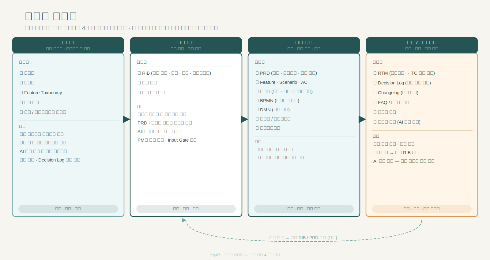

---
publish: true
publish_section: planning
publish_order: 44
title: "4장. 산출물 지형도: 무엇을 남기고 무엇을 줄일 것인가"
---

# 4장. 산출물 지형도: 무엇을 남기고 무엇을 줄일 것인가

## 이 장의 목적

이 장은 책 전체에서 다루는 문서들을 한 번에 조망하는 `지형도 장`이다. 독자는 이후 각 문서를 개별 장에서 배우게 되지만, 그 전에 전체 지형도가 보이지 않으면 무엇을 왜 남기는지 판단하기 어렵다.

이 장을 읽고 나면 독자는 다음을 할 수 있어야 한다.

- 책 전체 문서군을 큰 틀에서 구분할 수 있다.
- 어떤 문서를 기준 문서로 두고, 어떤 문서를 프로젝트 문서로 둘지 감을 잡을 수 있다.
- 무엇을 과감히 줄이고 무엇을 반드시 남겨야 하는지 판단할 수 있다.
- 작은 과제와 큰 과제에서 어떤 문서가 필수인지 결정할 수 있다.

---

## 1. 문서는 많아서 문제가 아니라 역할이 섞여서 문제다

많은 조직은 문서가 너무 많다고 느낀다. 하지만 실제로 문제는 문서 수 자체보다 **역할이 섞인 문서가 많다**는 데 있다.

- 비즈니스 목표와 제품 방향이 한 문서에 섞인다.
- 정책 규칙과 구현 조건이 같은 문단에 섞인다.
- 화면 설명과 테스트 기준이 뒤엉킨다.
- 기준 문서와 프로젝트 문서가 구분되지 않는다.

이 상태에서는 문서를 줄여도 해결되지 않는다. 오히려 어떤 문서를 무슨 역할로 둘지 먼저 보여주는 `산출물 지형도`가 필요하다.

---

## 2. 이 책이 보는 네 영역의 문서군

이 책은 전체 문서를 크게 네 영역으로 본다.

### 2-1. 기준 문서

여러 프로젝트가 공통으로 참조하며 쉽게 바뀌면 안 되는 문서다.

- 로드맵
- 용어집
- Feature Taxonomy
- 공통 정책
- 법률·가이드

### 2-2. 입력 문서

각 프로젝트가 시작할 때 방향과 범위를 정리하는 문서다.

- RIB (요구사항 입력 브리프)
- 범위 문서
- 문제 근거 정리

### 2-3. 실행 문서

실제 프로젝트를 움직이기 위해 만들어지는 문서다. 이 책에서 다루는 기본 산출물 체인이 이 레이어에 해당한다.

**입력 정의 단계**
- RIB (요구사항 입력 브리프) — 문제 정의·범위 초안
- PRD — 방향·기능 범위·성공 기준
- NFR — 성능·보안·가용성 기준
- Feature / Scenario / Acceptance Criteria — 구현 단위와 완료 기준

**규칙·흐름·판단 단계**
- 프로젝트 정책서 — 허용·차단·예외 규칙
- 권한 정책 매트릭스 — 역할별 기능 접근 권한
- BPMN — 업무 흐름·역할 분담·예외 경로
- DMN — 조건 조합별 판단 규칙

**구현 조건 단계**
- 정보 구조·데이터 모델 (IA·ERD·상태 모델)
- SAD (시스템 아키텍처 문서)
- 사양서 — 기능별 구현 조건
- API 명세서 — 시스템 간 인터페이스 계약
- 프로토타입 — 사용자 경험 검토 산출물

**검증·운영 단계**
- 테스트케이스 (TC) — 설계와 검증을 잇는 문서
- 테스트 계획서 (TP) — 검증 범위·우선순위·환경
- 운영 정책서 (OPD) — 출시 이후 서비스 유지 기준

### 2-4. 연결·운영 문서

실행이 끝난 뒤, 또는 운영 중 산출물을 추적하고 지식을 남기는 문서다.

- RTM
- Decision Log
- Changelog
- FAQ
- 릴리즈 노트
- 운영 가이드

> 도식: 산출물 지형도: 기준 문서 → 입력 문서 → 실행 문서 → 연결/운영 문서, 4개 영역과 흐름 매핑

이 네 영역이 구분되어야 무엇을 남기고 무엇을 줄일지 판단할 수 있다.

---

## 3. 무엇을 줄일 것인가

산출물 지형도를 본 뒤 줄일 수 있는 것은 주로 아래다.

- 같은 내용을 반복해서 적는 중복 문장
- 기준 문서 내용을 실행 문서에 통째로 복사하는 방식
- 한 문서가 여러 레이어 역할을 동시에 떠안는 구조
- 뒤 단계에서 다시 설명하게 만드는 장문 서술

즉, 문서를 줄인다는 것은 문서 수를 무조건 줄이자는 뜻이 아니라, **역할 중복과 서술 중복을 줄이자**는 뜻에 가깝다.

---

## 4. 무엇을 반드시 남겨야 하는가

반대로 반드시 남겨야 하는 것은 아래다.

- 범위와 제외 범위
- 정책과 예외
- 흐름과 판단
- 구현 조건
- 검증 기준
- 변경 이력과 결정 근거

이것이 없으면 문서가 짧아져도 실무는 더 흔들린다.

---

## 5. 최소 세트가 필요한 이유

모든 프로젝트가 대규모 체계를 필요로 하는 것은 아니다. 하지만 다음이 전혀 없으면 거의 항상 문제가 생긴다.

- 기준 문서가 전혀 없다
- 입력 문서가 없다
- 방향 문서가 없다
- 규칙과 예외를 정리한 문서가 없다
- 검증 기준이 없다

즉, 큰 체계는 과할 수 있어도 최소 세트는 필요하다.

---

## 6. 복잡도에 따라 달라지는 최소 세트

### 단순 과제

- RIB
- PRD
- 간단한 정책 정리
- 핵심 테스트 포인트

### 중간 복잡도 과제

- RIB
- PRD
- 정책서
- BPMN
- 사양서
- 테스트케이스

### 고복잡도 과제

- RIB
- PRD
- 정책서
- BPMN
- DMN
- 사양서
- 프로토타입
- 테스트케이스
- RTM / Decision Log / Changelog

### 기준 문서 세트 (조직·도메인 수준)

- 용어집
- 공통 정책 또는 상위 규칙
- 법률·가이드
- 로드맵 또는 범위 기준

과제에 따라 Feature Taxonomy나 운영 FAQ가 추가될 수 있다.

---

## 7. Source of Truth를 먼저 정하지 않으면 생기는 일

최소 세트를 골랐다면 이제 그중 무엇이 최종 기준인지까지 분명히 해야 한다. Source of Truth를 정하지 않으면 어떤 일이 생기는가.

- 같은 프로젝트의 산출물이 서로 다른 버전을 기준으로 작성된다.
- AI는 어떤 문서가 최신인지 스스로 판단하지 못하고, 입력된 문서를 모두 병렬로 읽는다.
- 변경이 발생했을 때 어떤 문서를 수정해야 하는지 불명확해진다.
- 팀마다 다른 버전의 "정답"을 갖게 된다.

Source of Truth는 "가장 중요한 문서"가 아니라, **"이 영역에서 최종 기준이 되는 문서"**를 지정하는 결정이다. 문서가 많아도 되고, 적어도 된다. 하지만 각 영역마다 기준이 어디에 있는지는 반드시 알고 있어야 한다.

실무에서 Source of Truth를 정하는 방법:

- 기준 문서(용어집, 공통 정책)는 조직 수준에서 하나를 지정한다.
- 실행 문서(PRD, 정책서)는 프로젝트별로 어느 버전이 승인본인지 명확히 한다.
- 변경 이력이 있는 문서는 가장 최근에 승인된 버전이 기준이다.
- AI에게 입력할 때는 항상 기준 문서를 먼저 읽히고, 참고 문서는 후순위로 준다.

---

## 8. 이 장의 핵심 메시지

> 기획 산출물은 많고 적음의 문제가 아니라, 어떤 역할의 문서를 어떤 위치에 둘 것인가의 문제다. 그리고 AI와 함께 일하려면 기준 문서와 실행 문서의 최소 세트가 명확해야 하며, 그중 무엇이 Source of Truth인지도 분명히 정해야 한다.

먼저 전체 지형도를 보고 역할 중복을 줄여야 한다. 기준 문서, 입력 문서, 실행 문서, 운영 문서를 구분해야 문서를 적게 남겨도 중요한 것을 놓치지 않을 수 있다. 복잡도에 따라 문서 세트는 달라질 수 있고, 중요한 것은 그 최소 세트를 의식적으로 고르는 일이다.

---

## 9. 다음 장으로의 연결

이 장에서는 전체 산출물 지형도를 살펴보고, 최소 문서 세트와 Source of Truth의 중요성을 정리했다. 그렇다면 이제 다음 질문이 이어진다.

> 이 문서들은 실제로 어떻게 연결되는가? 각 문서는 앞 문서에서 무엇을 받고, 뒤 문서로 무엇을 넘기는가?

다음 장(5장)부터는 **산출물 체인을 실제로 다루기 위한 환경 설정**으로 들어간다. 산출물 지형도가 파악되었다면 이제 그것을 실제로 만들고 연결하는 도구 환경을 구성해야 한다.

### 이 장에서 다음 장으로 이어지는 전제

| 이 장에서 확립한 것 | 다음 장이 이것을 바탕으로 하는 이유 |
|---|---|
| 전체 산출물 지형도 파악 | 어떤 파일을 어디에 둘지 판단하려면 지형도가 먼저 있어야 한다 |
| 기준/실행/운영 문서 구분 | 폴더 구조와 Obsidian 볼트 설계의 기반이 된다 |
| Source of Truth 개념 | 어떤 파일이 `_standards/`에 들어가야 하는지 이 장의 판단 기준에서 나온다 |
| 최소 산출물 세트 정의 | 환경 설정 시 처음부터 만들 파일 목록이 여기서 결정된다 |

- **이 장(4장)이 결정한 것**: 전체 산출물 지형도와 최소 세트, Source of Truth 필요성
- **다음 장(5장)이 시작하는 것**: 산출물 체인을 실제로 운영할 Obsidian + VS Code + AI + Git 환경 구성

