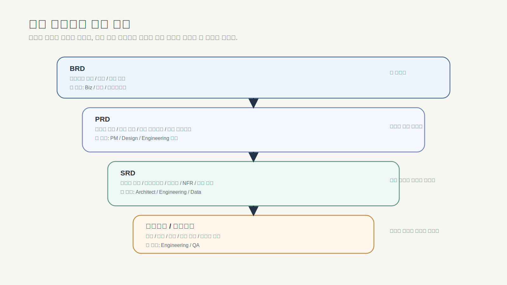

---
publish: true
publish_section: planning
publish_order: 46
title: "6장. 문서 레이어와 책임 분리"
---

# 6장. 문서 레이어와 책임 분리

> 앞 장(5장)에서는 산출물 체인을 운영하기 위한 도구 환경을 갖췄다. 도구가 준비됐다면 이제 그 위에 무엇을 어떤 층에 배치할지를 정해야 한다. 이 장은 그 문서 레이어와 역할 경계를 다룬다. 문서가 있다고 해서 역할이 자동으로 나뉘지는 않기 때문이다.

## 이 장의 목적

이 장은 BRD, PRD, 정책서, BPMN, DMN, 사양서, 프로토타입, 테스트케이스가 서로 어떤 경계와 책임을 가져야 하는지 설명한다.  
실무에서 문서는 없어서 문제가 되기도 하지만, 더 자주 문제를 만드는 것은 **문서가 서로의 역할을 대신하려고 할 때**다. PRD가 사양서 역할까지 떠안고, 정책이 BPMN 속 설명 문장에 묻히고, 판단 규칙이 사람의 기억 속에만 남아 있으면 문서는 많아져도 실행은 불안정해진다.

이 장은 문서의 레이어와 역할 경계를 정리한다. 어느 문서가 최종 기준이고 변경을 어떻게 관리하는지는 다음 장(7장)에서 이어진다.

이 장을 읽고 나면 독자는 다음을 할 수 있어야 한다.

- 문서 레이어를 목적별로 구분할 수 있다.
- 각 문서가 어디까지 답해야 하고 어디까지는 넘기지 말아야 하는지 설명할 수 있다.
- BPMN과 DMN, 정책서와 사양서, 프로토타입과 테스트케이스의 경계를 구분할 수 있다.
- 이후 장에서 다룰 RIB, PRD, 정책서, BPMN, DMN, 사양서, 테스트케이스를 서로 충돌 없이 설계할 수 있다.

---

## 1. 왜 문서 레이어를 나눠야 하는가

많은 조직에서 문서는 쌓이지만, 실제로는 같은 정보를 다른 표현으로 반복하는 경우가 많다.  
표면적으로는 여러 문서가 있는 것처럼 보이지만, 자세히 보면 어떤 문서는 방향을 말하고, 어떤 문서는 규칙을 말하고, 어떤 문서는 구현 조건을 말해야 하는데 그 경계가 흐려져 있다.

이 문제가 생기면 다음 현상이 반복된다.

- PRD가 구현 상세까지 포함하려 한다.
- 정책서가 예외 규칙과 운영 메모와 UI 설명을 한 문서에 섞어 담는다.
- BPMN이 흐름을 설명하는 대신 정책 설명 텍스트로 길어진다.
- DMN이 따로 없어서 판단 기준이 회의록과 사양서 문장 속에 숨어 있다.
- 프로토타입이 경험 검토용인지, 상세 설계 대체물인지 불분명해진다.
- 테스트케이스가 뒤늦게 붙어 추적성이 끊긴다.

문서가 역할을 분담하지 못하면 생기는 가장 큰 문제는 **같은 질문에 서로 다른 문서가 서로 다른 답을 주기 시작한다는 것**이다.  
AI 시대에는 이 문제가 더 치명적이다. AI는 여러 문서를 동시에 읽을 수 있지만, 그 문서들 사이에서 무엇이 방향이고 무엇이 규칙이며 무엇이 최종 구현 기준인지 스스로 안정적으로 보장하지 못한다.

그래서 이 책은 문서를 단순히 “많이 남기는 것”보다, **어떤 문서가 어떤 질문에 답해야 하는지 명확히 나누는 것**을 더 중요하게 본다.

---

## 1-1. 품질 불일치는 어디서 생기는가 — 원인의 구조

문서 레이어를 설계하기 전에 먼저 물어야 할 것이 있다. 서비스의 품질이 팀 안에서 일관되게 유지되지 않을 때, 그 원인은 정확히 어디에 있는가.

원인은 크게 두 갈래로 나뉜다.

**① 정보 부재**: 팀이 공유해야 할 정보가 어딘가에 문서화되지 않았다.

| 없는 정보 | 구체적 증상 | 이것을 담는 산출물 |
|---|---|---|
| **범위·기능 정의** | 팀마다 무엇을 만드는지 다르게 이해 | PRD |
| **정책·예외 규칙** | 개발·QA·CS가 예외 처리를 다르게 판단 | 정책서 |
| **역할·처리 순서** | 어느 시스템이 언제 무엇을 해야 하는지 불분명 | BPMN |
| **분기 판단 조건** | 조건별 처리 결과가 구현마다 다름 | DMN |
| **구현 상세 기준** | 상태 전이·오류 코드·API 응답이 개발자마다 다름 | 사양서 |
| **비기능 요구사항** | 성능·보안·가용성 기준이 구현마다 다름 | NFR / SAD |
| **완료·검증 기준** | “개발 완료”인데 무엇을 테스트해야 하는지 모름 | 테스트케이스 |

**② 프로세스 부재**: 정보는 있는데 올바르게 사용되지 않거나 유지되지 않는다.

| 없는 프로세스 | 구체적 증상 | 이것을 담는 구조 |
|---|---|---|
| **변경 관리** | 초기 문서는 있는데 변경사항이 반영 안 됨. 구현과 문서가 달라짐 | Changelog, RTM |
| **역할·승인 체계** | 누가 이 결정을 내릴 수 있는지 불분명 | RACI, DoD |
| **용어 통일** | 같은 개념을 팀·직군마다 다른 이름으로 부름 | 용어집(Glossary) |

이 두 갈래 중 이 책의 산출물 체인은 주로 **① 정보 부재**를 구조적으로 해결한다. 어떤 정보가 어떤 산출물에 들어가야 하는지 역할을 분리해서, 정보가 빠지거나 중복되는 것을 막는 것이 체인의 핵심 역할이다.

**② 프로세스 부재**는 산출물만으로 해결되지 않는다. Changelog·RTM·DoD·RACI는 별도의 운영 구조가 필요하다. 이 책은 24장(RTM·Decision Log), 23장(DoR·DoD)에서 이 부분을 다룬다.

이 구분이 중요한 이유가 하나 더 있다. 문서를 많이 쌓아도 품질이 일관되지 않는 팀은 보통 ① 정보 부재 문제를 이미 해결했는데 ② 프로세스 부재를 방치하는 경우다. 문서가 있는데 쓰이지 않거나, 업데이트가 안 되거나, 아무도 승인 구조를 따르지 않으면 문서 체계는 형식만 남는다.

---

## 2. 이 책이 제안하는 문서 레이어

이 책은 문서를 아래와 같이 일곱 개 레이어로 본다.

| 레이어 | 핵심 질문 | 대표 문서 | 산출 목적 |
|---|---|---|---|
| 비즈니스 레이어 | 왜 이 일을 해야 하는가 | BRD, 사업 요구, 문제 정의 문서 | 비즈니스 목적과 범위 정렬 |
| 제품/서비스 레이어 | 무엇을 만들고 어떤 가치를 줄 것인가 | PRD | 사용자 가치, 범위, 우선순위 정의 |
| 정책/판단 레이어 | 어떤 규칙과 조건으로 동작해야 하는가 | 정책서, DMN | 정책, 예외, 승인 기준, 분기 규칙 명확화 |
| 흐름 레이어 | 어떤 순서와 상태 변화로 처리되는가 | BPMN, 프로세스 설계서 | 업무/시스템 흐름 구조화 |
| 상세 설계 레이어 | 구현 가능한 수준으로 무엇을 남길 것인가 | SRD, 사양서, 기능명세서 | 상태, 조건, 메시지, 예외, 인터페이스 정의 |
| 경험 레이어 | 사용자는 무엇을 보고 어떻게 행동하는가 | 프로토타입, 화면 설계 | 경험 검토 및 협업 정렬 |
| 검증 레이어 | 요구사항이 실제로 충족됐는가 | 테스트케이스, RTM, DoR/DoD | 검증, 추적성, 변경관리 |

이 구조의 핵심은 문서를 이름으로 나누는 것이 아니라, **질문과 책임으로 나눈다**는 데 있다.  
같은 조직에서도 문서 이름은 다를 수 있다. 하지만 최소한 “왜”, “무엇”, “어떤 규칙”, “어떤 흐름”, “어떤 구현”, “어떤 경험”, “어떻게 검증”의 질문은 서로 분리되어야 한다.

---

> 도식: 문서 레이어 7단계 구조: 레이어별 핵심 질문 · 대표 문서 · 산출 목적

## 3. BRD와 PRD는 어디까지 써야 하는가

### 3-1. BRD는 목적을 정렬하는 문서다

BRD는 왜 이 일을 해야 하는지를 설명한다.  
여기에는 비즈니스 목표, 범위, 제약, 기대 효과, 상위 배경이 들어간다. BRD는 경영적·사업적 정렬의 문서다.

BRD가 잘 써졌다는 것은 다음 질문에 답할 수 있다는 뜻이다.

- 왜 지금 이 과제를 해야 하는가
- 기대하는 비즈니스 효과는 무엇인가
- 범위와 제약은 무엇인가
- 이 과제의 우선순위는 왜 높은가

반대로 BRD에 들어가면 과한 것은 다음과 같다.

- 화면 전환 흐름
- 상세 정책 예외
- 구현 상세 조건
- 테스트 입력값

즉, BRD는 목적과 범위에서 멈춰야 한다.

### 3-2. PRD는 방향을 정의하는 문서다

PRD는 무엇을 만들 것인가를 정의한다.  
여기에는 사용자 문제, 목표, 범위, 핵심 시나리오, 성공 기준, 우선순위가 들어간다.

PRD가 잘 써졌다는 것은 다음 질문에 답할 수 있다는 뜻이다.

- 어떤 사용자 문제를 해결하는가
- 어떤 범위를 이번 릴리즈에 포함하는가
- 핵심 시나리오는 무엇인가
- 성공은 무엇으로 판단하는가

하지만 PRD가 만능 문서가 되어서는 안 된다.  
PRD가 구현과 정책, 흐름, 판단까지 모두 떠안기 시작하면 문서는 길어지지만, 실제로는 뒤 장의 문서를 대체하지 못한다.

즉, PRD는 방향을 정의하되, 상세 규칙과 구현은 다음 레이어로 넘겨야 한다.

---

## 4. 정책서, BPMN, DMN은 왜 나눠야 하는가

이 장에서 가장 중요한 부분이다.  
실무에서는 이 세 가지가 자주 섞인다.

### 4-1. 정책서는 규칙의 서술형 기준이다

정책서는 조직이나 프로젝트가 따라야 할 규칙, 원칙, 예외를 설명한다.  
예를 들어 회원가입/로그인 도메인이라면 아래와 같은 내용이 정책서에 들어간다.

- 휴면 전환 기준
- 탈퇴 후 재가입 제한 조건
- 비밀번호 재설정 허용 규칙
- 로그인 실패 누적 처리 원칙
- 본인인증 실패 시 제한 기준

정책서는 사람이 읽고 이해할 수 있도록 설명하는 문서다.  
따라서 배경과 예외, 금지/허용 기준을 서술형으로 풀어낼 수 있다.

하지만 정책서가 흐름이나 구현까지 다 담으려 하면 너무 무거워진다.

### 4-2. BPMN은 흐름의 언어다

BPMN은 누가, 언제, 어떤 단계와 이벤트를 거쳐 업무가 진행되는지를 표현한다.  
흐름, 분기, 상태 변화, 시스템 간 상호작용을 구조적으로 보여주는 데 강하다.

예를 들어 로그인 실패 후 계정 잠금 프로세스를 본다면 BPMN은 이런 질문에 답한다.

- 어떤 이벤트에서 흐름이 시작되는가
- 실패 횟수 누적은 어디서 확인되는가
- 잠금 상태로 전환되는 시점은 언제인가
- 운영자 개입이 필요한 단계는 어디인가
- 외부 본인인증 시스템과의 상호작용은 어디서 일어나는가

BPMN은 흐름을 설명하는 문서다.  
따라서 여기에서 정책 문장을 길게 설명하기 시작하면 BPMN의 역할이 흐려진다.

### 4-3. DMN은 판단의 언어다

DMN은 조건과 입력값, 결과를 기준으로 어떤 판단을 내릴지 구조화하는 데 적합하다.  
정책서가 서술형 기준이라면, DMN은 그 기준을 **판단 가능한 규칙 집합**으로 바꾸는 역할을 한다.

예를 들어 아래와 같은 질문은 DMN에 가깝다.

- 휴면회원은 어떤 조건 조합일 때 로그인 제한인가
- 탈퇴 후 재가입은 어떤 기간 이후 허용인가
- 비밀번호 재설정은 어떤 상태에서만 가능한가
- 본인인증 방식에 따라 허용되는 후속 동작은 무엇인가

즉, 정책서는 규칙을 설명하고, BPMN은 흐름을 구조화하며, DMN은 판단 기준을 구조화한다.

### 4-4. 셋을 섞으면 왜 위험한가

정책, 흐름, 판단이 한 문서에 섞이면 처음에는 편해 보인다.  
하지만 시간이 지나면 아래 문제가 생긴다.

- 규칙 변경 시 어떤 흐름이 영향을 받는지 파악하기 어렵다.
- 같은 판단이 여러 문장 속에 중복 서술된다.
- 예외 규칙이 프로세스 그림 속 메모로만 남는다.
- AI가 규칙과 흐름을 혼동해 잘못 요약하거나 잘못 생성할 수 있다.

그래서 이 책은 반복해서 이 문장을 사용한다.

> PRD는 방향을 정의하고, 정책서는 규칙을 설명하며, BPMN은 흐름을 구조화하고, DMN은 판단 기준을 구조화한다.

---

## 5. 사양서는 무엇을 남기는 문서인가

사양서(상세설계서)는 구현 가능한 수준의 조건을 남기는 문서다.  
많은 조직에서 이 문서를 “예전 방식 문서”로 오해하지만, AI 시대에도 여전히 중요하다. 오히려 구현 조건을 분명히 남기지 않으면 AI가 그 빈틈을 임의로 메우기 쉽다.

사양서가 답해야 하는 질문은 다음과 같다.

- 어떤 상태와 값이 존재하는가
- 어떤 조건에서 어떤 메시지를 보여주는가
- 어떤 예외가 발생할 수 있는가
- 어떤 입력과 출력 인터페이스가 있는가
- 어떤 필드와 검증 규칙이 필요한가

즉, 사양서는 구현 팀이 “무엇을 만들지”가 아니라 “어떤 조건으로 동작해야 하는지”를 알 수 있게 하는 문서다.

반대로 사양서에 과한 것은 다음과 같다.

- 비즈니스 목적의 반복 설명
- 프로젝트 배경 서사
- 제품 전략의 장황한 설명

사양서는 구현을 위한 상세 조건 문서여야 한다.

---

## 6. 프로토타입은 무엇을 대신할 수 없나

프로토타입은 매우 강력한 협업 도구다.  
특히 AI 시대에는 화면 초안과 인터랙션 아이디어를 빠르게 시각화하는 데 큰 도움을 준다. 그러나 프로토타입은 자주 과대평가된다.

프로토타입이 잘하는 것은 다음이다.

- 사용자 경험 흐름을 보여준다.
- 화면 구조와 주요 인터랙션을 확인하게 한다.
- 이해관계자 간 빠른 정렬을 돕는다.
- 텍스트만으로 모호했던 경험 요소를 구체화한다.

하지만 프로토타입이 대신하기 어려운 것도 분명하다.

- 정책 규칙 전체 설명
- 복잡한 예외 조건의 구조화
- 시스템 상태 모델
- 세부 판단 기준
- 검증 가능한 테스트 조건의 완전한 명시

프로토타입은 경험 레이어의 문서다.  
프로토타입 하나로 정책서, DMN, 사양서까지 대체하려 하면 설명되지 않는 빈틈이 생긴다.

---

## 7. 테스트케이스는 왜 마지막 문서가 아닌가

많은 팀이 테스트케이스를 개발 이후 문서라고 생각한다.  
하지만 이 책에서는 테스트케이스를 **검증 레이어의 핵심 문서**로 본다.

테스트케이스가 답해야 하는 질문은 명확하다.

- 어떤 입력과 전제가 있을 때
- 어떤 결과가 나와야 하는가
- 무엇을 성공으로 볼 것인가
- 어떤 예외 상황을 검증해야 하는가

이 질문은 개발 이후가 아니라 요구사항 설계 단계에서부터 존재한다.  
테스트케이스는 구현 완료 후 붙이는 문서가 아니라, 요구사항·정책·흐름·판단 기준이 실제로 검증 가능한지를 확인하는 문서다.

테스트케이스를 늦게 만들면 어떤 문제가 생길까.

- 요구사항이 검증 불가능한 상태로 통과된다.
- 예외 규칙이 빠져도 뒤늦게 발견된다.
- 정책 변경이 테스트에 반영되지 않는다.
- PRD와 QA가 서로 다른 전제를 가지게 된다.

그래서 테스트케이스는 가능한 한 앞단에서 설계돼야 하고, RTM과 함께 추적성을 형성해야 한다.

---

## 8. 대표 러닝 케이스로 보면 경계가 더 선명해진다

회원가입/로그인 정책 복원 및 개선 사례로 보면 각 문서의 역할은 분명해진다.

### BRD
- 왜 이 기능을 개선해야 하는가
- 운영 비용과 사용자 불편이 무엇인가
- 개선 목표와 범위는 무엇인가

### PRD
- 어떤 사용자 문제를 어떤 범위에서 해결할 것인가
- 핵심 시나리오는 무엇인가
- 성공 기준은 무엇인가

### 정책서
- 휴면, 탈퇴, 재가입, 비밀번호, 본인인증에 대한 정책 원칙은 무엇인가

### BPMN
- 가입, 인증, 로그인, 실패, 잠금, 재설정, 해제까지의 전체 흐름은 어떻게 되는가

### DMN
- 특정 상태에서 로그인 허용/차단은 어떤 조건 조합으로 판단되는가

### 사양서
- 어떤 메시지를 어떤 화면에서 어떻게 보여주는가
- 어떤 필드와 상태값을 저장하는가
- 어떤 API 응답과 에러코드를 반환하는가

### 프로토타입
- 사용자는 어떤 화면을 보고 어떤 행동을 하는가
- 흐름 전환이 어떻게 보이는가

### 테스트케이스
- 어떤 입력에서 어떤 결과가 나와야 하는가
- 어떤 예외 케이스를 반드시 검증해야 하는가

이렇게 놓고 보면 문서가 많아진 것이 아니라, **질문이 나뉘었을 뿐**이라는 점이 보인다.

---

## 9. 실무에서는 어떻게 경계를 유지할 것인가

문서 레이어를 이해하는 것과 실제로 유지하는 것은 다르다.  
실무에서는 아래 원칙이 도움이 된다.

### 9-1. 한 문서에 한 질문군을 우선 배정한다
문서마다 “이 문서는 주로 어떤 질문에 답하는가”를 먼저 정한다.  
그 질문과 직접 관계없는 내용은 가능한 한 다른 레이어로 넘긴다.

### 9-2. 중복 서술보다 참조 구조를 택한다
정책 문장을 PRD, BPMN, 사양서에 모두 복사하지 않는다.  
정책서는 정책서대로 유지하고, 다른 문서는 그것을 참조하도록 설계한다.

### 9-3. BPMN과 DMN은 텍스트 설명을 대신하는 도구가 아니다
둘은 시각적 장식이 아니라 **흐름과 판단을 분리하는 구조화 도구**다.  
도식이 있으면 끝나는 것이 아니라, 오히려 경계를 더 엄격히 관리해야 한다.

### 9-4. 프로토타입은 결정 근거가 아니라 표현 결과다
프로토타입은 경험을 보여주지만, 정책과 판단 기준의 최종 근거가 되어서는 안 된다.

### 9-5. 테스트케이스를 뒤로 미루지 않는다
테스트케이스를 뒤로 미루면, 앞단의 문서 경계가 흐려진 채 진행된다.  
검증 문서를 앞당겨야 문서 레이어도 제대로 작동한다.

### 9-6. AI/PM 역할 구분을 레이어별로 지킨다

AI는 문서 레이어를 구분하지 않고 요청받은 내용을 작성한다. 따라서 PM이 레이어별로 역할을 명확히 지시해야 한다.

| 레이어 | AI 담당 | PM 책임 |
|---|---|---|
| 방향(PRD) | 시나리오 초안·Out of Scope 후보 생성 | 범위 확정·성공 기준 확정 |
| 규칙(정책서·DMN) | 규칙 항목 구조화·조건 조합 초안 | 예외 우선순위·정책 책임 확정 |
| 흐름(BPMN) | 기본 흐름 노드 초안·예외 경로 후보 | 역할 경계·운영 개입 지점 확정 |
| 구현(사양서) | 상태값·메시지·API 초안 | 비즈니스 로직 검증·승인 |
| 검증(TC) | DMN 행 → TC 변환·누락 케이스 제안 | 우선순위·환경 조건 확정 |

AI가 PRD에 사양서 수준 내용을 섞거나, 사양서에 정책 규칙을 끼워 넣으면 레이어 경계가 무너진다. PM이 프롬프트 단계에서 "이 문서는 [레이어명] 문서다"를 명시하고 결과물 검토 시 레이어 경계 위반 여부를 확인한다.

---

## 10. 레이어 경계 자가 진단 체크리스트

이 체크리스트는 현재 프로젝트의 문서 구조가 레이어 경계를 유지하고 있는지 빠르게 확인하는 용도다.

| 항목 | 확인 기준 |
|------|-----------|
| PRD 과부하 | PRD에 구현 상세(메시지·필드·조건값)가 섞여 있지 않은가 |
| 정책·흐름 혼재 | BPMN 안에 정책 설명 텍스트가 길게 들어가 있지 않은가 |
| 판단 기준 누락 | 조건 분기가 있지만 DMN 없이 텍스트 설명만 있지 않은가 |
| 사양서 부재 | "개발자가 알아서 구현한다"는 가정 하에 사양서가 없지 않은가 |
| 프로토타입 과의존 | 프로토타입이 정책서·DMN·사양서를 사실상 대체하고 있지 않은가 |
| 테스트케이스 후치 | 테스트케이스가 개발 완료 후에야 작성되고 있지 않은가 |
| 중복 서술 | 같은 정책 문장이 PRD·BPMN·사양서에 각각 복사되어 있지 않은가 |
| Source of Truth | 각 정보 종류별 최종 기준 문서가 합의되어 있는가 |

모든 항목을 한 번에 해결하기는 어렵다. 이 체크리스트는 어느 레이어가 가장 먼저 정리되어야 하는지 우선순위를 잡는 데 사용한다.

---

## 11. 이 장의 핵심 메시지

핵심은 문서 수가 아니라 문서 경계다.

> 문서가 많아서 문제가 아니라, 문서의 역할이 섞여서 문제가 된다.

BRD는 목적을, PRD는 방향을, 정책서는 규칙을, BPMN과 DMN은 흐름과 판단을 맡아야 한다.  
문서가 분리되어야 산출물 체인도 제대로 이어진다.
- BPMN은 흐름을 구조화한다.
- DMN은 판단 기준을 구조화한다.
- 사양서는 구현 조건을 남긴다.
- 프로토타입은 경험을 검토하게 한다.
- 테스트케이스는 그 모든 것이 실제로 충족되는지 검증한다.

이 구조가 서야 산출물 체인은 서로를 보완한다.  
이 구조가 무너지면 문서는 서로를 방해한다.

---

## 12. 다음 장으로의 연결

이 장에서는 각 문서가 어떤 질문에 답해야 하는지, 그리고 서로 어디까지 책임져야 하는지를 정리했다.  
그렇다면 이제 다음 질문이 남는다.

> 이 문서들은 실제 프로젝트에서 어떤 순서와 어떤 연결 구조로 생성되어야 하는가?

다음 장(7장)에서는 Source of Truth와 버전관리 원칙을 다룬다. 문서 레이어가 분리되어 있어도, 어느 문서가 최종 기준인지와 변경이 어떻게 관리되는지가 정리되지 않으면 실제 운영에서는 다시 충돌이 생기기 때문이다.

### 이 장에서 다음 장으로 이어지는 것

| 이 장에서 정의된 것 | 다음 장이 이것을 전제하는 이유 |
|---|---|
| 7개 레이어 구조와 역할 | Source of Truth를 지정할 때 "어느 레이어의 문서가 최종 기준인가"를 묻게 된다 |
| 레이어 간 의존 관계 | 상위/하위 기준 구분이 레이어 의존 방향과 일치해야 한다 |
| 레이어 경계 체크리스트 | 어떤 문서를 Source of Truth로 지정해야 하는지 판단 기준이 된다 |
| 문서 책임 분리 원칙 | 버전 관리 시 누가 어떤 레이어의 변경 승인 주체가 되는지의 근거 |

- **이 장(6장)이 정의한 것**: 문서 레이어 구조, 역할 경계, 책임 분리 원칙
- **다음 장(7장)이 결정하는 것**: 정보 종류별 최종 기준 문서 지정, 버전 관리 원칙, Obsidian + Git 실습 셋팅

