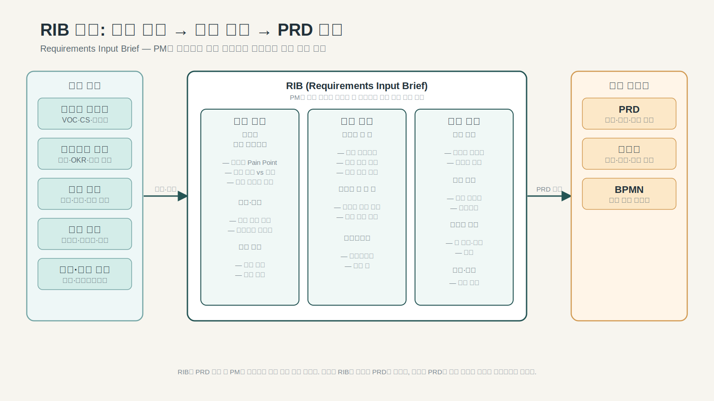

---
publish: true
publish_section: planning
publish_order: 48
title: "8장. RIB: Requirements Input Brief"
---

# 8장. RIB: Requirements Input Brief


> **이 장에서 다루는 것**
> - RIB의 역할과 PRD 전 단계 위치
> - AI와 함께 요구사항 입력 구조를 만드는 법
> - RIB → PRD 연결 기준



> 도식: RIB 구조: 입력 원천(피드백·비즈니스·운영·기술·규제) → 문제 정의·범위 결정·제약 명시 → PRD 입력

> **전제 지식**: 4장(산출물 지형도 개관) — 어떤 산출물이 어느 위치에 있는지 큰 그림을 먼저 보면 RIB의 역할을 잡기 쉽다.

## 이 장의 목적

이 장은 프로젝트나 기능 개선 과제가 어디에서 시작되어야 하는지를 설명한다. 많은 팀은 기획을 PRD 작성부터 시작한다. 그러나 PRD보다 먼저 정리되어야 할 것이 있다. 바로 `RIB(Requirements Input Brief)`다.

RIB는 완성된 기획 문서가 아니다. 문제·범위·제약·이해관계자·확인 필요 사항을 구조화하여 이후 모든 산출물이 같은 전제 위에서 시작될 수 있게 만드는 `입력 정리 문서`다.

이 장을 읽고 나면 다음을 할 수 있어야 한다.

- RIB가 왜 PRD보다 먼저 필요한지 설명할 수 있다.
- RIB의 필수 구성 항목과 실제 작성 형식을 이해할 수 있다.
- AI를 활용해 RIB를 만들 때 무엇을 맡기고 무엇을 직접 판단해야 하는지 구분할 수 있다.
- 완성된 RIB가 다음 산출물에 어떤 입력을 넘겨주는지 확인할 수 있다.

---

## 1. 이 산출물이 왜 존재하는가

실무에서 과제는 대부분 이런 말로 시작된다.

> "회원가입이 불편하니 개선이 필요하다."
> "로그인 오류 문의가 많다."
> "운영팀이 수동 처리를 너무 많이 하고 있다."

이 말들은 모두 중요하다. 그러나 아직 요구사항이 아니다. 문제 제기·불만·운영 이슈·가설이 한데 섞인 상태다. 그런데 많은 팀이 이 상태에서 곧바로 PRD를 작성하거나 Jira 티켓을 쪼갠다. 그 결과는 예측 가능하다.

- 문제와 해결안이 섞인다.
- 범위가 계속 바뀐다.
- 누가 최종 의사결정자인지 불분명하다.
- 정책 이슈인지 UX 이슈인지 시스템 이슈인지 구분되지 않는다.
- As-is가 비어 있는 상태에서 To-be만 커진다.

프로젝트가 흔들리는 이유는 실행력이 부족해서가 아니다. **입력 정보가 정리되지 않은 채 산출물 단계로 너무 빨리 넘어가기 때문이다.** RIB는 그 구멍을 막는 문서다.

RIB가 정리하는 것은 딱 하나다. 지금 알고 있는 것과 아직 모르는 것을 구분하는 것. 이 구분이 없으면 PRD는 추정과 전제 위에 쌓이고, 이후 모든 산출물이 그 불확실성을 그대로 물려받는다.

---

## 2. 입력과 출력

### 2-1. RIB가 받는 주요 입력

| 입력 소스 | 내용 |
|---|---|
| 요청 원문 | 이메일·회의 메모·Slack 스레드·경영 지시 |
| 기능 분류 체계 (FT) | 과제가 속하는 기능 영역과 분류 기준 |
| As-is 분석 자료 | 현재 운영 현황·로그·VOC·기존 정책 문서 |
| 이해관계자 인터뷰 | 운영팀·고객센터·개발팀 의견 |
| 제약 정보 | 일정·예산·시스템·법규·조직 제약 |

### 2-2. RIB가 넘겨주는 출력

| 다음 산출물 | RIB에서 넘겨주는 것 |
|---|---|
| **PRD** | 문제 정의·요청 배경·In/Out Scope·이해관계자·제약 조건 |
| **정책서** | 정책 충돌 의심 지점·운영 예외 반복 패턴·확인 필요 규칙 목록 |
| **BPMN** | 역할이 얽힌 현재 프로세스 이슈·운영 개입 발생 지점 |
| **DMN** | 조건 조합이 복잡한 규칙 문제·허용/차단/보류 기준 불명확 지점 |
| **RTM** | 요구사항 원문 ID (추적 시작점) |

> **핵심 원칙**: 좋은 RIB는 PRD가 방향을 잡고, 정책서가 규칙을 확정하고, BPMN/DMN이 흐름과 판단을 구조화할 수 있는 전제를 갖추고 있다.

---

## 3. RIB 구조와 템플릿

RIB는 10개 섹션으로 구성된다. 처음부터 모두 채울 필요는 없다. 미확정 항목은 '확인 필요'로 명시하고 진행한다.

### 3-1. 구성 항목

| 섹션 | 내용 | 비고 |
|---|---|---|
| 과제명 | 과제의 공식 명칭 | 이후 모든 산출물에 동일하게 사용 |
| 문제 정의 | 무엇이 문제인지 현상 중심으로 기술 | 해결안 미포함 |
| 문제의 근거 | VOC·운영 문의·이슈 데이터·레거시 로직 확인 결과 | 가능한 정량 근거 포함 |
| As-is 요약 | 현재 알고 있는 구조·아직 모르는 부분 구분 | 모르는 것도 명시 |
| 요청 배경 / 목적 | 왜 지금 이 과제를 하는가 | 사업 맥락 포함 |
| 범위 (In / Out of Scope) | 이번에 다루는 것 / 다루지 않는 것 | 경계가 명확해야 PRD 시작 가능 |
| 이해관계자 | PM·운영팀·고객센터·개발·QA·디자인 등 | 결정권자 별도 표시 |
| 제약 조건 | 일정·정책·시스템·조직 제약 | 현실적으로 기술 |
| 확인 필요 사항 | 아직 확정되지 않은 사실·추가 확인이 필요한 항목 | 숨기지 말고 드러낼 것 |
| 후속 산출물 예상 | PRD·정책서·BPMN·DMN·Spec·TC 등 | 체인 시작점 역할 |

### 3-2. 템플릿 (마크다운 형식)

```markdown
# RIB: [과제명]

작성일: YYYY-MM-DD
작성자:
버전: v1.0

---

## 문제 정의
[현재 무엇이 문제인가 — 현상 중심으로 기술. 해결안 포함 금지]

## 문제의 근거
- VOC: [건수/내용]
- 운영 문의: [빈도/패턴]
- 이슈 데이터: [근거]

## As-is 요약
**알고 있는 것:**
- [현재 구조·규칙·프로세스 요약]

**아직 모르는 것:**
- [확인이 필요한 현황]

## 요청 배경 / 목적
[왜 지금 이 과제를 해야 하는가]

## 범위
**In Scope:**
- [이번에 다루는 것]

**Out of Scope:**
- [이번에 다루지 않는 것]

## 이해관계자
| 역할 | 담당 | 책임 |
|---|---|---|
| 의사결정 | | |
| 기획 | | |
| 개발 | | |
| QA | | |
| 운영 | | |

## 제약 조건
- 일정: [목표 일정]
- 시스템: [기술 제약]
- 정책: [법규·사내 정책 제약]
- 기타: [조직·예산 제약]

## 확인 필요 사항
| # | 확인 항목 | 담당 | 기한 |
|---|---|---|---|
| 1 | | | |
| 2 | | | |

## 후속 산출물
- [ ] PRD
- [ ] 정책서
- [ ] BPMN
- [ ] DMN
- [ ] 사양서
- [ ] 테스트케이스
```

---

## 4. AI와 함께 만드는 법

### 4-1. 흐름 개요

```
PM 입력 → AI 초안 생성 → PM 판단·확정
```

### 4-2. AI에게 맡기는 단계

**입력 1: 요청 원문 투입**

```
다음 요청 원문을 분석해서 RIB 초안을 작성해줘.

[요청 원문]
회원가입이 불편하니 개선이 필요하다.
로그인 오류 문의가 많다.
휴면회원 정책을 다시 봐야 한다.

RIB 항목:
1. 문제 정의 (현상 중심, 해결안 포함 금지)
2. 문제 근거 후보 (어떤 데이터가 필요한지)
3. As-is에서 확인이 필요한 항목 목록
4. 이해관계자 후보
5. 제약 조건 후보
6. 확인 필요 사항 목록
```

AI가 잘 하는 작업:
- 원문에서 현상·요청·가설 분리
- 이해관계자 후보 추출
- 확인이 필요한 사항 질문 생성
- As-is / To-be 혼재 문장 분리

**입력 2: As-is 자료 보완 후 재투입**

```
위 RIB 초안에 다음 As-is 자료를 반영해서 보완해줘.

[As-is 자료]
- 현재 로그인 잠금 정책: 5회 실패 시 30분 잠금
- 휴면 전환 기준: 12개월 미로그인
- 고객센터 문의 중 15%가 로그인 잠금 관련
```

### 4-3. PM이 직접 판단·확정해야 하는 것

| 항목 | 이유 |
|---|---|
| 문제의 실제 우선순위 | AI는 원문에서 우선순위를 판단할 수 없음 |
| 범위 확정 (In/Out Scope) | 조직 맥락·사업 방향 반영 필요 |
| 이해관계자 책임 구분 | 내부 조직 구조 이해 필요 |
| 제약 조건의 현실성 | 실제 일정·예산·시스템 상황 확인 필요 |
| 확인 필요 사항의 중요도 | 다음 단계를 막는 블로커인지 판단 필요 |

> **원칙**: AI는 RIB 초안을 빠르게 구조화할 수 있다. 그러나 **무엇을 이번 과제의 입력으로 인정할 것인가**는 사람이 확정한다.

> **→ 프롬프트 예시**: [[wiser-prompt-examples-v1]] — 10. RIB 초안 생성 예시

---

## 5. 품질 기준 / 체크리스트

RIB를 PRD로 넘기기 전에 다음 항목을 확인한다.

### 5-1. 필수 확인 (이것이 없으면 PRD를 시작하면 안 된다)

- [ ] 문제와 해결안이 섞이지 않았는가
- [ ] 범위(In/Out Scope)가 명시되어 있는가
- [ ] 이해관계자와 결정권자가 식별되었는가
- [ ] 미확정 항목이 숨겨지지 않고 드러났는가
- [ ] 다음 산출물(PRD·정책서·BPMN)에 넘길 입력이 식별되었는가

### 5-2. 품질 향상 항목 (가능하면 포함할 것)

- [ ] 문제의 정량적 근거가 있는가 (VOC 건수·오류율·운영 문의 빈도 등)
- [ ] As-is에서 아직 모르는 부분이 명시되었는가
- [ ] 제약 조건이 현실적으로 기술되었는가
- [ ] 확인 필요 사항에 담당자와 기한이 부여되었는가

### 5-3. 자주 발생하는 오류

| 오류 유형 | 현상 | 수정 방향 |
|---|---|---|
| 해결안 혼입 | "회원가입 화면을 개선해야 한다" — 해결안이 문제 정의에 포함 | 현상만 기술: "회원가입 완료율이 낮다" |
| 범위 무경계 | Out of Scope가 비어 있음 | 최소 2~3가지 명시적 제외 항목 추가 |
| 확인 필요 사항 은폐 | 불확실한 내용을 확정된 것처럼 기술 | '확인 필요' 태그 명시 |
| 이해관계자 역할 혼재 | 모든 사람이 "관련"으로만 표시 | 결정권자·승인자·참고인 구분 |

---

## 6. 다음 단계 연결 규칙

### 6-1. RIB → PRD 전환 조건

다음 조건이 충족되어야 PRD 작성을 시작한다.

- 문제 정의가 현상 기준으로 확정되었다
- In/Out Scope 초안이 존재한다
- 핵심 이해관계자와 결정권자가 식별되었다
- 주요 제약 조건이 기술되었다
- 블로킹 이슈(확인 필요 사항 중 PRD 방향에 영향을 주는 것)가 해소되었거나, 해소 전까지 PRD에서 가정으로 명시하기로 합의되었다

### 6-2. RIB가 열어주는 병렬 작업

RIB가 완성되면 다음 산출물을 병렬로 시작할 수 있다.

| 병렬 가능 산출물 | RIB에서 받는 것 |
|---|---|
| PRD | 문제 정의·범위·이해관계자·제약 |
| 정책서 초안 (항목 식별) | 정책 충돌 의심 지점·운영 예외 패턴 |
| BPMN 현행 흐름 (As-is) | 현재 프로세스 이슈·운영 개입 지점 |

### 6-3. RIB에서 해결하지 않는 것

RIB는 다음을 결정하지 않는다.

- 우선순위 (→ PRD에서)
- 구체적인 기능 설계 (→ Feature 정의·Spec에서)
- 규칙과 예외 처리 (→ 정책서·DMN에서)
- 프로세스 흐름 (→ BPMN에서)

범위를 벗어난 내용이 RIB에 섞이면 PRD가 조기에 방향을 잃는다.

---

## 적용 예시: 회원가입/로그인 정책 복원 과제

RIB 작성 전에 다음 질문에 먼저 답할 수 있어야 한다.

- 현재 로그인 잠금 규칙은 문서와 코드가 일치하는가
- 휴면회원 해제 절차를 운영과 서비스가 같은 기준으로 보고 있는가
- 탈퇴 후 재가입 제한 기간은 어디에 어떤 버전으로 남아 있는가
- 고객센터가 반복적으로 수동 처리하는 예외는 무엇인가
- 이번 범위는 정책 복원까지인가, 화면 개선까지인가

이 질문에 답이 없으면 PRD 방향을 잡을 수 없다. PRD가 방향을 잡지 못하면 정책서·BPMN·DMN도 표류한다. RIB는 이 질문들에 답하는 문서다.

---

## 정리

RIB는 PRD의 축약판이 아니다. 좋은 RIB는 문제·범위·제약·이해관계자·확인 필요 사항을 구조화하여 이후 PRD와 정책·설계 산출물이 같은 전제 위에서 시작되게 만든다.

RIB에서 기억할 세 가지:

1. **입력을 정리한다** — 무엇을 알고 무엇을 모르는지 구분한다.
2. **범위를 고정한다** — In/Out Scope 없이 PRD를 시작하면 범위가 계속 바뀐다.
3. **미확정을 드러낸다** — 불확실성을 숨기면 이후 산출물이 그 위에 쌓인다.

---

## 다음 장으로의 연결

RIB가 완성되면 산출물 체인의 첫 번째 관문이 열린다. RIB는 PRD의 입력이고, RIB가 흐리면 PRD도 흔들린다.

### RIB에서 PRD로 이동하는 항목

| RIB 항목 | 이동 형태 | PRD에서의 역할 |
|---|---|---|
| 문제 정의 (Problem Statement) | 문장 그대로 | PRD "왜 만드는가" 섹션의 직접 입력 |
| 요청 범위 (Scope) | In-scope / Out-of-scope 목록 | PRD Feature 범위 결정 기준 |
| 핵심 이해관계자 | 역할·이름·관심사 목록 | PRD 이해관계자 및 영향 분석 |
| 제약 조건 | 기술·일정·예산 구분 목록 | PRD 제약사항 섹션 |
| 우선순위 기준 | Must Have / Nice to Have 구분 | PRD Feature 우선순위 결정 |
| 미확정 항목 | 확인 필요 사항 목록 | PRD 작성 전 선결 과제 목록 |

### 체인 전환 기준 (RIB → PRD)

| 확인 항목 | 기준 |
|---|---|
| 문제 정의 완료 | 1~3문장으로 명확히 서술되어 있는가 |
| Scope In/Out 명시 | 포함 범위와 제외 범위가 각각 목록으로 있는가 |
| 이해관계자 목록 | 최소 3명 이상, 역할과 관심사가 기재되어 있는가 |
| 미확정 항목 처리 | "확인 필요" 항목이 드러나 있고, PRD 작성 전 해소 여부가 판단되었는가 |
| RIB 상태 | `Approved` 또는 팀 합의 완료 상태인가 |

- **이 장(8장)이 결정한 것**: 문제·범위·제약·이해관계자·전제 조건의 구조화
- **다음 장(9장)이 시작하는 것**: 방향·목적·성공 기준·Feature 우선순위를 확정하는 PRD 작성
---

